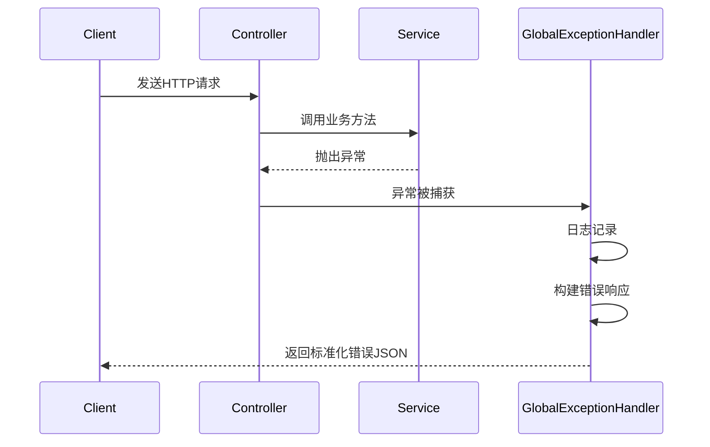
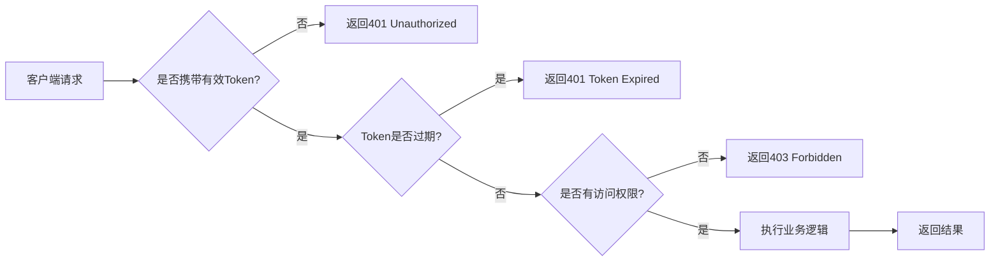

# 开发规范

<cite>
**本文档引用文件**  
- [AGENTS.md](file://AGENTS.md)
- [qoder/rules/version.md](file://qoder/rules/version.md)
- [pom.xml](file://pom.xml)
- [mall-common/pom.xml](file://mall-common/pom.xml)
- [mall-auth/src/main/resources/application.yml](file://mall-auth/src/main/resources/application.yml)
- [mall-product/src/main/resources/application.yml](file://mall-product/src/main/resources/application.yml)
- [mall-trade/src/main/resources/application.yml](file://mall-trade/src/main/resources/application.yml)
- [mall-job/src/main/resources/application.yml](file://mall-job/src/main/resources/application.yml)
- [mall-zipkin/pom.xml](file://mall-zipkin/pom.xml)
</cite>

## 目录
1. [编码规范](#编码规范)
2. [版本管理策略](#版本管理策略)
3. [MyBatis-Plus使用规范](#mybatis-plus使用规范)
4. [RESTful API设计原则](#restful-api设计原则)
5. [异常处理机制](#异常处理机制)
6. [安全编码要求](#安全编码要求)

## 编码规范

根据项目要求，所有Java代码必须遵循以下编码规范：

### Java版本要求
项目统一使用Java 25作为开发版本，所有模块的编译和运行环境必须保持一致。在`pom.xml`文件中已明确指定Java版本为25。

**Section sources**
- [pom.xml](file://pom.xml#L44)
- [mall-common/pom.xml](file://mall-common/pom.xml#L15-L16)

### 日志记录方式
日志记录必须通过AOP（面向切面编程）切入，确保日志能够精确到方法级别。所有关键业务方法的进入、退出、异常情况都应被记录，便于问题追踪和性能分析。

**Section sources**
- [AGENTS.md](file://AGENTS.md#L28)

### 参数封装规则
当方法参数超过三个时，必须将参数封装为DTO（Data Transfer Object）对象。此举可提高代码可读性、可维护性，并减少接口变更带来的影响。

**Section sources**
- [AGENTS.md](file://AGENTS.md#L29)

### Javadoc编写标准
每个方法块都必须添加完整的Javadoc注释，包含以下内容：
- 方法作用：清晰描述该方法的功能
- 参数说明：使用`@param`标注每个参数的含义
- 返回值说明：使用`@return`描述返回值类型及意义
- 异常说明：使用`@throws`或`@exception`标明可能抛出的异常类型及原因

**Section sources**
- [AGENTS.md](file://AGENTS.md#L30)

### Controller层统一返回格式
Controller层所有接口必须统一返回JSON格式的数据结构。建议采用标准响应体封装，包含状态码、消息提示、数据内容等字段，确保前后端交互的一致性和可预测性。

**Section sources**
- [AGENTS.md](file://AGENTS.md#L31)

## 版本管理策略

### Git分支命名规则
采用主流的Git分支管理模型，具体命名规范如下：
- 主分支：`main`，用于生产环境发布
- 预发布分支：`release/*`，用于版本测试和准备
- 功能分支：`feature/*`，开发新功能时使用
- 修复分支：`hotfix/*`，紧急修复生产问题时使用
- 任务分支：`task/*`，针对特定任务或需求开发

### 提交信息格式
Git提交信息必须遵循约定式提交（Conventional Commits）规范，格式为：
```
<type>(<scope>): <subject>
<BLANK LINE>
<body>
<BLANK LINE>
<footer>
```
其中`type`可选值包括：`feat`（新功能）、`fix`（修复bug）、`docs`（文档变更）、`style`（代码格式调整）、`refactor`（重构）、`test`（测试相关）、`chore`（构建过程或辅助工具变动）。

### 版本号语义化规则（SemVer）
版本号采用语义化版本规范（Semantic Versioning），格式为`MAJOR.MINOR.PATCH`：
- 主版本号（MAJOR）：当进行不兼容的API修改时递增
- 次版本号（MINOR）：当以向后兼容的方式添加功能时递增
- 修订号（PATCH）：当进行向后兼容的bug修复时递增

预发布版本可在版本号后添加连字符和标识符，如`1.0.0-alpha`、`1.0.0-beta`等。

**Section sources**
- [qoder/rules/version.md](file://qoder/rules/version.md)

## MyBatis-Plus使用规范

### 基础配置
所有使用MyBatis-Plus的模块均需在`application.yml`中配置以下项：
- `mapper-locations`：指定Mapper XML文件路径
- `type-aliases-package`：设置实体类别名包路径
- `configuration.map-underscore-to-camel-case`：开启下划线转驼峰命名
- `configuration.log-impl`：指定日志实现为Slf4jImpl

### 使用原则
- 优先使用MyBatis-Plus提供的CRUD接口，减少重复SQL编写
- 复杂查询可通过`@Select`注解或XML方式实现
- 分页查询统一使用`Page<T>`对象作为返回类型
- 实体类应继承`com.baomidou.mybatisplus.annotation.IdType`并合理设置主键策略

```mermaid
graph TD
A[Service层] --> B[调用MyBatis-Plus BaseMapper]
B --> C{简单CRUD}
C --> |是| D[直接使用内置方法]
C --> |否| E[自定义SQL]
E --> F[通过@Select/@Update等注解]
E --> G[通过XML映射文件]
D --> H[返回结果]
F --> H
G --> H
```

**Diagram sources**
- [mall-auth/src/main/resources/application.yml](file://mall-auth/src/main/resources/application.yml#L22-L27)
- [pom.xml](file://pom.xml#L78-L83)

**Section sources**
- [mall-auth/src/main/resources/application.yml](file://mall-auth/src/main/resources/application.yml#L22-L27)
- [pom.xml](file://pom.xml#L78-L83)

## RESTful API设计原则

### 路径设计
- 使用名词而非动词表示资源
- 使用复数形式表示资源集合
- 层级关系使用斜杠分隔
- 避免在URL中使用动词

示例：
```
GET /api/users          # 获取用户列表
GET /api/users/{id}     # 获取单个用户
POST /api/users         # 创建用户
PUT /api/users/{id}     # 更新用户
DELETE /api/users/{id}  # 删除用户
```

### HTTP方法语义
- `GET`：获取资源，安全且幂等
- `POST`：创建资源，非幂等
- `PUT`：更新资源（全量），幂等
- `PATCH`：部分更新资源，幂等
- `DELETE`：删除资源，幂等

### 状态码规范
- `200 OK`：请求成功
- `201 Created`：资源创建成功
- `204 No Content`：操作成功但无返回内容
- `400 Bad Request`：客户端请求错误
- `401 Unauthorized`：未授权
- `403 Forbidden`：禁止访问
- `404 Not Found`：资源不存在
- `500 Internal Server Error`：服务器内部错误

**Section sources**
- [AGENTS.md](file://AGENTS.md#L31)

## 异常处理机制

### 统一异常处理
使用`@ControllerAdvice`和`@ExceptionHandler`实现全局异常处理，捕获并处理各类异常，返回标准化的错误响应。

### 异常分类
- 业务异常：继承自`BusinessException`，表示业务逻辑错误
- 系统异常：继承自`SystemException`，表示系统级错误
- 参数异常：使用`MethodArgumentNotValidException`处理参数校验失败
- 认证异常：处理JWT验证失败等情况

### 错误响应格式
统一返回包含以下字段的JSON结构：
- `code`：错误码
- `message`：错误信息
- `timestamp`：发生时间
- `path`：请求路径
- `details`：详细信息（可选）



**Diagram sources**
- [AGENTS.md](file://AGENTS.md#L30-L31)

**Section sources**
- [AGENTS.md](file://AGENTS.md#L30-L31)

## 安全编码要求

### 输入验证
- 所有外部输入必须进行有效性验证
- 使用JSR-380（Bean Validation）注解进行参数校验
- 防止SQL注入、XSS攻击、CSRF攻击等常见安全漏洞

### 认证与授权
- 使用JWT进行用户身份认证
- 敏感接口必须添加权限校验
- Token应设置合理的过期时间
- 支持Token刷新机制

### 数据安全
- 敏感数据（如密码）必须加密存储
- 日志中禁止打印敏感信息
- 使用HTTPS传输数据
- 定期更新依赖库，修复已知安全漏洞

### 安全配置
- 在`application.yml`中合理配置安全相关参数
- 启用Spring Security进行访问控制
- 配置CORS策略，限制跨域访问
- 使用Nacos进行敏感配置的集中管理



**Diagram sources**
- [pom.xml](file://pom.xml#L97-L114)
- [AGENTS.md](file://AGENTS.md#L24-L25)

**Section sources**
- [pom.xml](file://pom.xml#L97-L114)
- [AGENTS.md](file://AGENTS.md#L24-L25)