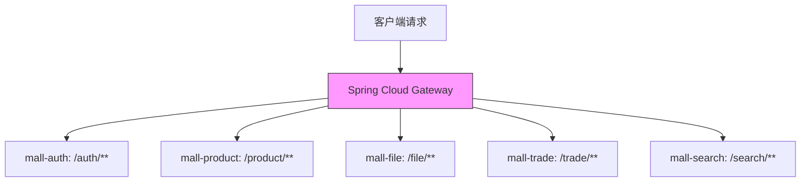
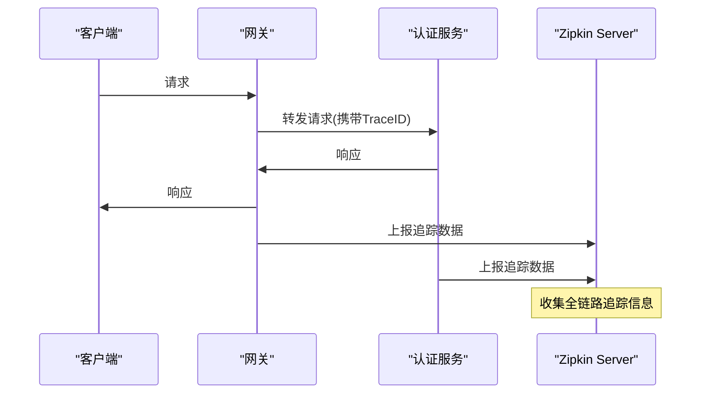

# 技术栈与依赖

<cite>
**本文档引用的文件**  
- [AGENTS.md](file://AGENTS.md)
- [pom.xml](file://pom.xml)
- [mall-gateway/pom.xml](file://mall-gateway/pom.xml)
- [mall-zipkin/pom.xml](file://mall-zipkin/pom.xml)
- [mall-gateway/src/main/resources/application.yml](file://mall-gateway/src/main/resources/application.yml)
</cite>

## 目录
1. [技术栈概览](#技术栈概览)  
2. [核心组件与版本](#核心组件与版本)  
3. [关键依赖库分析](#关键依赖库分析)  
4. [开发环境要求](#开发环境要求)  
5. [角色化环境准备建议](#角色化环境准备建议)  
6. [版本兼容性注意事项](#版本兼容性注意事项)

## 技术栈概览

mail-cloud项目是一个基于微服务架构的电商平台后端系统，采用Spring Boot 4.0.0-M1作为核心框架，结合Spring Cloud Gateway、Nacos、MySQL、Redis、Elasticsearch等技术构建高可用、可扩展的分布式系统。项目采用Maven作为构建工具，模块化设计清晰，包含认证、商品、交易、搜索、文件、配置、网关、任务调度和链路追踪等多个独立服务模块。

**Section sources**  
- [pom.xml](file://pom.xml#L1-L223)

## 核心组件与版本

根据AGENTS.md文件和pom.xml配置，项目使用的核心技术栈及其版本如下：

| 组件 | 版本 | 角色说明 |
|------|------|----------|
| Java | 25 | 项目运行的基础语言环境，支持最新语言特性 |
| Maven | 3.8.4 | 项目构建与依赖管理工具 |
| Spring Boot | 4.0.0-M1 | 微服务基础框架，提供自动配置、嵌入式容器等能力 |
| Nacos | 2.5.1 / 2025.0.0.0-preview | 服务注册与发现、统一配置中心 |
| MySQL | 8.0.39 | 主关系型数据库，存储核心业务数据 |
| Redis | 5.0.14.1 | 分布式缓存，用于会话管理、热点数据缓存等 |
| Elasticsearch | 7.17.5 | 全文搜索引擎，支持商品搜索等复杂查询场景 |

Nacos在项目中通过`spring-cloud-starter-alibaba-nacos-discovery`和`spring-cloud-starter-alibaba-nacos-config`实现服务注册发现和配置管理，各服务通过`application.yml`中的`spring.cloud.nacos.discovery.server-addr`配置Nacos服务器地址。

**Section sources**  
- [AGENTS.md](file://AGENTS.md#L1-L31)  
- [pom.xml](file://pom.xml#L8-L9)  
- [pom.xml](file://pom.xml#L62-L69)  
- [mall-gateway/src/main/resources/application.yml](file://mall-gateway/src/main/resources/application.yml#L5-L7)

## 关键依赖库分析

### Spring Cloud Gateway
在`mall-gateway`模块中引入，作为系统的统一API网关，负责请求路由、负载均衡、安全控制等功能。通过`spring-cloud-starter-gateway-server-webmvc`依赖实现，配置了多个路由规则，将不同路径的请求转发到对应微服务。

**Diagram sources**  
- [mall-gateway/pom.xml](file://mall-gateway/pom.xml#L22-L24)  
- [mall-gateway/src/main/resources/application.yml](file://mall-gateway/src/main/resources/application.yml#L8-L30)

### MyBatis-Plus
在根pom.xml中通过`mybatis-plus-boot-starter`引入，版本为3.5.5。作为MyBatis的增强工具，提供CRUD操作的简化、分页插件、代码生成器等功能，减少重复SQL编写，提高开发效率。

**Section sources**  
- [pom.xml](file://pom.xml#L78-L84)  
- [pom.xml](file://pom.xml#L47)

### Micrometer Tracing、Brave、Zipkin Reporter
在`mall-zipkin`模块中引入完整的分布式链路追踪体系：
- **Micrometer Tracing**：提供跨服务的请求追踪能力
- **Brave**：Zipkin的客户端实现，负责生成和传播追踪上下文
- **Zipkin Reporter**：将追踪数据上报至Zipkin服务器

这些组件共同实现请求在微服务间的全链路追踪，便于性能分析和故障排查。

**Diagram sources**  
- [mall-zipkin/pom.xml](file://mall-zipkin/pom.xml#L28-L44)  
- [pom.xml](file://pom.xml#L24-L26)

## 开发环境要求

### 最低环境配置
- **JDK版本**：Java 25（必须，项目中`java.version`属性明确指定）
- **Maven版本**：3.8.4（推荐，确保依赖解析一致性）
- **Nacos服务**：需部署Nacos 2.5.1或2025.0.0.0-preview版本，监听8848端口
- **数据库**：MySQL 8.0.39，需提前创建各服务对应的数据库
- **缓存服务**：Redis 5.0.14.1，用于会话和数据缓存
- **搜索服务**：Elasticsearch 7.17.5，用于商品搜索功能

### Maven配置要点
- 确保Maven使用Java 25进行编译（`maven.compiler.source`和`maven.compiler.target`设置为25）
- 正确配置`spring-boot-starter-parent`版本为4.0.0-M1
- 通过`dependencyManagement`统一管理Spring Cloud和Spring Cloud Alibaba版本

**Section sources**  
- [pom.xml](file://pom.xml#L44)  
- [mall-gateway/pom.xml](file://mall-gateway/pom.xml#L15-L16)  
- [AGENTS.md](file://AGENTS.md#L1-L31)

## 角色化环境准备建议

### 开发者
1. 安装JDK 25并配置环境变量
2. 安装Maven 3.8.4并配置本地仓库
3. 克隆项目代码，导入IDE（推荐IntelliJ IDEA）
4. 启动本地Nacos服务（或连接测试环境Nacos）
5. 配置本地数据库连接信息
6. 重点关注`mall-common`模块的公共组件和工具类
7. 遵循代码规范：方法超过三个参数需封装，每个方法需添加Javadoc

### 运维人员
1. 部署高可用Nacos集群（生产环境建议3节点）
2. 部署MySQL主从集群，确保数据安全
3. 部署Redis哨兵或集群模式，保证缓存高可用
4. 部署Elasticsearch集群，配置合适的分片和副本
5. 配置Zipkin Server用于链路追踪数据展示
6. 监控各服务的Actuator端点，集成Prometheus和Grafana
7. 制定服务启停、扩容、回滚的标准化流程

**Section sources**  
- [AGENTS.md](file://AGENTS.md#L28-L31)  
- [pom.xml](file://pom.xml#L34-L35)  
- [mall-zipkin/pom.xml](file://mall-zipkin/pom.xml#L35-L36)

## 版本兼容性注意事项

Spring Boot 4.0.0-M1作为里程碑版本，与生态组件的兼容性需特别注意：
- **Spring Cloud版本**：需使用2025.0.0版本，与Spring Boot 4.0.0-M1匹配
- **Spring Cloud Alibaba**：需使用2025.0.0.0-preview版本，支持Nacos 2.5.1
- **Spring Data模块**：Redis和Elasticsearch的Spring Data版本需为4.0.0-M1，确保API兼容性
- **测试框架**：JUnit已升级至6.0.0版本，与Spring Boot 4.0.0-M1兼容
- **Lombok**：需确保Lombok版本支持Java 25的新语法特性

建议在项目根pom.xml中通过`dependencyManagement`统一管理所有依赖版本，避免版本冲突。

**Section sources**  
- [pom.xml](file://pom.xml#L8-L9)  
- [pom.xml](file://pom.xml#L45-L46)  
- [pom.xml](file://pom.xml#L94-L95)  
- [pom.xml](file://pom.xml#L88-L89)