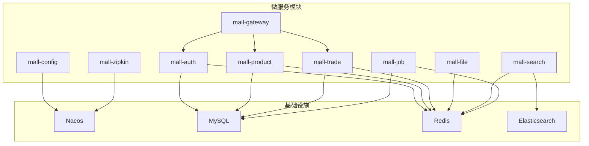
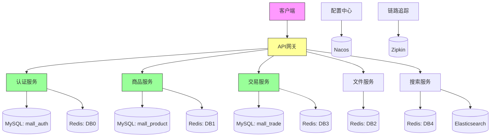
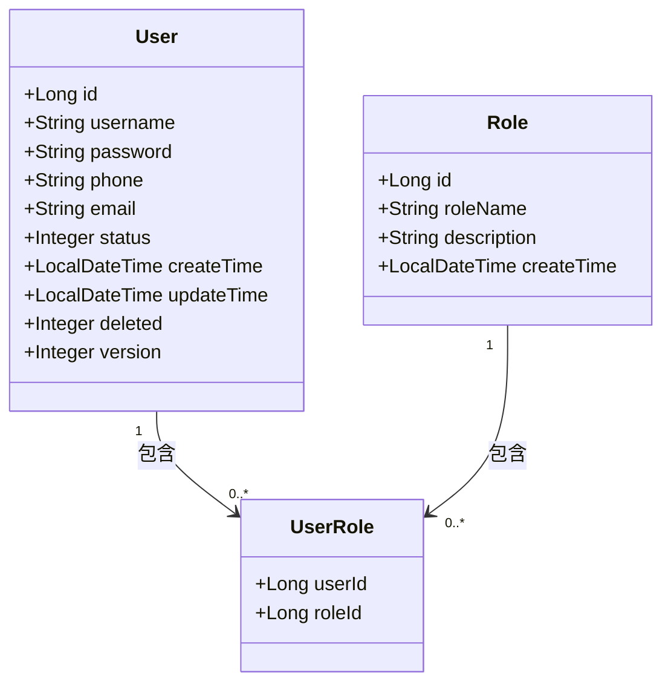
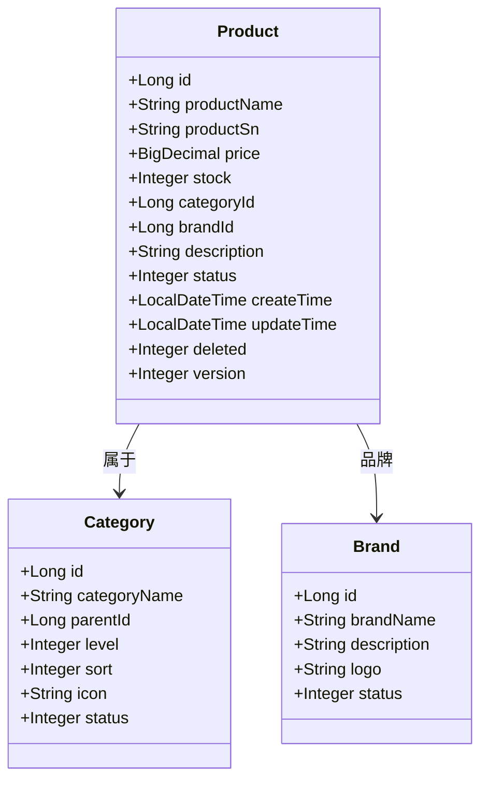
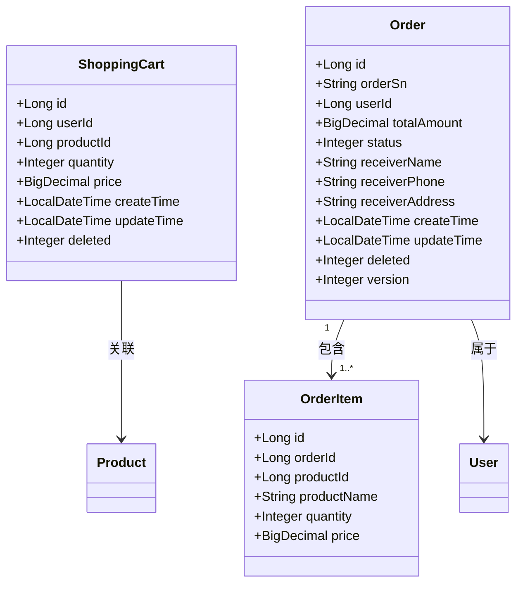
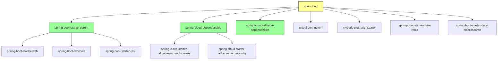

# 数据库设计

<cite>
**本文档中引用的文件**   
- [application.yml](file://mall-auth/src/main/resources/application.yml)
- [application.yml](file://mall-product/src/main/resources/application.yml)
- [application.yml](file://mall-trade/src/main/resources/application.yml)
- [application.yml](file://mall-job/src/main/resources/application.yml)
- [application.yml](file://mall-file/src/main/resources/application.yml)
- [application.yml](file://mall-search/src/main/resources/application.yml)
- [pom.xml](file://pom.xml)
- [MallAuthApplication.java](file://mall-auth/src/main/java/xyh/dp/mall/auth/MallAuthApplication.java)
- [MallProductApplication.java](file://mall-product/src/main/java/xyh/dp/mall/product/MallProductApplication.java)
- [MallTradeApplication.java](file://mall-trade/src/main/java/xyh/dp/mall/trade/MallTradeApplication.java)
</cite>

## 目录
1. [简介](#简介)
2. [项目结构](#项目结构)
3. [核心组件](#核心组件)
4. [架构概述](#架构概述)
5. [详细组件分析](#详细组件分析)
6. [依赖分析](#依赖分析)
7. [性能考虑](#性能考虑)
8. [故障排除指南](#故障排除指南)
9. [结论](#结论)

## 简介
mail-cloud项目是一个基于微服务架构的电商平台后端系统，采用Spring Cloud Alibaba技术栈构建。本数据库设计文档旨在分析各微服务的数据源配置、数据库连接策略、ORM框架使用规范以及缓存机制应用。系统通过Nacos实现服务发现与配置管理，各服务独立维护自己的数据库实例，实现了数据层面的完全解耦。主要业务模块包括用户认证（mall-auth）、商品管理（mall-product）、交易处理（mall-trade）等，每个模块都有专用的MySQL数据库和Redis缓存实例，确保了系统的高可用性和可扩展性。

## 项目结构
mail-cloud项目采用Maven多模块结构，包含多个独立的微服务模块。每个服务模块（如mall-auth、mall-product、mall-trade）都拥有独立的配置文件和数据库连接，实现了业务逻辑和数据存储的完全分离。项目根目录下的pom.xml文件定义了统一的依赖管理和版本控制，确保了各服务之间的依赖一致性。各服务通过Nacos注册中心进行服务发现和配置获取，实现了配置的集中化管理。这种模块化设计使得每个服务可以独立开发、部署和扩展，极大地提高了系统的可维护性和灵活性。

**Diagram sources**
- [pom.xml](file://pom.xml)
- [application.yml](file://mall-auth/src/main/resources/application.yml)

**Section sources**
- [pom.xml](file://pom.xml)
- [application.yml](file://mall-auth/src/main/resources/application.yml)

## 核心组件
mail-cloud项目的核心组件包括用户认证服务（mall-auth）、商品管理服务（mall-product）和交易处理服务（mall-trade）。这些服务各自管理独立的数据库实例，通过MyBatis-Plus作为ORM框架实现数据库操作。用户认证服务负责存储和验证用户身份信息，商品管理服务维护商品元数据和分类信息，交易处理服务则管理订单、购物车等交易相关数据。所有服务都集成了Redis缓存，用于提升数据访问性能和会话管理。系统通过Spring Cloud Gateway作为统一入口，将请求路由到相应的后端服务。

**Section sources**
- [MallAuthApplication.java](file://mall-auth/src/main/java/xyh/dp/mall/auth/MallAuthApplication.java)
- [MallProductApplication.java](file://mall-product/src/main/java/xyh/dp/mall/product/MallProductApplication.java)
- [MallTradeApplication.java](file://mall-trade/src/main/java/xyh/dp/mall/trade/MallTradeApplication.java)

## 架构概述
mail-cloud项目采用典型的微服务架构，各服务之间通过HTTP API进行通信，由Spring Cloud Gateway统一管理API路由。每个微服务都拥有独立的数据库实例，实现了数据的物理隔离和按业务域划分。系统使用Nacos作为服务注册与配置中心，实现了服务的动态发现和配置的集中管理。数据库层面采用MySQL作为主存储，Redis作为缓存层，Elasticsearch用于商品搜索功能。这种架构设计确保了系统的高可用性、可扩展性和容错能力，同时通过服务解耦降低了系统的复杂性。

**Diagram sources**
- [application.yml](file://mall-auth/src/main/resources/application.yml)
- [application.yml](file://mall-product/src/main/resources/application.yml)
- [application.yml](file://mall-trade/src/main/resources/application.yml)

## 详细组件分析

### 用户认证服务分析
用户认证服务（mall-auth）负责管理平台的用户身份认证和授权功能。该服务使用独立的MySQL数据库实例（mall_auth）存储用户账户信息，包括用户名、密码哈希、用户角色等敏感数据。通过MyBatis-Plus框架实现数据访问，遵循统一的ORM映射规范。服务配置了Redis缓存实例（DB0）用于存储用户会话信息和JWT令牌，提高了认证过程的性能和安全性。服务通过Nacos注册中心进行服务发现，确保了高可用性。

**Diagram sources**
- [application.yml](file://mall-auth/src/main/resources/application.yml)
- [MallAuthApplication.java](file://mall-auth/src/main/java/xyh/dp/mall/auth/MallAuthApplication.java)

### 商品管理服务分析
商品管理服务（mall-product）负责维护平台的商品元数据，包括商品信息、分类、品牌等。该服务使用独立的MySQL数据库实例（mall_product）存储商品相关数据，通过MyBatis-Plus框架实现高效的数据访问。服务配置了专用的Redis缓存实例（DB1）用于缓存热门商品信息，显著提升了商品详情页的加载速度。商品搜索功能通过Elasticsearch实现，提供了高效的全文检索能力。服务的实体类设计遵循统一的命名规范和字段约定。

**Diagram sources**
- [application.yml](file://mall-product/src/main/resources/application.yml)
- [MallProductApplication.java](file://mall-product/src/main/java/xyh/dp/mall/product/MallProductApplication.java)

### 交易处理服务分析
交易处理服务（mall-trade）负责管理用户的购物车、订单和支付流程。该服务使用独立的MySQL数据库实例（mall_trade）存储交易相关数据，确保了交易数据的一致性和完整性。服务配置了Redis缓存实例（DB3）用于存储用户的购物车数据，提供了快速的购物车操作响应。订单处理流程采用事务管理，确保了数据的ACID特性。服务的实体类设计包含了逻辑删除和乐观锁字段，支持数据的软删除和并发控制。

**Diagram sources**
- [application.yml](file://mall-trade/src/main/resources/application.yml)
- [MallTradeApplication.java](file://mall-trade/src/main/java/xyh/dp/mall/trade/MallTradeApplication.java)

## 依赖分析
mail-cloud项目的依赖关系清晰明确，各服务之间通过API进行松耦合通信。项目根pom.xml文件定义了统一的依赖版本管理，确保了各模块之间的兼容性。核心依赖包括Spring Boot、Spring Cloud Alibaba、MyBatis-Plus、MySQL驱动、Redis客户端等。各服务通过Nacos进行服务发现，避免了硬编码的服务地址。数据库连接通过Spring Boot的自动配置实现，简化了数据源的配置过程。这种依赖管理策略确保了项目的稳定性和可维护性。

**Diagram sources**
- [pom.xml](file://pom.xml)

**Section sources**
- [pom.xml](file://pom.xml)

## 性能考虑
mail-cloud项目在性能设计方面采用了多种优化策略。首先，通过将各服务的数据库物理分离，避免了跨服务的数据库锁竞争，提高了系统的并发处理能力。其次，广泛使用Redis作为缓存层，将高频访问的数据（如用户会话、商品信息、购物车数据）存储在内存中，显著降低了数据库的访问压力。MyBatis-Plus框架的使用简化了数据库操作，同时提供了性能监控和SQL日志功能。服务间的通信通过API网关进行统一管理，支持负载均衡和熔断机制，确保了系统的稳定性和响应速度。

## 故障排除指南
当遇到数据库相关问题时，应首先检查各服务的application.yml配置文件，确保数据库连接参数正确无误。对于连接池问题，可以检查MySQL服务器的最大连接数设置和服务的连接池配置。缓存相关问题可以通过Redis客户端连接到相应的数据库实例进行排查。日志级别已设置为debug，可以通过查看服务日志获取详细的执行信息。对于数据一致性问题，应检查事务管理配置和分布式锁的使用情况。链路追踪功能已集成，可以通过Zipkin监控服务调用链路，快速定位性能瓶颈。

**Section sources**
- [application.yml](file://mall-auth/src/main/resources/application.yml)
- [application.yml](file://mall-product/src/main/resources/application.yml)
- [application.yml](file://mall-trade/src/main/resources/application.yml)

## 结论
mail-cloud项目的数据库设计体现了现代微服务架构的最佳实践。通过将各业务模块的数据存储完全分离，实现了系统的高内聚、低耦合。使用MyBatis-Plus作为统一的ORM框架，确保了数据访问层的一致性和可维护性。Redis缓存的合理应用显著提升了系统的性能表现。Nacos配置中心的使用实现了配置的集中化管理，便于环境切换和参数调整。整体设计充分考虑了系统的可扩展性、可用性和性能需求，为电商平台的稳定运行提供了坚实的基础。