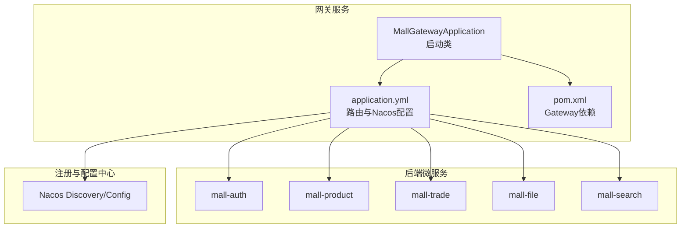
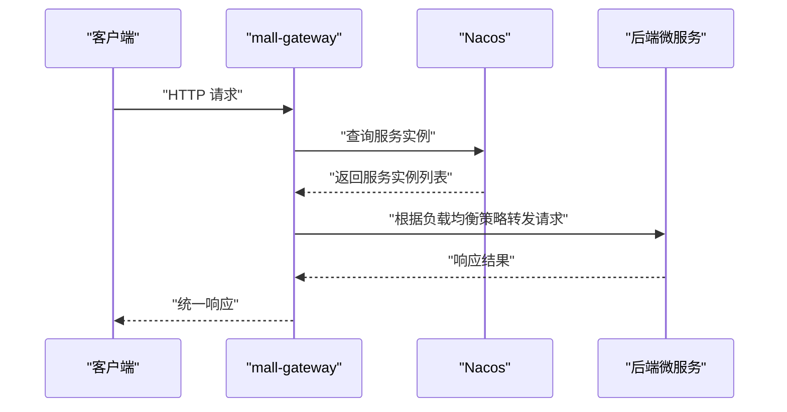
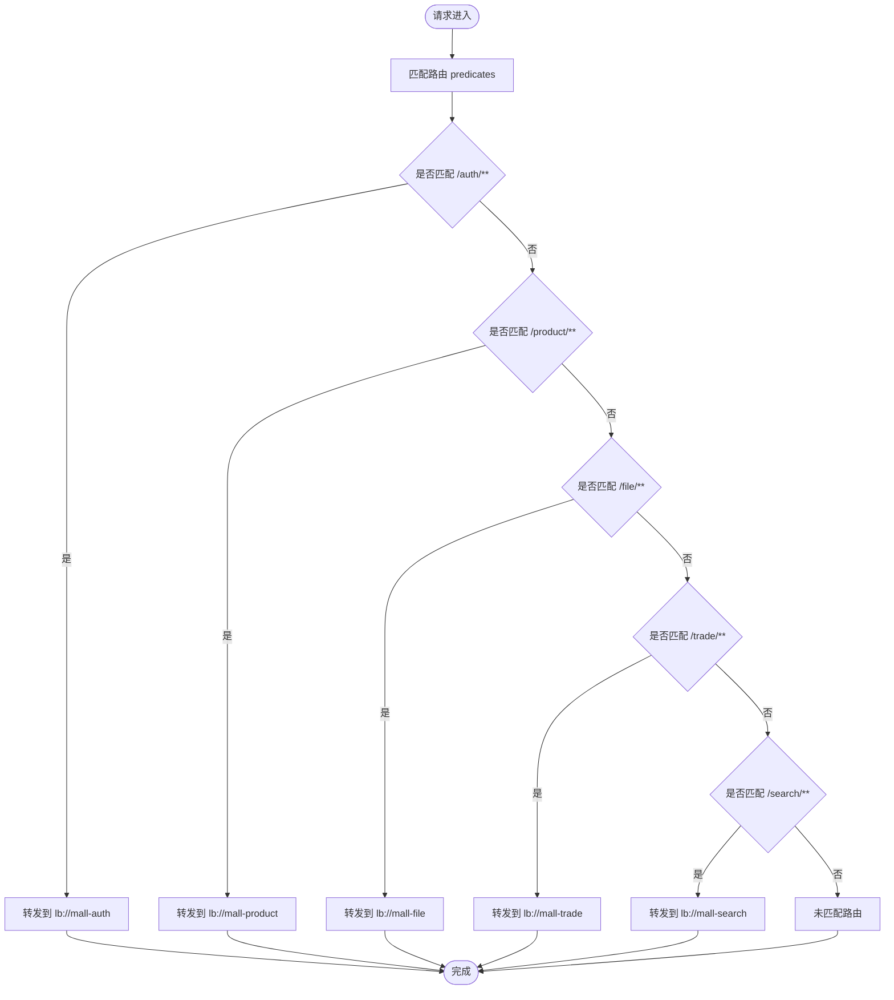
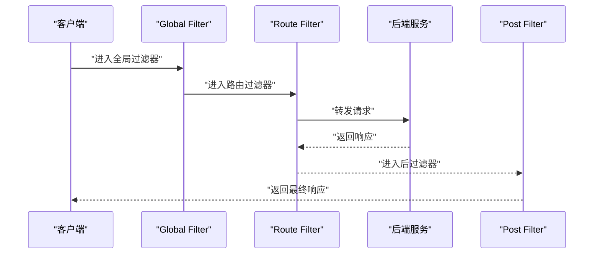
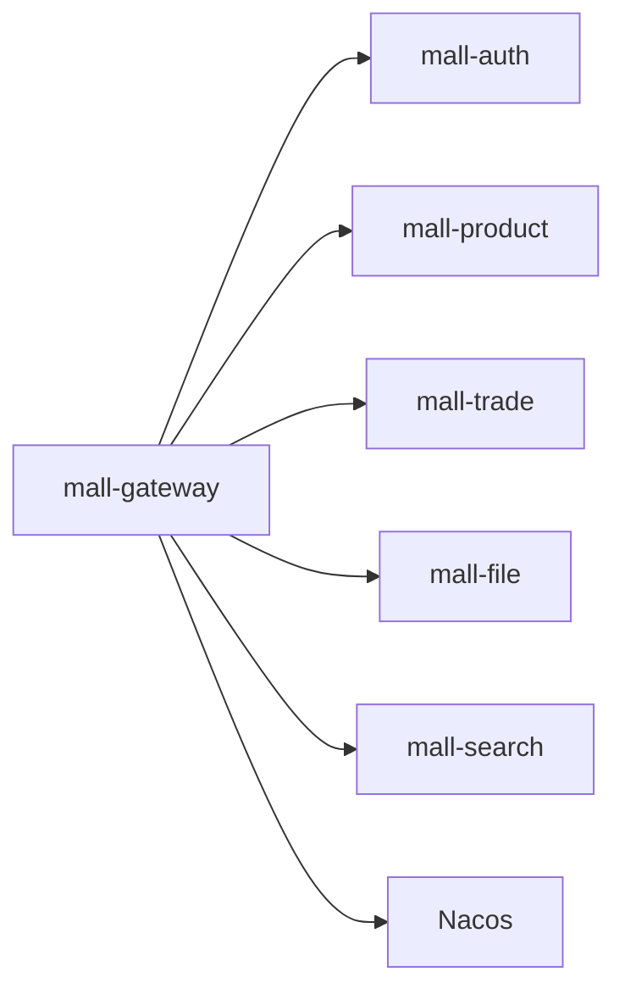

# API网关服务

<cite>
**本文引用的文件**
- [MallGatewayApplication.java](file://mall-gateway/src/main/java/xyh/dp/mall/gateway/MallGatewayApplication.java)
- [application.yml](file://mall-gateway/src/main/resources/application.yml)
- [pom.xml](file://mall-gateway/pom.xml)
- [pom.xml](file://pom.xml)
- [MallAuthApplication.java](file://mall-auth/src/main/java/xyh/dp/mall/auth/MallAuthApplication.java)
- [MallProductApplication.java](file://mall-product/src/main/java/xyh/dp/mall/product/MallProductApplication.java)
- [MallTradeApplication.java](file://mall-trade/src/main/java/xyh/dp/mall/trade/MallTradeApplication.java)
- [MallSearchApplication.java](file://mall-search/src/main/java/xyh/dp/mall/search/MallSearchApplication.java)
- [MallFileApplication.java](file://mall-file/src/main/java/xyh/dp/mall/file/MallFileApplication.java)
- [MallConfigApplication.java](file://mall-config/src/main/java/xyh/dp/mall/config/MallConfigApplication.java)
- [MallZipkinApplication.java](file://mall-zipkin/src/main/java/xyh/dp/mall/zipkin/MallZipkinApplication.java)
</cite>

## 目录
1. [引言](#引言)
2. [项目结构](#项目结构)
3. [核心组件](#核心组件)
4. [架构总览](#架构总览)
5. [详细组件分析](#详细组件分析)
6. [依赖关系分析](#依赖关系分析)
7. [性能考虑](#性能考虑)
8. [故障排查指南](#故障排查指南)
9. [结论](#结论)
10. [附录](#附录)

## 引言
本文件围绕 mall-gateway 模块展开，系统性解析其作为 Spring Cloud Gateway 的实现机制与运行原理。重点包括：
- 基于 MallGatewayApplication 中的 @SpringBootApplication 与 @EnableDiscoveryClient 注解，说明其作为网关服务的核心职责与启动流程。
- 结合 application.yml 的路由配置，阐述如何将外部请求分发至 mall-auth、mall-product、mall-trade、mall-file、mall-search 等后端微服务。
- 解释网关的路由匹配规则、过滤器链（Filter Chain）的执行顺序与可扩展点，以及统一请求入口与请求转发的工作方式。
- 说明与 Nacos 服务注册中心的集成方式，以及如何实现动态路由更新。
- 讨论跨域处理、限流、安全校验等常见扩展能力的落地路径与最佳实践。

## 项目结构
mall-gateway 是一个独立的 Spring Boot 应用，使用 Spring Cloud Gateway 作为统一入口，通过 Nacos 进行服务发现与配置管理。其关键文件与职责如下：
- MallGatewayApplication.java：网关服务启动类，启用 Spring Boot 自动装配与服务发现。
- application.yml：定义网关路由规则、Nacos 服务发现地址、日志级别等。
- pom.xml：引入 spring-cloud-starter-gateway-server-webmvc 依赖，支撑 WebFlux 网关能力。

图表来源
- [MallGatewayApplication.java](file://mall-gateway/src/main/java/xyh/dp/mall/gateway/MallGatewayApplication.java#L1-L25)
- [application.yml](file://mall-gateway/src/main/resources/application.yml#L1-L36)
- [pom.xml](file://mall-gateway/pom.xml#L1-L33)

章节来源
- [MallGatewayApplication.java](file://mall-gateway/src/main/java/xyh/dp/mall/gateway/MallGatewayApplication.java#L1-L25)
- [application.yml](file://mall-gateway/src/main/resources/application.yml#L1-L36)
- [pom.xml](file://mall-gateway/pom.xml#L1-L33)

## 核心组件
- 启动类与注解
  - @SpringBootApplication：启用自动配置与组件扫描，使网关具备 WebFlux 能力。
  - @EnableDiscoveryClient：开启服务发现，从 Nacos 获取后端服务实例列表，支持负载均衡与动态路由。
- 路由配置
  - 使用 spring.cloud.gateway.routes 定义多条路由规则，每条路由包含 id、uri、predicates 等字段。
  - uri 支持 lb:// 前缀，结合服务名进行负载均衡转发。
  - predicates 使用 Path 匹配，将 /auth/**、/product/**、/file/**、/trade/**、/search/** 等路径映射到对应服务。
- 服务发现与端口
  - spring.cloud.nacos.discovery.server-addr 指定 Nacos 地址。
  - server.port 指定网关监听端口。

章节来源
- [MallGatewayApplication.java](file://mall-gateway/src/main/java/xyh/dp/mall/gateway/MallGatewayApplication.java#L1-L25)
- [application.yml](file://mall-gateway/src/main/resources/application.yml#L1-L36)

## 架构总览
下图展示了客户端请求经由 mall-gateway 分发到各后端微服务的整体流程，以及与 Nacos 的交互关系。

图表来源
- [application.yml](file://mall-gateway/src/main/resources/application.yml#L1-L36)
- [MallGatewayApplication.java](file://mall-gateway/src/main/java/xyh/dp/mall/gateway/MallGatewayApplication.java#L1-L25)

## 详细组件分析

### 路由配置与请求分发
- 路由规则
  - 每条路由由 id、uri、predicates 组成。uri 采用 lb:// 服务名形式，结合服务发现实现负载均衡。
  - predicates 使用 Path 匹配，将不同前缀的请求分发到不同后端服务。
- 分发逻辑
  - 网关根据请求路径匹配 predicates，选择对应路由。
  - 将请求转发到 uri 指向的服务实例，完成统一入口与请求转发。

图表来源
- [application.yml](file://mall-gateway/src/main/resources/application.yml#L1-L36)

章节来源
- [application.yml](file://mall-gateway/src/main/resources/application.yml#L1-L36)

### 过滤器链（Filter Chain）执行流程
- 执行顺序
  - Global Filter：全局过滤器在路由过滤器之前执行，适合做跨域、鉴权、限流等横切逻辑。
  - Route Filter：路由级过滤器，按路由定义顺序执行，适合对特定路由进行预处理或后处理。
- 典型场景
  - 预过滤：记录请求、提取令牌、校验签名、限流判断。
  - 后过滤：统一封装响应、设置跨域头、记录耗时。
- 可扩展点
  - 自定义 GlobalFilter 或 GatewayFilter 实现业务需求。
  - 通过 spring.cloud.gateway.filter 来启用或调整过滤器优先级。

图表来源
- [application.yml](file://mall-gateway/src/main/resources/application.yml#L1-L36)

章节来源
- [application.yml](file://mall-gateway/src/main/resources/application.yml#L1-L36)

### 统一请求入口与请求转发
- 统一入口
  - 网关作为单一对外暴露点，所有外部请求先到达网关，再由网关根据路由规则转发到具体微服务。
- 请求转发
  - 通过 lb:// 服务名进行负载均衡转发，结合 Nacos 服务发现动态感知服务实例变化。
- 负载均衡
  - 默认使用轮询策略，可在路由或全局层配置更细粒度的负载均衡策略。

章节来源
- [application.yml](file://mall-gateway/src/main/resources/application.yml#L1-L36)
- [MallGatewayApplication.java](file://mall-gateway/src/main/java/xyh/dp/mall/gateway/MallGatewayApplication.java#L1-L25)

### 与 Nacos 的集成与动态路由
- 服务发现
  - mall-gateway 通过 @EnableDiscoveryClient 与 Nacos Discovery 集成，自动拉取服务实例列表。
- 动态路由
  - 路由配置中使用 lb:// 服务名，网关会根据 Nacos 的服务实例变化动态更新可用实例，实现无感扩容与故障切换。
- 配置中心
  - 项目中已引入 Nacos Config 依赖，可在运行时从 Nacos Config 加载网关路由等配置，实现动态更新。

章节来源
- [MallGatewayApplication.java](file://mall-gateway/src/main/java/xyh/dp/mall/gateway/MallGatewayApplication.java#L1-L25)
- [pom.xml](file://pom.xml#L55-L95)
- [application.yml](file://mall-gateway/src/main/resources/application.yml#L1-L36)

### 跨域处理、限流、安全校验的扩展能力
- 跨域处理（CORS）
  - 在 Global Filter 中添加跨域响应头，或通过 spring.cloud.gateway.globalcors 配置统一跨域策略。
- 限流
  - 可在路由或全局层启用限流过滤器，结合 Redis 实现令牌桶/滑动窗口限流。
- 安全校验
  - 在 Global Filter 中实现鉴权与签名校验，如校验 JWT、防重放、参数签名等。
- 最佳实践
  - 将通用逻辑下沉到 Global Filter，避免在每个路由重复实现。
  - 对热点路由单独配置限流与熔断策略。

章节来源
- [application.yml](file://mall-gateway/src/main/resources/application.yml#L1-L36)

### 实际路由配置示例（说明性）
以下为基于现有配置的示例说明，不直接展示代码内容：
- 认证服务：将 /auth/** 路径转发到 lb://mall-auth。
- 商品服务：将 /product/** 路径转发到 lb://mall-product。
- 文件服务：将 /file/** 路径转发到 lb://mall-file。
- 交易服务：将 /trade/** 路径转发到 lb://mall-trade。
- 搜索服务：将 /search/** 路径转发到 lb://mall-search。

章节来源
- [application.yml](file://mall-gateway/src/main/resources/application.yml#L1-L36)

## 依赖关系分析
- 模块依赖
  - mall-gateway 依赖 spring-cloud-starter-gateway-server-webmvc，提供 WebFlux 网关能力。
  - 顶层 pom.xml 引入了 spring-cloud-starter-alibaba-nacos-discovery 与 spring-cloud-starter-alibaba-nacos-config，为网关与配置中心集成提供基础。
- 服务间依赖
  - mall-gateway 依赖 mall-auth、mall-product、mall-trade、mall-file、mall-search 等服务，通过 lb:// 服务名进行调用。
  - 各服务均启用 @EnableDiscoveryClient，参与服务发现。

图表来源
- [pom.xml](file://mall-gateway/pom.xml#L1-L33)
- [pom.xml](file://pom.xml#L55-L95)
- [MallAuthApplication.java](file://mall-auth/src/main/java/xyh/dp/mall/auth/MallAuthApplication.java#L1-L26)
- [MallProductApplication.java](file://mall-product/src/main/java/xyh/dp/mall/product/MallProductApplication.java#L1-L26)
- [MallTradeApplication.java](file://mall-trade/src/main/java/xyh/dp/mall/trade/MallTradeApplication.java#L1-L26)
- [MallFileApplication.java](file://mall-file/src/main/java/xyh/dp/mall/file/MallFileApplication.java#L1-L26)
- [MallSearchApplication.java](file://mall-search/src/main/java/xyh/dp/mall/search/MallSearchApplication.java#L1-L26)

章节来源
- [pom.xml](file://mall-gateway/pom.xml#L1-L33)
- [pom.xml](file://pom.xml#L55-L95)
- [MallAuthApplication.java](file://mall-auth/src/main/java/xyh/dp/mall/auth/MallAuthApplication.java#L1-L26)
- [MallProductApplication.java](file://mall-product/src/main/java/xyh/dp/mall/product/MallProductApplication.java#L1-L26)
- [MallTradeApplication.java](file://mall-trade/src/main/java/xyh/dp/mall/trade/MallTradeApplication.java#L1-L26)
- [MallFileApplication.java](file://mall-file/src/main/java/xyh/dp/mall/file/MallFileApplication.java#L1-L26)
- [MallSearchApplication.java](file://mall-search/src/main/java/xyh/dp/mall/search/MallSearchApplication.java#L1-L26)

## 性能考虑
- 路由匹配复杂度
  - predicates 的数量与类型会影响匹配性能，建议合理拆分路由，避免过多重叠匹配。
- 负载均衡策略
  - 默认轮询策略简单高效；对于高并发场景可评估权重、一致性哈希等策略。
- 过滤器开销
  - 全局过滤器应尽量轻量，避免阻塞；必要时将耗时逻辑异步化或缓存结果。
- 动态路由更新
  - 通过 Nacos Config 热加载路由配置时，注意幂等性与回滚策略，确保平滑过渡。

## 故障排查指南
- 无法访问网关
  - 检查 server.port 是否正确，确认 Nacos 地址与服务发现是否正常。
- 路由不生效
  - 核对 predicates 的 Path 是否与请求路径一致；确认 lb:// 服务名与实际服务名一致。
- 服务实例不可用
  - 检查各后端服务是否成功注册到 Nacos；确认服务健康状态。
- 日志定位
  - application.yml 中已设置日志级别，便于调试与问题定位。

章节来源
- [application.yml](file://mall-gateway/src/main/resources/application.yml#L1-L36)

## 结论
mall-gateway 通过 Spring Cloud Gateway 与 Nacos 的组合，实现了统一的请求入口、灵活的路由分发与动态的服务治理。基于 @SpringBootApplication 与 @EnableDiscoveryClient 的启动机制，网关能够快速接入微服务体系并承担安全、限流、跨域等横切能力。结合 Nacos Config 的动态配置能力，可进一步提升运维效率与系统弹性。

## 附录
- 启动类与注解
  - MallGatewayApplication：负责网关服务的启动与服务发现启用。
- 路由配置要点
  - 使用 lb:// 服务名进行负载均衡转发。
  - predicates 采用 Path 匹配，覆盖认证、商品、文件、交易、搜索等业务域。
- 服务发现与配置中心
  - 顶层 pom.xml 已引入 Nacos Discovery 与 Config 依赖，便于网关与配置中心集成。

章节来源
- [MallGatewayApplication.java](file://mall-gateway/src/main/java/xyh/dp/mall/gateway/MallGatewayApplication.java#L1-L25)
- [application.yml](file://mall-gateway/src/main/resources/application.yml#L1-L36)
- [pom.xml](file://pom.xml#L55-L95)