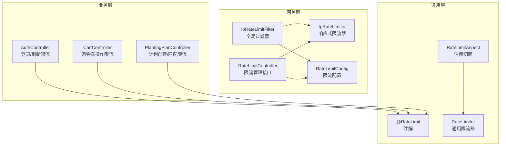
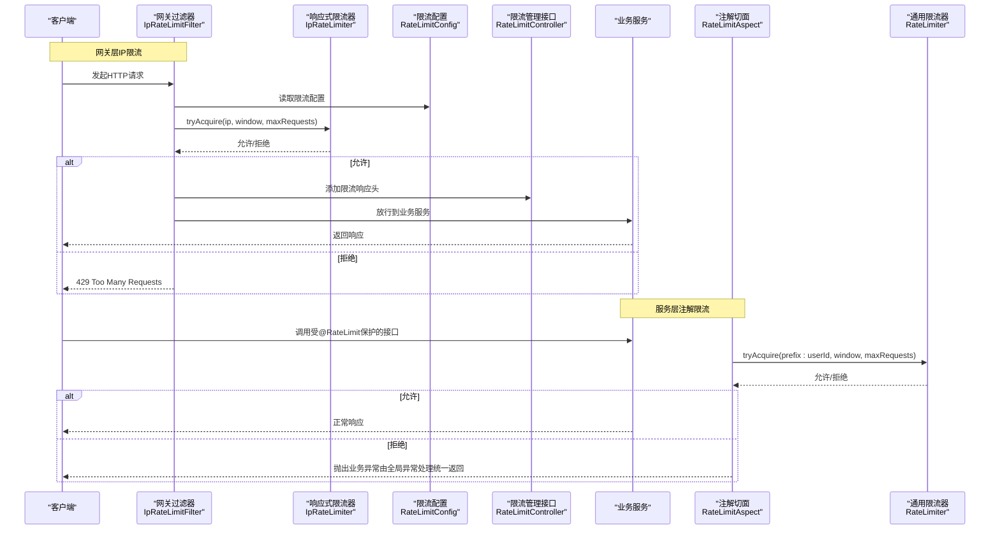
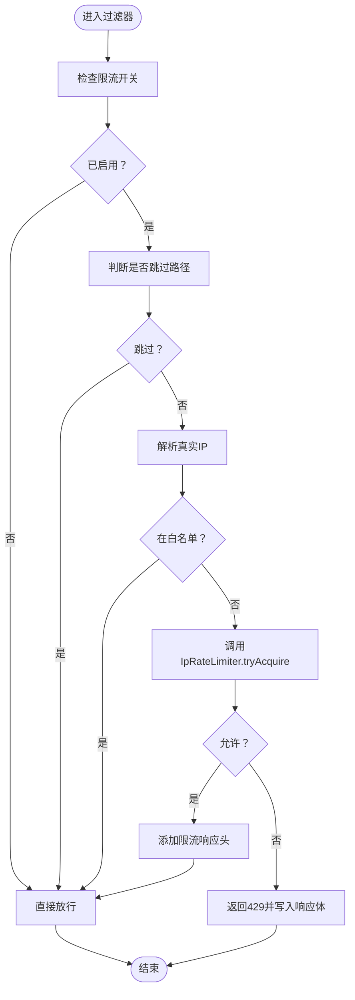
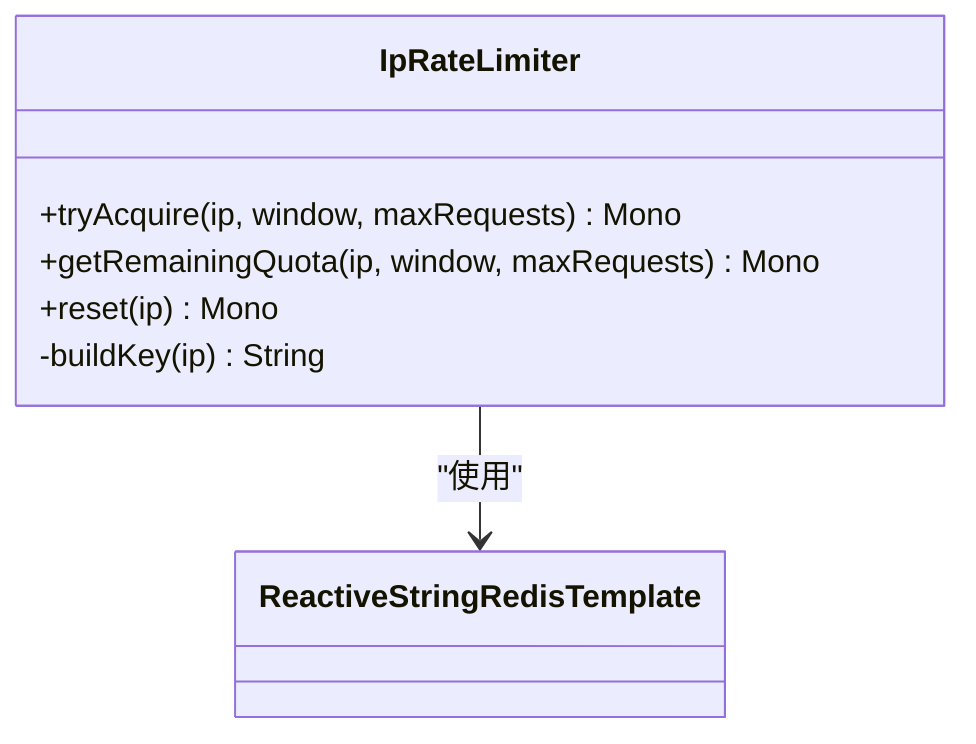
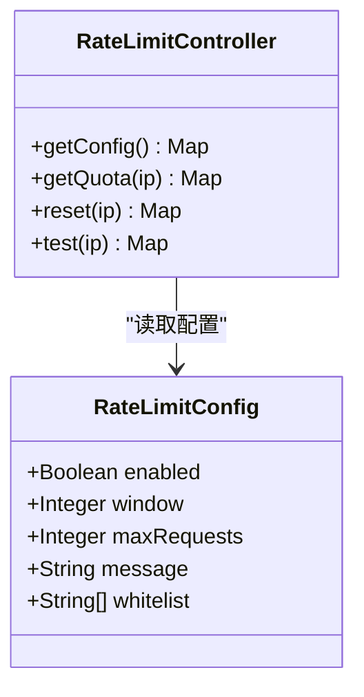
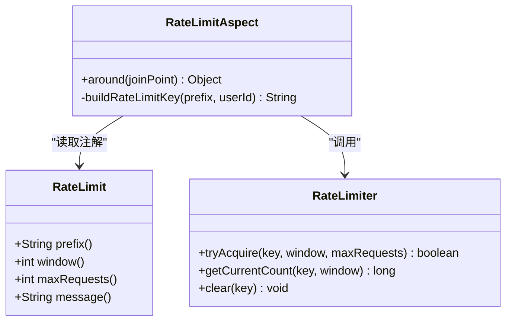
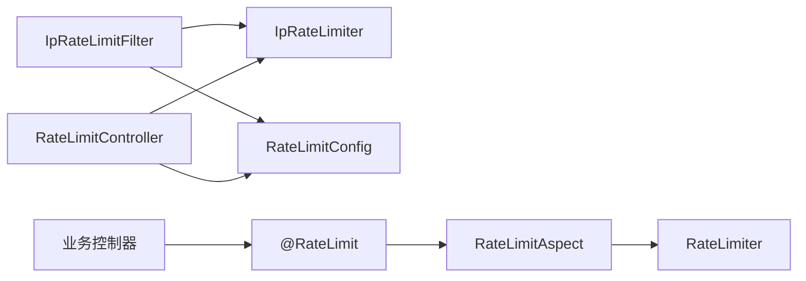

# IP限流机制

<cite>
**本文引用的文件**
- [mall-common/src/main/java/xyh/dp/mall/common/annotation/RateLimit.java](file://mall-common/src/main/java/xyh/dp/mall/common/annotation/RateLimit.java)
- [mall-common/src/main/java/xyh/dp/mall/common/aspect/RateLimitAspect.java](file://mall-common/src/main/java/xyh/dp/mall/common/aspect/RateLimitAspect.java)
- [mall-common/src/main/java/xyh/dp/mall/common/ratelimit/RateLimiter.java](file://mall-common/src/main/java/xyh/dp/mall/common/ratelimit/RateLimiter.java)
- [mall-gateway/src/main/java/xyh/dp/mall/gateway/filter/IpRateLimitFilter.java](file://mall-gateway/src/main/java/xyh/dp/mall/gateway/filter/IpRateLimitFilter.java)
- [mall-gateway/src/main/java/xyh/dp/mall/gateway/ratelimit/IpRateLimiter.java](file://mall-gateway/src/main/java/xyh/dp/mall/gateway/ratelimit/IpRateLimiter.java)
- [mall-gateway/src/main/java/xyh/dp/mall/gateway/config/RateLimitConfig.java](file://mall-gateway/src/main/java/xyh/dp/mall/gateway/config/RateLimitConfig.java)
- [mall-gateway/src/main/java/xyh/dp/mall/gateway/controller/RateLimitController.java](file://mall-gateway/src/main/java/xyh/dp/mall/gateway/controller/RateLimitController.java)
- [mall-auth/src/main/java/xyh/dp/mall/auth/controller/AuthController.java](file://mall-auth/src/main/java/xyh/dp/mall/auth/controller/AuthController.java)
- [mall-trade/src/main/java/xyh/dp/mall/trade/controller/CartController.java](file://mall-trade/src/main/java/xyh/dp/mall/trade/controller/CartController.java)
- [mall-trade/src/main/java/xyh/dp/mall/trade/controller/PlantingPlanController.java](file://mall-trade/src/main/java/xyh/dp/mall/trade/controller/PlantingPlanController.java)
- [mall-common/src/main/java/xyh/dp/mall/common/ratelimit/README.md](file://mall-common/src/main/java/xyh/dp/mall/common/ratelimit/README.md)
</cite>

## 目录
1. [简介](#简介)
2. [项目结构](#项目结构)
3. [核心组件](#核心组件)
4. [架构总览](#架构总览)
5. [详细组件分析](#详细组件分析)
6. [依赖关系分析](#依赖关系分析)
7. [性能与可靠性](#性能与可靠性)
8. [故障排查指南](#故障排查指南)
9. [结论](#结论)
10. [附录](#附录)

## 简介
本文件系统化梳理了仓库中的“IP限流机制”，包括：
- 网关层基于Redis的响应式IP限流（滑动窗口）
- 服务层基于Redis的注解式限流（滑动窗口）
- 配置与管理接口
- 使用示例与最佳实践

目标是帮助读者快速理解限流的设计思路、运行流程、关键参数与调优建议，并能在生产环境中安全落地。

## 项目结构
围绕IP限流的相关模块主要分布在以下位置：
- 网关模块（mall-gateway）：提供全局过滤器、响应式限流器、配置与管理接口
- 通用模块（mall-common）：提供注解、切面与通用限流器
- 业务模块（mall-auth、mall-trade）：通过注解方式对特定接口进行限流

图表来源
- [mall-gateway/src/main/java/xyh/dp/mall/gateway/filter/IpRateLimitFilter.java](file://mall-gateway/src/main/java/xyh/dp/mall/gateway/filter/IpRateLimitFilter.java#L1-L230)
- [mall-gateway/src/main/java/xyh/dp/mall/gateway/ratelimit/IpRateLimiter.java](file://mall-gateway/src/main/java/xyh/dp/mall/gateway/ratelimit/IpRateLimiter.java#L1-L143)
- [mall-gateway/src/main/java/xyh/dp/mall/gateway/config/RateLimitConfig.java](file://mall-gateway/src/main/java/xyh/dp/mall/gateway/config/RateLimitConfig.java#L1-L43)
- [mall-gateway/src/main/java/xyh/dp/mall/gateway/controller/RateLimitController.java](file://mall-gateway/src/main/java/xyh/dp/mall/gateway/controller/RateLimitController.java#L1-L119)
- [mall-common/src/main/java/xyh/dp/mall/common/annotation/RateLimit.java](file://mall-common/src/main/java/xyh/dp/mall/common/annotation/RateLimit.java#L1-L48)
- [mall-common/src/main/java/xyh/dp/mall/common/aspect/RateLimitAspect.java](file://mall-common/src/main/java/xyh/dp/mall/common/aspect/RateLimitAspect.java#L1-L105)
- [mall-common/src/main/java/xyh/dp/mall/common/ratelimit/RateLimiter.java](file://mall-common/src/main/java/xyh/dp/mall/common/ratelimit/RateLimiter.java#L1-L151)
- [mall-auth/src/main/java/xyh/dp/mall/auth/controller/AuthController.java](file://mall-auth/src/main/java/xyh/dp/mall/auth/controller/AuthController.java#L1-L78)
- [mall-trade/src/main/java/xyh/dp/mall/trade/controller/CartController.java](file://mall-trade/src/main/java/xyh/dp/mall/trade/controller/CartController.java#L1-L156)
- [mall-trade/src/main/java/xyh/dp/mall/trade/controller/PlantingPlanController.java](file://mall-trade/src/main/java/xyh/dp/mall/trade/controller/PlantingPlanController.java#L1-L181)

章节来源
- [mall-gateway/src/main/java/xyh/dp/mall/gateway/filter/IpRateLimitFilter.java](file://mall-gateway/src/main/java/xyh/dp/mall/gateway/filter/IpRateLimitFilter.java#L1-L230)
- [mall-gateway/src/main/java/xyh/dp/mall/gateway/ratelimit/IpRateLimiter.java](file://mall-gateway/src/main/java/xyh/dp/mall/gateway/ratelimit/IpRateLimiter.java#L1-L143)
- [mall-gateway/src/main/java/xyh/dp/mall/gateway/config/RateLimitConfig.java](file://mall-gateway/src/main/java/xyh/dp/mall/gateway/config/RateLimitConfig.java#L1-L43)
- [mall-gateway/src/main/java/xyh/dp/mall/gateway/controller/RateLimitController.java](file://mall-gateway/src/main/java/xyh/dp/mall/gateway/controller/RateLimitController.java#L1-L119)
- [mall-common/src/main/java/xyh/dp/mall/common/annotation/RateLimit.java](file://mall-common/src/main/java/xyh/dp/mall/common/annotation/RateLimit.java#L1-L48)
- [mall-common/src/main/java/xyh/dp/mall/common/aspect/RateLimitAspect.java](file://mall-common/src/main/java/xyh/dp/mall/common/aspect/RateLimitAspect.java#L1-L105)
- [mall-common/src/main/java/xyh/dp/mall/common/ratelimit/RateLimiter.java](file://mall-common/src/main/java/xyh/dp/mall/common/ratelimit/RateLimiter.java#L1-L151)
- [mall-auth/src/main/java/xyh/dp/mall/auth/controller/AuthController.java](file://mall-auth/src/main/java/xyh/dp/mall/auth/controller/AuthController.java#L1-L78)
- [mall-trade/src/main/java/xyh/dp/mall/trade/controller/CartController.java](file://mall-trade/src/main/java/xyh/dp/mall/trade/controller/CartController.java#L1-L156)
- [mall-trade/src/main/java/xyh/dp/mall/trade/controller/PlantingPlanController.java](file://mall-trade/src/main/java/xyh/dp/mall/trade/controller/PlantingPlanController.java#L1-L181)

## 核心组件
- 注解与切面（服务层）
  - @RateLimit：标注接口限流参数（前缀、窗口、最大请求数、提示信息）
  - RateLimitAspect：环绕拦截带注解的方法，基于用户ID构建限流key，调用通用限流器执行检查
  - RateLimiter：基于Redis的滑动窗口限流器，使用Lua脚本保证原子性
- 网关过滤器与限流器（网关层）
  - IpRateLimitFilter：全局过滤器，按配置对请求进行IP限流，支持白名单、跳过路径、响应头透传
  - IpRateLimiter：响应式滑动窗口限流器，提供剩余配额查询与重置能力
  - RateLimitConfig：限流配置（开关、窗口、最大请求数、消息、白名单）
  - RateLimitController：限流管理接口（查询配置、查询剩余配额、重置计数、测试）

章节来源
- [mall-common/src/main/java/xyh/dp/mall/common/annotation/RateLimit.java](file://mall-common/src/main/java/xyh/dp/mall/common/annotation/RateLimit.java#L1-L48)
- [mall-common/src/main/java/xyh/dp/mall/common/aspect/RateLimitAspect.java](file://mall-common/src/main/java/xyh/dp/mall/common/aspect/RateLimitAspect.java#L1-L105)
- [mall-common/src/main/java/xyh/dp/mall/common/ratelimit/RateLimiter.java](file://mall-common/src/main/java/xyh/dp/mall/common/ratelimit/RateLimiter.java#L1-L151)
- [mall-gateway/src/main/java/xyh/dp/mall/gateway/filter/IpRateLimitFilter.java](file://mall-gateway/src/main/java/xyh/dp/mall/gateway/filter/IpRateLimitFilter.java#L1-L230)
- [mall-gateway/src/main/java/xyh/dp/mall/gateway/ratelimit/IpRateLimiter.java](file://mall-gateway/src/main/java/xyh/dp/mall/gateway/ratelimit/IpRateLimiter.java#L1-L143)
- [mall-gateway/src/main/java/xyh/dp/mall/gateway/config/RateLimitConfig.java](file://mall-gateway/src/main/java/xyh/dp/mall/gateway/config/RateLimitConfig.java#L1-L43)
- [mall-gateway/src/main/java/xyh/dp/mall/gateway/controller/RateLimitController.java](file://mall-gateway/src/main/java/xyh/dp/mall/gateway/controller/RateLimitController.java#L1-L119)

## 架构总览
下图展示了“IP限流机制”的整体交互流程，涵盖网关层与服务层两条路径。

图表来源
- [mall-gateway/src/main/java/xyh/dp/mall/gateway/filter/IpRateLimitFilter.java](file://mall-gateway/src/main/java/xyh/dp/mall/gateway/filter/IpRateLimitFilter.java#L1-L230)
- [mall-gateway/src/main/java/xyh/dp/mall/gateway/ratelimit/IpRateLimiter.java](file://mall-gateway/src/main/java/xyh/dp/mall/gateway/ratelimit/IpRateLimiter.java#L1-L143)
- [mall-gateway/src/main/java/xyh/dp/mall/gateway/config/RateLimitConfig.java](file://mall-gateway/src/main/java/xyh/dp/mall/gateway/config/RateLimitConfig.java#L1-L43)
- [mall-gateway/src/main/java/xyh/dp/mall/gateway/controller/RateLimitController.java](file://mall-gateway/src/main/java/xyh/dp/mall/gateway/controller/RateLimitController.java#L1-L119)
- [mall-common/src/main/java/xyh/dp/mall/common/aspect/RateLimitAspect.java](file://mall-common/src/main/java/xyh/dp/mall/common/aspect/RateLimitAspect.java#L1-L105)
- [mall-common/src/main/java/xyh/dp/mall/common/ratelimit/RateLimiter.java](file://mall-common/src/main/java/xyh/dp/mall/common/ratelimit/RateLimiter.java#L1-L151)

## 详细组件分析

### 网关层：IpRateLimitFilter
- 职责
  - 全局过滤器，对所有请求进行IP限流
  - 支持配置开关、白名单、跳过路径（如健康检查）
  - 从代理头与远端地址解析真实IP
  - 成功时添加限流相关响应头；触发限流时返回429并携带标准头部
- 关键流程
  - 解析IP -> 白名单校验 -> 配置开关 -> 限流检查 -> 放行或拒绝

图表来源
- [mall-gateway/src/main/java/xyh/dp/mall/gateway/filter/IpRateLimitFilter.java](file://mall-gateway/src/main/java/xyh/dp/mall/gateway/filter/IpRateLimitFilter.java#L1-L230)

章节来源
- [mall-gateway/src/main/java/xyh/dp/mall/gateway/filter/IpRateLimitFilter.java](file://mall-gateway/src/main/java/xyh/dp/mall/gateway/filter/IpRateLimitFilter.java#L1-L230)

### 网关层：IpRateLimiter（响应式）
- 职责
  - 基于Redis的滑动窗口限流（响应式）
  - 提供剩余配额查询与重置能力
  - Lua脚本保证原子性：清理窗口外记录、统计窗口内计数、必要时新增记录并设置过期
- 降级策略
  - Redis异常时默认放行，避免雪崩

图表来源
- [mall-gateway/src/main/java/xyh/dp/mall/gateway/ratelimit/IpRateLimiter.java](file://mall-gateway/src/main/java/xyh/dp/mall/gateway/ratelimit/IpRateLimiter.java#L1-L143)

章节来源
- [mall-gateway/src/main/java/xyh/dp/mall/gateway/ratelimit/IpRateLimiter.java](file://mall-gateway/src/main/java/xyh/dp/mall/gateway/ratelimit/IpRateLimiter.java#L1-L143)

### 网关层：RateLimitConfig 与 RateLimitController
- RateLimitConfig
  - 提供限流开关、窗口、最大请求数、提示信息、白名单等配置
- RateLimitController
  - 提供查询配置、查询剩余配额、重置计数、测试接口的能力

图表来源
- [mall-gateway/src/main/java/xyh/dp/mall/gateway/config/RateLimitConfig.java](file://mall-gateway/src/main/java/xyh/dp/mall/gateway/config/RateLimitConfig.java#L1-L43)
- [mall-gateway/src/main/java/xyh/dp/mall/gateway/controller/RateLimitController.java](file://mall-gateway/src/main/java/xyh/dp/mall/gateway/controller/RateLimitController.java#L1-L119)

章节来源
- [mall-gateway/src/main/java/xyh/dp/mall/gateway/config/RateLimitConfig.java](file://mall-gateway/src/main/java/xyh/dp/mall/gateway/config/RateLimitConfig.java#L1-L43)
- [mall-gateway/src/main/java/xyh/dp/mall/gateway/controller/RateLimitController.java](file://mall-gateway/src/main/java/xyh/dp/mall/gateway/controller/RateLimitController.java#L1-L119)

### 服务层：@RateLimit 注解与 RateLimitAspect
- @RateLimit
  - prefix：限流key前缀（最终key为 prefix:userId ）
  - window：时间窗口（秒）
  - maxRequests：窗口内最大请求数
  - message：限流提示信息
- RateLimitAspect
  - 从用户上下文获取userId，构建key
  - 调用通用限流器执行检查
  - 超限时抛出业务异常，由全局异常处理统一返回

图表来源
- [mall-common/src/main/java/xyh/dp/mall/common/annotation/RateLimit.java](file://mall-common/src/main/java/xyh/dp/mall/common/annotation/RateLimit.java#L1-L48)
- [mall-common/src/main/java/xyh/dp/mall/common/aspect/RateLimitAspect.java](file://mall-common/src/main/java/xyh/dp/mall/common/aspect/RateLimitAspect.java#L1-L105)
- [mall-common/src/main/java/xyh/dp/mall/common/ratelimit/RateLimiter.java](file://mall-common/src/main/java/xyh/dp/mall/common/ratelimit/RateLimiter.java#L1-L151)

章节来源
- [mall-common/src/main/java/xyh/dp/mall/common/annotation/RateLimit.java](file://mall-common/src/main/java/xyh/dp/mall/common/annotation/RateLimit.java#L1-L48)
- [mall-common/src/main/java/xyh/dp/mall/common/aspect/RateLimitAspect.java](file://mall-common/src/main/java/xyh/dp/mall/common/aspect/RateLimitAspect.java#L1-L105)
- [mall-common/src/main/java/xyh/dp/mall/common/ratelimit/RateLimiter.java](file://mall-common/src/main/java/xyh/dp/mall/common/ratelimit/RateLimiter.java#L1-L151)

### 服务层：通用限流器 RateLimiter（非响应式）
- 基于Redis ZSET实现滑动窗口
- Lua脚本原子性保障：清理过期、统计计数、必要时新增记录并设置过期
- 提供当前计数查询与清空能力
- Redis异常时降级为允许访问

章节来源
- [mall-common/src/main/java/xyh/dp/mall/common/ratelimit/RateLimiter.java](file://mall-common/src/main/java/xyh/dp/mall/common/ratelimit/RateLimiter.java#L1-L151)

### 使用示例（业务层）
- 认证模块
  - 登录接口与Token刷新接口均使用@RateLimit进行限流
- 购物车模块
  - 添加购物车、更新数量等高频操作使用@RateLimit进行限流
- 种植计划模块
  - 创建计划、执行匹配等操作使用@RateLimit进行限流

章节来源
- [mall-auth/src/main/java/xyh/dp/mall/auth/controller/AuthController.java](file://mall-auth/src/main/java/xyh/dp/mall/auth/controller/AuthController.java#L1-L78)
- [mall-trade/src/main/java/xyh/dp/mall/trade/controller/CartController.java](file://mall-trade/src/main/java/xyh/dp/mall/trade/controller/CartController.java#L1-L156)
- [mall-trade/src/main/java/xyh/dp/mall/trade/controller/PlantingPlanController.java](file://mall-trade/src/main/java/xyh/dp/mall/trade/controller/PlantingPlanController.java#L1-L181)

## 依赖关系分析
- 组件耦合
  - IpRateLimitFilter 依赖 IpRateLimiter 与 RateLimitConfig
  - RateLimitController 依赖 IpRateLimiter 与 RateLimitConfig
  - RateLimitAspect 依赖 RateLimiter 与用户上下文
  - 业务控制器依赖注解与切面
- 外部依赖
  - Redis（ZSET + Lua脚本）
  - Spring Cloud Gateway（全局过滤器）
  - Spring AOP（注解切面）

图表来源
- [mall-gateway/src/main/java/xyh/dp/mall/gateway/filter/IpRateLimitFilter.java](file://mall-gateway/src/main/java/xyh/dp/mall/gateway/filter/IpRateLimitFilter.java#L1-L230)
- [mall-gateway/src/main/java/xyh/dp/mall/gateway/ratelimit/IpRateLimiter.java](file://mall-gateway/src/main/java/xyh/dp/mall/gateway/ratelimit/IpRateLimiter.java#L1-L143)
- [mall-gateway/src/main/java/xyh/dp/mall/gateway/config/RateLimitConfig.java](file://mall-gateway/src/main/java/xyh/dp/mall/gateway/config/RateLimitConfig.java#L1-L43)
- [mall-gateway/src/main/java/xyh/dp/mall/gateway/controller/RateLimitController.java](file://mall-gateway/src/main/java/xyh/dp/mall/gateway/controller/RateLimitController.java#L1-L119)
- [mall-common/src/main/java/xyh/dp/mall/common/aspect/RateLimitAspect.java](file://mall-common/src/main/java/xyh/dp/mall/common/aspect/RateLimitAspect.java#L1-L105)
- [mall-common/src/main/java/xyh/dp/mall/common/ratelimit/RateLimiter.java](file://mall-common/src/main/java/xyh/dp/mall/common/ratelimit/RateLimiter.java#L1-L151)

## 性能与可靠性
- 性能特性
  - 滑动窗口基于Redis ZSET，时间复杂度低，适合高并发场景
  - Lua脚本原子性保障，避免竞态条件
  - 网关层采用响应式实现，非阻塞处理
- 可靠性保障
  - Redis异常时网关层默认放行，避免雪崩
  - 服务层注解限流在Redis异常时降级为允许访问
- 参数建议
  - 窗口与最大请求数需结合业务流量与Redis容量评估
  - 对热点接口可适当降低maxRequests或缩短window
  - 合理设置白名单，避免误伤内部监控与运维

[本节为通用指导，无需列出具体文件来源]

## 故障排查指南
- 网关层429过多
  - 检查限流开关、窗口与最大请求数配置
  - 排查是否命中白名单
  - 查看限流响应头（X-RateLimit-Limit、X-RateLimit-Remaining、X-RateLimit-Window、Retry-After）
  - 使用管理接口查询剩余配额与重置计数
- 服务层注解限流未生效
  - 确认方法上已标注@RateLimit
  - 确认用户已登录（注解限流依赖用户ID构建key）
  - 检查切面是否启用（AOP）
- Redis异常
  - 观察日志中降级放行记录
  - 临时提高maxRequests或延长window以缓解压力
- 管理与诊断
  - 使用管理接口查询配置、剩余配额、重置计数、测试接口

章节来源
- [mall-gateway/src/main/java/xyh/dp/mall/gateway/filter/IpRateLimitFilter.java](file://mall-gateway/src/main/java/xyh/dp/mall/gateway/filter/IpRateLimitFilter.java#L1-L230)
- [mall-gateway/src/main/java/xyh/dp/mall/gateway/controller/RateLimitController.java](file://mall-gateway/src/main/java/xyh/dp/mall/gateway/controller/RateLimitController.java#L1-L119)
- [mall-common/src/main/java/xyh/dp/mall/common/aspect/RateLimitAspect.java](file://mall-common/src/main/java/xyh/dp/mall/common/aspect/RateLimitAspect.java#L1-L105)
- [mall-common/src/main/java/xyh/dp/mall/common/ratelimit/RateLimiter.java](file://mall-common/src/main/java/xyh/dp/mall/common/ratelimit/RateLimiter.java#L1-L151)

## 结论
本项目提供了两套完善的限流方案：
- 网关层：面向全站的IP级限流，具备白名单、跳过路径、响应头透传与管理接口
- 服务层：面向接口的注解限流，基于用户维度进行精细化控制

两者配合可有效抵御恶意刷量与突发流量冲击，同时通过降级策略提升系统韧性。建议在生产环境结合业务特征合理配置窗口与阈值，并持续监控限流命中率与Redis负载。

[本节为总结性内容，无需列出具体文件来源]

## 附录
- 快速参考
  - @RateLimit参数：prefix、window、maxRequests、message
  - 网关配置：enabled、window、maxRequests、message、whitelist
  - 管理接口：GET /gateway/ratelimit/config、GET /gateway/ratelimit/quota/{ip}、DELETE /gateway/ratelimit/reset/{ip}、GET /gateway/ratelimit/test/{ip}

章节来源
- [mall-common/src/main/java/xyh/dp/mall/common/annotation/RateLimit.java](file://mall-common/src/main/java/xyh/dp/mall/common/annotation/RateLimit.java#L1-L48)
- [mall-gateway/src/main/java/xyh/dp/mall/gateway/config/RateLimitConfig.java](file://mall-gateway/src/main/java/xyh/dp/mall/gateway/config/RateLimitConfig.java#L1-L43)
- [mall-gateway/src/main/java/xyh/dp/mall/gateway/controller/RateLimitController.java](file://mall-gateway/src/main/java/xyh/dp/mall/gateway/controller/RateLimitController.java#L1-L119)
- [mall-common/src/main/java/xyh/dp/mall/common/ratelimit/README.md](file://mall-common/src/main/java/xyh/dp/mall/common/ratelimit/README.md#L1-L55)