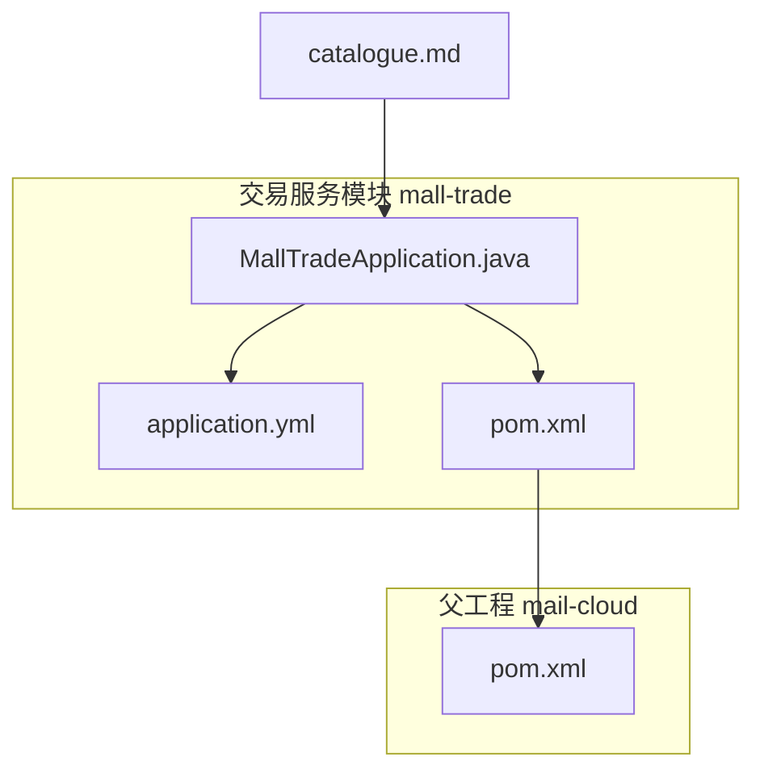
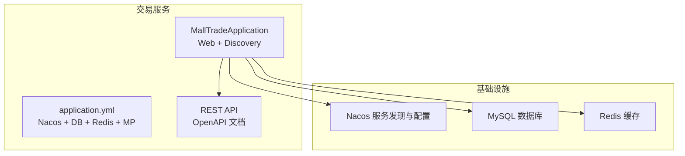
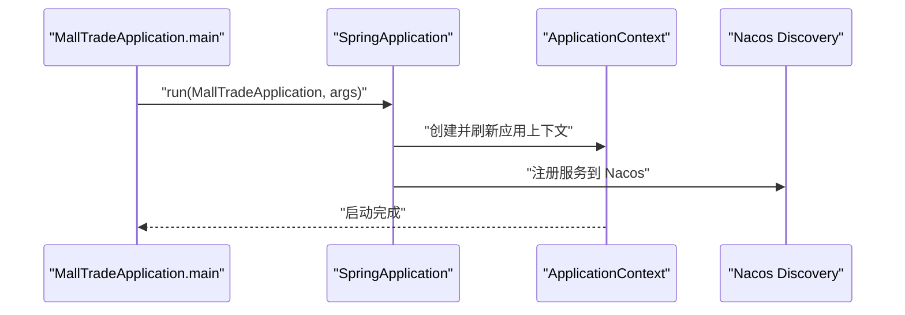
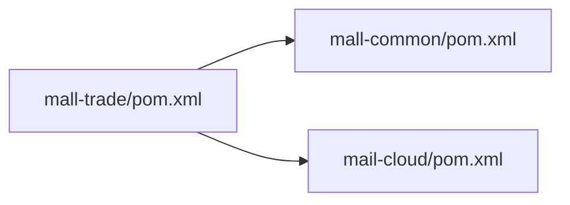
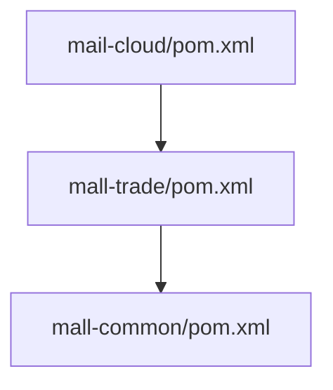

# 交易服务

<cite>
**本文引用的文件列表**
- [MallTradeApplication.java](file://mall-trade/src/main/java/xyh/dp/mall/trade/MallTradeApplication.java)
- [application.yml](file://mall-trade/src/main/resources/application.yml)
- [pom.xml](file://mall-trade/pom.xml)
- [catalogue.md](file://catalogue.md)
- [pom.xml](file://pom.xml)
</cite>

## 目录
1. [引言](#引言)
2. [项目结构](#项目结构)
3. [核心组件](#核心组件)
4. [架构总览](#架构总览)
5. [详细组件分析](#详细组件分析)
6. [依赖分析](#依赖分析)
7. [性能考虑](#性能考虑)
8. [故障排查指南](#故障排查指南)
9. [结论](#结论)
10. [附录](#附录)

## 引言
本文件围绕 mall-cloud 中的交易服务模块进行深入剖析，目标是帮助读者理解交易服务在微服务体系中的定位、启动入口、基础配置与潜在扩展点。根据现有仓库内容，交易服务模块目前仅包含启动类与基础配置，未包含具体业务实现（如购物车、订单、支付回调等）。本文将基于启动类与配置文件，结合整体工程结构与依赖，给出可落地的实现建议与最佳实践，帮助读者在该基础上快速扩展购物车、订单、支付回调等核心功能。

## 项目结构
交易服务模块位于 mall-trade 目录下，采用标准 Spring Boot 多模块工程组织：
- 启动类：MallTradeApplication.java
- 配置文件：application.yml
- 依赖声明：pom.xml

从根 pom.xml 可知，该工程为聚合工程，包含多个子模块，交易服务模块继承父工程的统一依赖与插件配置，具备 Web、Nacos 发现与配置、MyBatis-Plus、Redis、OpenAPI 等能力。

图表来源
- [MallTradeApplication.java](file://mall-trade/src/main/java/xyh/dp/mall/trade/MallTradeApplication.java#L1-L26)
- [application.yml](file://mall-trade/src/main/resources/application.yml#L1-L35)
- [pom.xml](file://mall-trade/pom.xml#L1-L28)
- [pom.xml](file://pom.xml#L1-L223)
- [catalogue.md](file://catalogue.md#L1-L13)

章节来源
- [MallTradeApplication.java](file://mall-trade/src/main/java/xyh/dp/mall/trade/MallTradeApplication.java#L1-L26)
- [application.yml](file://mall-trade/src/main/resources/application.yml#L1-L35)
- [pom.xml](file://mall-trade/pom.xml#L1-L28)
- [pom.xml](file://pom.xml#L1-L223)
- [catalogue.md](file://catalogue.md#L1-L13)

## 核心组件
- 启动类：负责应用上下文初始化、启用服务发现与自动装配。
- 配置文件：定义服务名称、注册中心地址、数据库连接、Redis 连接、MyBatis-Plus 映射与日志级别等。
- 依赖管理：继承父工程，引入 Web、Nacos、MySQL、MyBatis-Plus、Redis、JWT、Fastjson2、OpenAPI 等依赖。

章节来源
- [MallTradeApplication.java](file://mall-trade/src/main/java/xyh/dp/mall/trade/MallTradeApplication.java#L1-L26)
- [application.yml](file://mall-trade/src/main/resources/application.yml#L1-L35)
- [pom.xml](file://pom.xml#L55-L171)

## 架构总览
交易服务作为微服务之一，运行在 Spring Cloud 生态中，通过 Nacos 实现服务注册与配置拉取；持久层使用 MyBatis-Plus；缓存使用 Redis；对外提供 REST 接口并通过 OpenAPI 文档化。

图表来源
- [MallTradeApplication.java](file://mall-trade/src/main/java/xyh/dp/mall/trade/MallTradeApplication.java#L1-L26)
- [application.yml](file://mall-trade/src/main/resources/application.yml#L1-L35)
- [pom.xml](file://pom.xml#L55-L171)

## 详细组件分析

### 启动类分析
- 职责：应用启动入口，启用 Spring Boot 自动装配与服务发现。
- 关键注解：SpringBootApplication、EnableDiscoveryClient。
- 启动流程：通过 SpringApplication.run 启动应用上下文。

图表来源
- [MallTradeApplication.java](file://mall-trade/src/main/java/xyh/dp/mall/trade/MallTradeApplication.java#L1-L26)

章节来源
- [MallTradeApplication.java](file://mall-trade/src/main/java/xyh/dp/mall/trade/MallTradeApplication.java#L1-L26)

### 配置文件分析
- 服务与注册中心：spring.application.name、cloud.nacos.discovery.server-addr、cloud.nacos.config.server-addr。
- 数据源：driver-class-name、url、username、password。
- Redis：host、port、database。
- MyBatis-Plus：mapper-locations、type-aliases-package、map-underscore-to-camel-case、log-impl。
- 服务器端口：server.port。
- 日志级别：logging.level.xyh.dp.mall。

章节来源
- [application.yml](file://mall-trade/src/main/resources/application.yml#L1-L35)

### 依赖与模块关系
- 交易服务模块依赖 mall-common，体现模块化设计。
- 父工程统一管理 Spring Cloud、Spring Cloud Alibaba、MyBatis-Plus、JWT、Fastjson2 等版本。
- 交易服务模块自身引入 mall-common 依赖。

图表来源
- [pom.xml](file://mall-trade/pom.xml#L1-L28)
- [pom.xml](file://pom.xml#L1-L223)

章节来源
- [pom.xml](file://mall-trade/pom.xml#L1-L28)
- [pom.xml](file://pom.xml#L1-L223)

## 依赖分析
- 继承关系：交易服务模块继承父工程，获得统一依赖与版本管理。
- 直接依赖：mall-common（工具与通用模型）、Web、Nacos、MySQL、MyBatis-Plus、Redis、JWT、Fastjson2、OpenAPI。
- 间接依赖：由父工程统一管理的 Spring Cloud 与 Spring Cloud Alibaba 版本。

图表来源
- [pom.xml](file://pom.xml#L1-L223)
- [pom.xml](file://mall-trade/pom.xml#L1-L28)

章节来源
- [pom.xml](file://pom.xml#L1-L223)
- [pom.xml](file://mall-trade/pom.xml#L1-L28)

## 性能考虑
- 数据访问：MyBatis-Plus 默认日志实现已配置，建议在生产环境关闭或调整日志级别以降低开销。
- 缓存策略：Redis 已接入，建议对热点数据（如购物车、订单状态）进行缓存，避免频繁读写数据库。
- 并发与限流：在网关或服务层增加限流与熔断策略，防止突发流量导致系统抖动。
- 数据库优化：合理设置连接池大小、索引与查询计划，避免慢查询影响整体性能。

## 故障排查指南
- 服务无法注册到 Nacos：检查 spring.cloud.nacos.discovery.server-addr 是否正确，确认 Nacos 服务可用。
- 数据库连接失败：核对 application.yml 中的 driver-class-name、url、username、password。
- Redis 连接异常：核对 host、port、database 配置是否与实际一致。
- 日志级别过高：适当调整 logging.level.xyh.dp.mall，避免过多调试信息影响性能。
- OpenAPI 文档不可见：确认已引入 springdoc-openapi-starter-webmvc-ui 依赖并在启动类所在包路径下扫描。

章节来源
- [application.yml](file://mall-trade/src/main/resources/application.yml#L1-L35)
- [pom.xml](file://pom.xml#L55-L171)

## 结论
当前仓库中的交易服务模块提供了启动入口与基础配置，尚未包含购物车、订单、支付回调等具体业务实现。基于现有依赖与配置，可在该模块中快速扩展业务功能，结合 Nacos、MySQL、Redis、MyBatis-Plus 等基础设施，构建高可用的交易系统。后续建议补充实体模型、Mapper、Service、Controller 层，并完善订单状态机、支付回调处理、库存一致性保障与定时任务等核心能力。

## 附录

### 基于现有配置的支付系统集成建议
- 支付系统对接：可在交易服务中引入支付 SDK（如微信支付），结合 application.yml 的 Nacos 配置中心进行密钥与回调地址的动态配置。
- 回调处理：提供独立的回调接口，接收支付平台异步通知后，校验签名与金额，更新订单状态并落库。
- 幂等与一致性：通过幂等键与数据库唯一约束保证重复回调不产生重复入账；必要时引入消息队列或本地事务表确保订单与库存的一致性。

章节来源
- [application.yml](file://mall-trade/src/main/resources/application.yml#L1-L35)
- [pom.xml](file://pom.xml#L55-L171)

### 下单接口调用示例（概念性说明）
- 请求方法：POST
- 路径：/trade/order/create
- 请求体字段：用户标识、收货地址、商品清单、优惠券、支付方式等
- 返回值：订单号、应付金额、支付链接或二维码
- 注意事项：请求前需完成用户鉴权与参数校验；对库存进行预扣减或冻结，避免超卖

章节来源
- [MallTradeApplication.java](file://mall-trade/src/main/java/xyh/dp/mall/trade/MallTradeApplication.java#L1-L26)

### 订单状态机设计（概念性说明）
- 状态集合：待支付、已支付、已发货、已完成、已取消
- 触发事件：提交订单、支付成功、发货、确认收货、取消订单
- 状态流转：待支付 -> 已支付 -> 已发货 -> 已完成；待支付 -> 已取消
- 异常处理：超时未支付自动取消；重复支付幂等处理；库存不足回滚

章节来源
- [MallTradeApplication.java](file://mall-trade/src/main/java/xyh/dp/mall/trade/MallTradeApplication.java#L1-L26)

### 超时订单与重复支付处理（概念性说明）
- 超时订单：定时任务扫描待支付订单，超过设定时间自动取消并释放库存
- 重复支付：回调接口中通过幂等键与数据库唯一约束去重，避免重复入账
- 一致性保障：采用最终一致性方案，先写订单与库存冻结，再异步扣减库存与发送消息

章节来源
- [MallTradeApplication.java](file://mall-trade/src/main/java/xyh/dp/mall/trade/MallTradeApplication.java#L1-L26)