# 混合匹配引擎

<cite>
**本文档引用文件**   
- [MLHybridMatchService.java](file://mall-trade\src\main\java\xyh\dp\mall\trade\matching\engine\MLHybridMatchService.java)
- [MatchFeatureExtractor.java](file://mall-trade\src\main\java\xyh\dp\mall\trade\matching\engine\MatchFeatureExtractor.java)
- [MatchScoreCalculator.java](file://mall-trade\src\main\java\xyh\dp\mall\trade\matching\engine\MatchScoreCalculator.java)
- [MatchFeature.java](file://mall-trade\src\main\java\xyh\dp\mall\trade\matching\feature\MatchFeature.java)
- [FeatureWeight.java](file://mall-trade\src\main\java\xyh\dp\mall\trade\matching\feature\FeatureWeight.java)
- [RegionClimateData.java](file://mall-trade\src\main\java\xyh\dp\mall\trade\matching\feature\RegionClimateData.java)
- [AsyncMatchService.java](file://mall-trade\src\main\java\xyh\dp\mall\trade\matching\async\AsyncMatchService.java)
- [MatchTask.java](file://mall-trade\src\main\java\xyh\dp\mall\trade\matching\async\MatchTask.java)
- [MatchResult.java](file://mall-trade\src\main\java\xyh\dp\mall\trade\matching\async\MatchResult.java)
- [MatchTaskStore.java](file://mall-trade\src\main\java\xyh\dp\mall\trade\matching\async\MatchTaskStore.java)
- [predict_api.py](file://ml-model\predict_api.py)
- [MatchController.java](file://mall-trade\src\main\java\xyh\dp\mall\trade\controller\MatchController.java)
</cite>

## 目录
1. [简介](#简介)
2. [项目结构](#项目结构)
3. [核心组件](#核心组件)
4. [架构概述](#架构概述)
5. [详细组件分析](#详细组件分析)
6. [依赖分析](#依赖分析)
7. [性能考虑](#性能考虑)
8. [故障排除指南](#故障排除指南)
9. [结论](#结论)

## 简介
混合匹配引擎是农业供销平台的核心功能模块，旨在通过智能算法为农户提供最优的种子商品推荐。该系统结合了规则引擎和机器学习模型，实现了基于种植计划与商品信息的多维度智能匹配。系统支持异步处理大规模匹配任务，并具备高可用性和可扩展性。

## 项目结构
混合匹配引擎主要位于`mall-trade`微服务的`matching`包下，采用分层架构设计，包含引擎层、特征层、异步处理层和控制器层。系统通过Nacos进行配置管理，利用Redis实现任务队列和状态存储，与Python机器学习模型通过REST API进行通信。

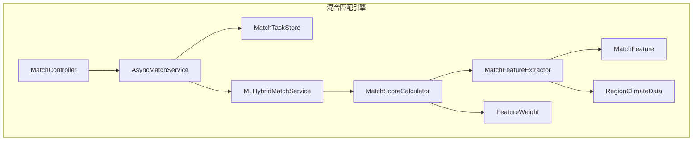

**图表来源**
- [MLHybridMatchService.java](file://mall-trade\src\main\java\xyh\dp\mall\trade\matching\engine\MLHybridMatchService.java)
- [MatchFeatureExtractor.java](file://mall-trade\src\main\java\xyh\dp\mall\trade\matching\engine\MatchFeatureExtractor.java)
- [MatchScoreCalculator.java](file://mall-trade\src\main\java\xyh\dp\mall\trade\matching\engine\MatchScoreCalculator.java)
- [MatchFeature.java](file://mall-trade\src\main\java\xyh\dp\mall\trade\matching\feature\MatchFeature.java)
- [FeatureWeight.java](file://mall-trade\src\main\java\xyh\dp\mall\trade\matching\feature\FeatureWeight.java)
- [RegionClimateData.java](file://mall-trade\src\main\java\xyh\dp\mall\trade\matching\feature\RegionClimateData.java)
- [AsyncMatchService.java](file://mall-trade\src\main\java\xyh\dp\mall\trade\matching\async\AsyncMatchService.java)
- [MatchTaskStore.java](file://mall-trade\src\main\java\xyh\dp\mall\trade\matching\async\MatchTaskStore.java)
- [MatchController.java](file://mall-trade\src\main\java\xyh\dp\mall\trade\controller\MatchController.java)

**章节来源**
- [MLHybridMatchService.java](file://mall-trade\src\main\java\xyh\dp\mall\trade\matching\engine\MLHybridMatchService.java)
- [MatchFeatureExtractor.java](file://mall-trade\src\main\java\xyh\dp\mall\trade\matching\engine\MatchFeatureExtractor.java)
- [MatchScoreCalculator.java](file://mall-trade\src\main\java\xyh\dp\mall\trade\matching\engine\MatchScoreCalculator.java)

## 核心组件
混合匹配引擎的核心组件包括混合匹配服务、特征提取器、评分计算器、特征权重配置和区域气候数据。这些组件协同工作，实现了从种植计划和商品信息中提取特征、计算匹配得分、生成推荐结果的完整流程。

**章节来源**
- [MLHybridMatchService.java](file://mall-trade\src\main\java\xyh\dp\mall\trade\matching\engine\MLHybridMatchService.java)
- [MatchFeatureExtractor.java](file://mall-trade\src\main\java\xyh\dp\mall\trade\matching\engine\MatchFeatureExtractor.java)
- [MatchScoreCalculator.java](file://mall-trade\src\main\java\xyh\dp\mall\trade\matching\engine\MatchScoreCalculator.java)
- [FeatureWeight.java](file://mall-trade\src\main\java\xyh\dp\mall\trade\matching\feature\FeatureWeight.java)
- [RegionClimateData.java](file://mall-trade\src\main\java\xyh\dp\mall\trade\matching\feature\RegionClimateData.java)

## 架构概述
混合匹配引擎采用混合架构，结合了规则引擎和机器学习模型的优势。系统通过异步处理机制支持大规模匹配任务，确保了高并发场景下的性能和稳定性。整体架构分为四个层次：接口层、异步处理层、匹配引擎层和数据层。

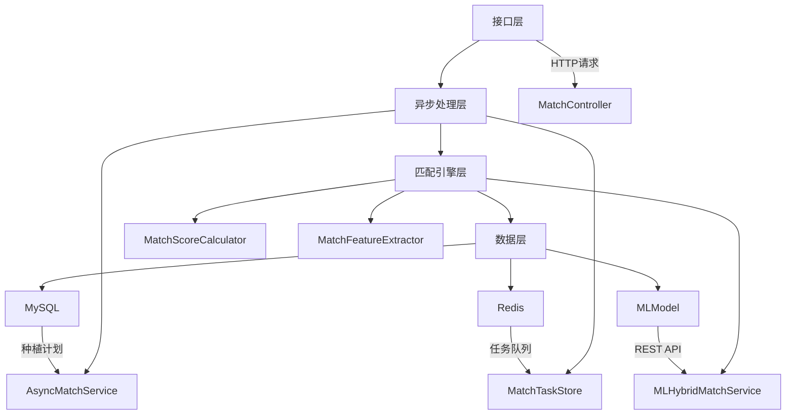

**图表来源**
- [MatchController.java](file://mall-trade\src\main\java\xyh\dp\mall\trade\controller\MatchController.java)
- [AsyncMatchService.java](file://mall-trade\src\main\java\xyh\dp\mall\trade\matching\async\AsyncMatchService.java)
- [MatchTaskStore.java](file://mall-trade\src\main\java\xyh\dp\mall\trade\matching\async\MatchTaskStore.java)
- [MLHybridMatchService.java](file://mall-trade\src\main\java\xyh\dp\mall\trade\matching\engine\MLHybridMatchService.java)
- [MatchScoreCalculator.java](file://mall-trade\src\main\java\xyh\dp\mall\trade\matching\engine\MatchScoreCalculator.java)
- [MatchFeatureExtractor.java](file://mall-trade\src\main\java\xyh\dp\mall\trade\matching\engine\MatchFeatureExtractor.java)

## 详细组件分析

### 混合匹配服务分析
混合匹配服务是整个引擎的核心，负责协调规则引擎和机器学习模型的工作。该服务实现了智能降级机制，当机器学习模型不可用时自动切换到规则引擎，确保了系统的高可用性。

#### 混合匹配服务类图
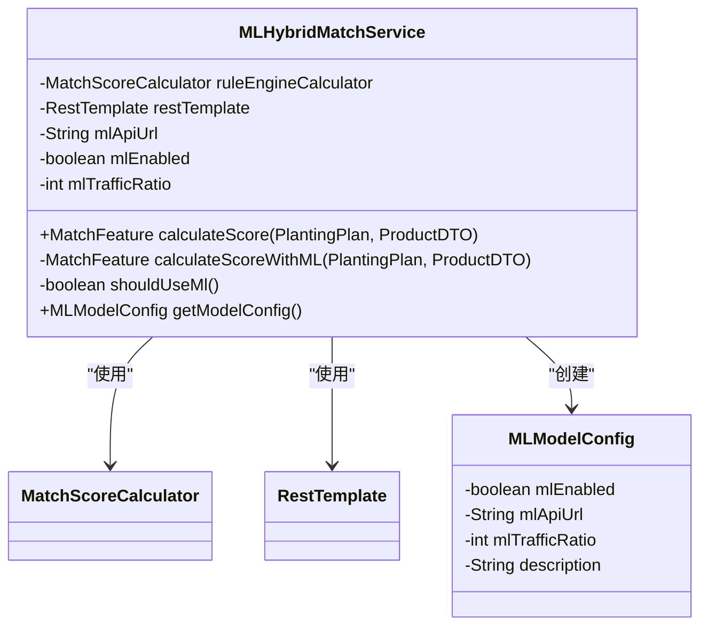

**图表来源**
- [MLHybridMatchService.java](file://mall-trade\src\main\java\xyh\dp\mall\trade\matching\engine\MLHybridMatchService.java)

#### 混合匹配服务流程图
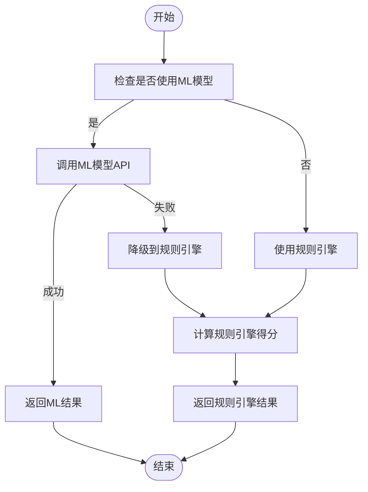

**图表来源**
- [MLHybridMatchService.java](file://mall-trade\src\main\java\xyh\dp\mall\trade\matching\engine\MLHybridMatchService.java)

**章节来源**
- [MLHybridMatchService.java](file://mall-trade\src\main\java\xyh\dp\mall\trade\matching\engine\MLHybridMatchService.java)

### 特征提取器分析
特征提取器负责从种植计划和商品信息中提取六个维度的匹配特征，包括品种一致性、区域适配、气候匹配、季节匹配、种子质量和供需意图匹配。

#### 特征提取器类图
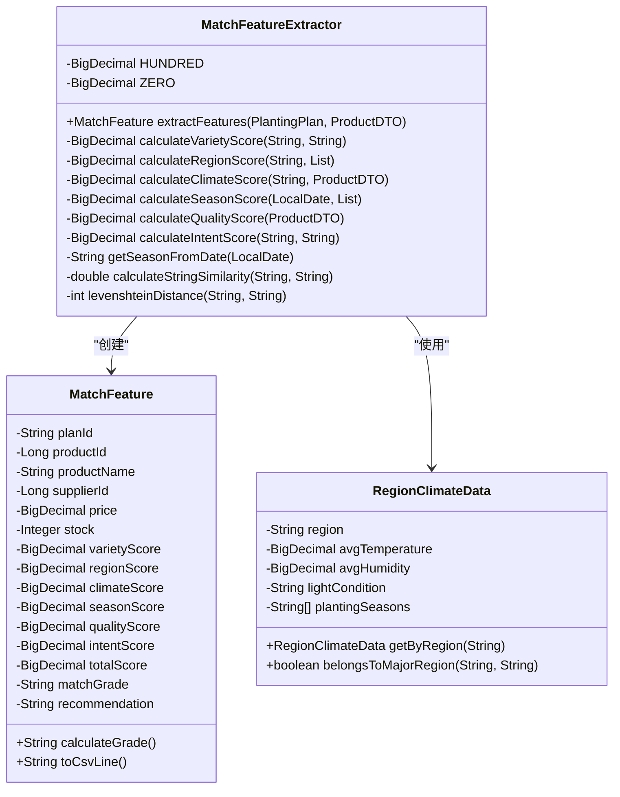

**图表来源**
- [MatchFeatureExtractor.java](file://mall-trade\src\main\java\xyh\dp\mall\trade\matching\engine\MatchFeatureExtractor.java)
- [MatchFeature.java](file://mall-trade\src\main\java\xyh\dp\mall\trade\matching\feature\MatchFeature.java)
- [RegionClimateData.java](file://mall-trade\src\main\java\xyh\dp\mall\trade\matching\feature\RegionClimateData.java)

#### 特征提取流程图
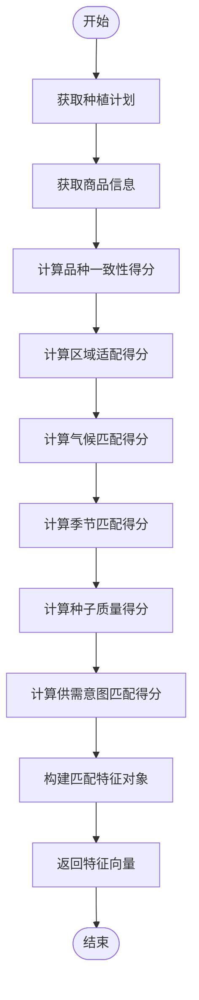

**图表来源**
- [MatchFeatureExtractor.java](file://mall-trade\src\main\java\xyh\dp\mall\trade\matching\engine\MatchFeatureExtractor.java)

**章节来源**
- [MatchFeatureExtractor.java](file://mall-trade\src\main\java\xyh\dp\mall\trade\matching\engine\MatchFeatureExtractor.java)
- [MatchFeature.java](file://mall-trade\src\main\java\xyh\dp\mall\trade\matching\feature\MatchFeature.java)
- [RegionClimateData.java](file://mall-trade\src\main\java\xyh\dp\mall\trade\matching\feature\RegionClimateData.java)

### 评分计算器分析
评分计算器基于特征提取器的结果，通过加权计算生成综合匹配得分。该组件实现了硬性约束过滤机制，确保不满足基本条件的匹配直接被排除。

#### 评分计算器类图
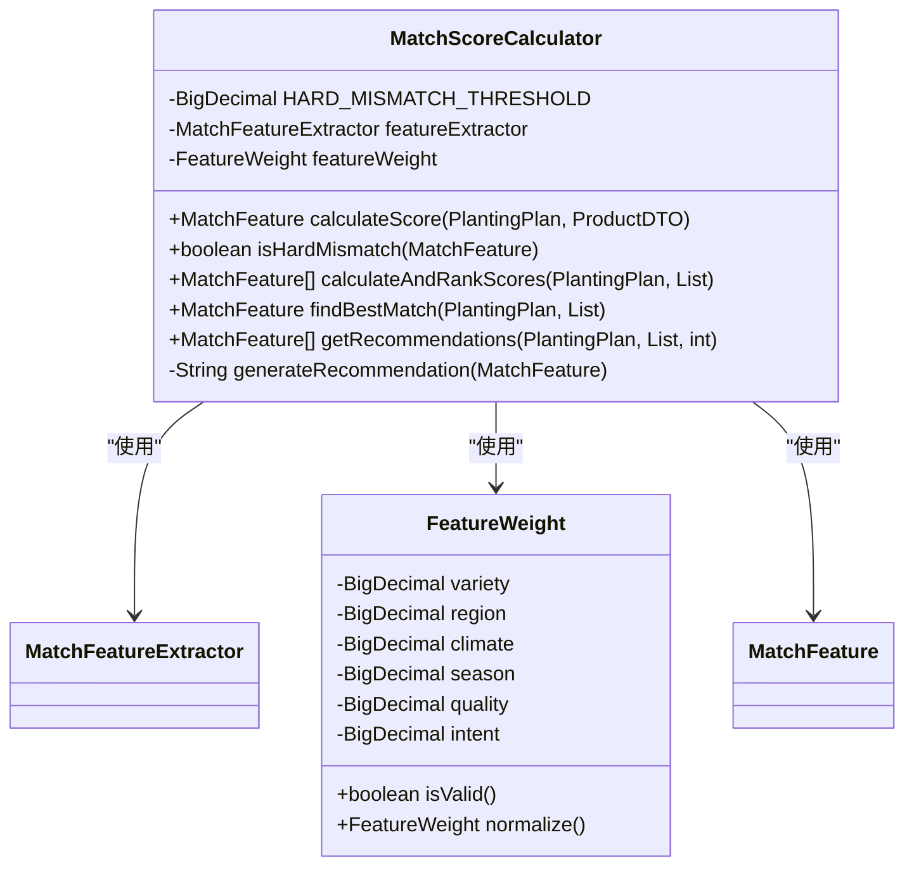

**图表来源**
- [MatchScoreCalculator.java](file://mall-trade\src\main\java\xyh\dp\mall\trade\matching\engine\MatchScoreCalculator.java)
- [FeatureWeight.java](file://mall-trade\src\main\java\xyh\dp\mall\trade\matching\feature\FeatureWeight.java)
- [MatchFeature.java](file://mall-trade\src\main\java\xyh\dp\mall\trade\matching\feature\MatchFeature.java)

#### 评分计算流程图
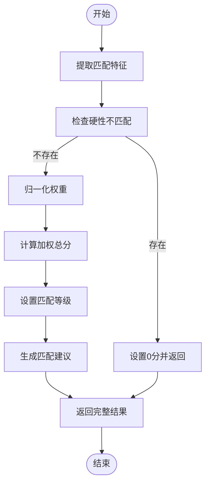

**图表来源**
- [MatchScoreCalculator.java](file://mall-trade\src\main\java\xyh\dp\mall\trade\matching\engine\MatchScoreCalculator.java)

**章节来源**
- [MatchScoreCalculator.java](file://mall-trade\src\main\java\xyh\dp\mall\trade\matching\engine\MatchScoreCalculator.java)
- [FeatureWeight.java](file://mall-trade\src\main\java\xyh\dp\mall\trade\matching\feature\FeatureWeight.java)

### 异步匹配服务分析
异步匹配服务处理大规模匹配任务，通过任务队列机制实现异步处理，避免阻塞主线程，提高系统响应速度。

#### 异步匹配服务类图
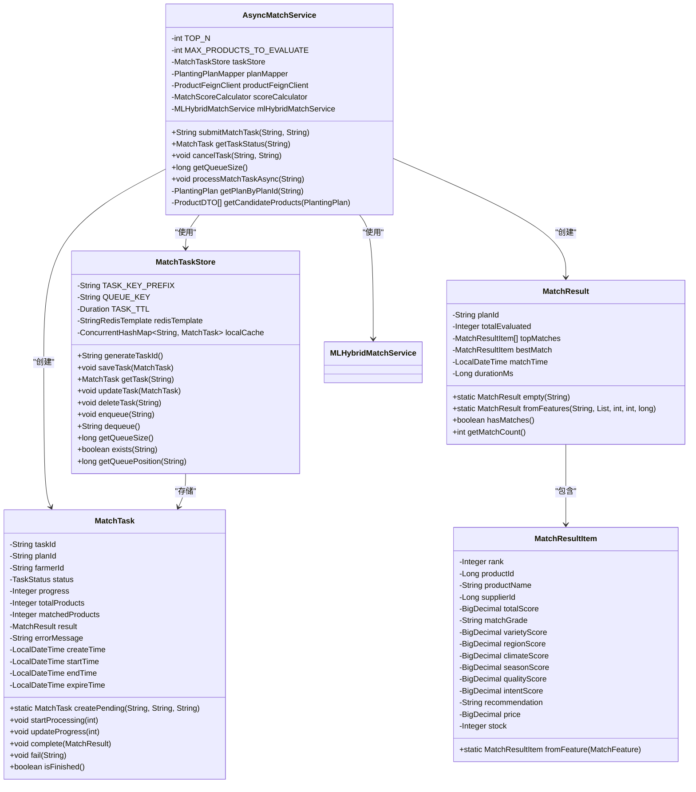

**图表来源**
- [AsyncMatchService.java](file://mall-trade\src\main\java\xyh\dp\mall\trade\matching\async\AsyncMatchService.java)
- [MatchTaskStore.java](file://mall-trade\src\main\java\xyh\dp\mall\trade\matching\async\MatchTaskStore.java)
- [MatchTask.java](file://mall-trade\src\main\java\xyh\dp\mall\trade\matching\async\MatchTask.java)
- [MatchResult.java](file://mall-trade\src\main\java\xyh\dp\mall\trade\matching\async\MatchResult.java)

#### 异步匹配服务序列图
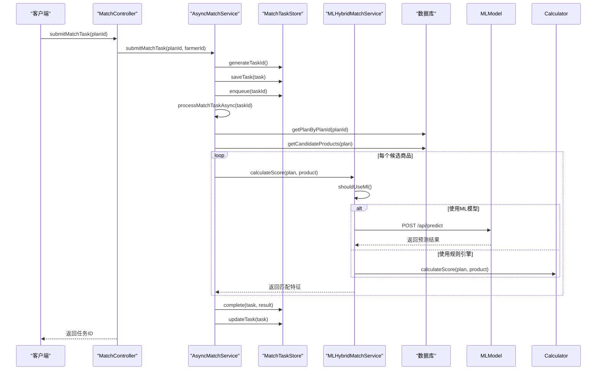

**图表来源**
- [AsyncMatchService.java](file://mall-trade\src\main\java\xyh\dp\mall\trade\matching\async\AsyncMatchService.java)
- [MatchTaskStore.java](file://mall-trade\src\main\java\xyh\dp\mall\trade\matching\async\MatchTaskStore.java)
- [MLHybridMatchService.java](file://mall-trade\src\main\java\xyh\dp\mall\trade\matching\engine\MLHybridMatchService.java)
- [MatchController.java](file://mall-trade\src\main\java\xyh\dp\mall\trade\controller\MatchController.java)

**章节来源**
- [AsyncMatchService.java](file://mall-trade\src\main\java\xyh\dp\mall\trade\matching\async\AsyncMatchService.java)
- [MatchTaskStore.java](file://mall-trade\src\main\java\xyh\dp\mall\trade\matching\async\MatchTaskStore.java)
- [MatchTask.java](file://mall-trade\src\main\java\xyh\dp\mall\trade\matching\async\MatchTask.java)
- [MatchResult.java](file://mall-trade\src\main\java\xyh\dp\mall\trade\matching\async\MatchResult.java)

### 机器学习模型分析
机器学习模型作为混合匹配引擎的重要组成部分，通过Python Flask服务提供REST API接口，实现了与Java后端的无缝集成。

#### 机器学习模型API流程图
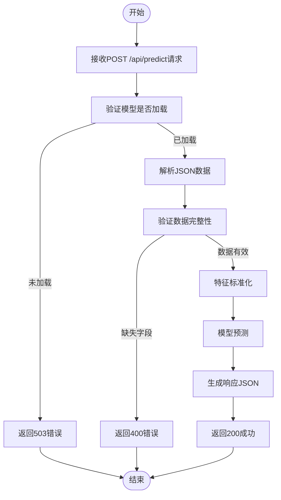

**图表来源**
- [predict_api.py](file://ml-model\predict_api.py)

**章节来源**
- [predict_api.py](file://ml-model\predict_api.py)

## 依赖分析
混合匹配引擎的组件之间存在明确的依赖关系，形成了清晰的调用链。核心依赖关系包括：控制器依赖异步服务，异步服务依赖任务存储和混合匹配服务，混合匹配服务依赖规则引擎和外部机器学习模型。

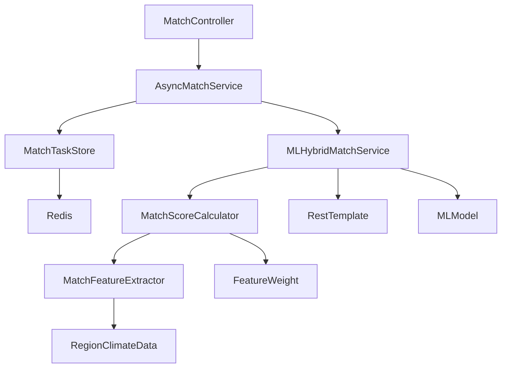

**图表来源**
- [MatchController.java](file://mall-trade\src\main\java\xyh\dp\mall\trade\controller\MatchController.java)
- [AsyncMatchService.java](file://mall-trade\src\main\java\xyh\dp\mall\trade\matching\async\AsyncMatchService.java)
- [MatchTaskStore.java](file://mall-trade\src\main\java\xyh\dp\mall\trade\matching\async\MatchTaskStore.java)
- [MLHybridMatchService.java](file://mall-trade\src\main\java\xyh\dp\mall\trade\matching\engine\MLHybridMatchService.java)
- [MatchScoreCalculator.java](file://mall-trade\src\main\java\xyh\dp\mall\trade\matching\engine\MatchScoreCalculator.java)
- [MatchFeatureExtractor.java](file://mall-trade\src\main\java\xyh\dp\mall\trade\matching\engine\MatchFeatureExtractor.java)
- [FeatureWeight.java](file://mall-trade\src\main\java\xyh\dp\mall\trade\matching\feature\FeatureWeight.java)
- [RegionClimateData.java](file://mall-trade\src\main\java\xyh\dp\mall\trade\matching\feature\RegionClimateData.java)

**章节来源**
- [MatchController.java](file://mall-trade\src\main\java\xyh\dp\mall\trade\controller\MatchController.java)
- [AsyncMatchService.java](file://mall-trade\src\main\java\xyh\dp\mall\trade\matching\async\AsyncMatchService.java)
- [MatchTaskStore.java](file://mall-trade\src\main\java\xyh\dp\mall\trade\matching\async\MatchTaskStore.java)

## 性能考虑
混合匹配引擎在设计时充分考虑了性能因素，采用了多项优化策略。异步处理机制避免了长时间计算阻塞主线程，Redis任务队列确保了任务的可靠存储和处理，本地缓存回退机制提高了系统的可用性。特征权重配置支持动态调整，无需重启服务即可优化匹配策略。

## 故障排除指南
当混合匹配引擎出现问题时，可以按照以下步骤进行排查：
1. 检查机器学习模型服务是否正常运行
2. 验证Redis连接是否正常
3. 检查Nacos配置中心中的相关配置
4. 查看日志文件中的错误信息
5. 验证数据库连接和数据完整性

**章节来源**
- [MLHybridMatchService.java](file://mall-trade\src\main\java\xyh\dp\mall\trade\matching\engine\MLHybridMatchService.java)
- [MatchTaskStore.java](file://mall-trade\src\main\java\xyh\dp\mall\trade\matching\async\MatchTaskStore.java)
- [AsyncMatchService.java](file://mall-trade\src\main\java\xyh\dp\mall\trade\matching\async\AsyncMatchService.java)

## 结论
混合匹配引擎通过创新的混合架构，成功实现了规则引擎与机器学习模型的有机结合。系统具备高可用性、可扩展性和灵活性，能够为农业种子供销平台提供精准的智能匹配服务。未来可以通过引入更多机器学习算法和优化特征工程，进一步提升匹配准确率和用户体验。