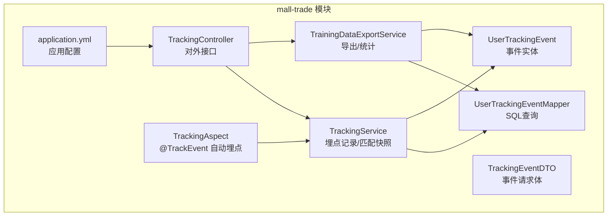
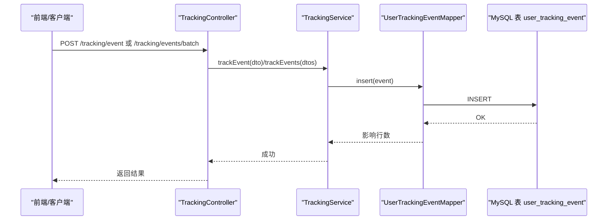
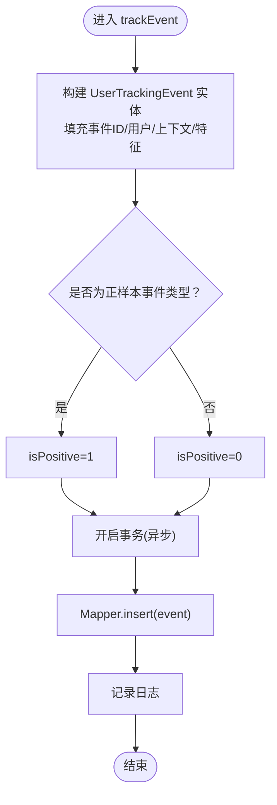
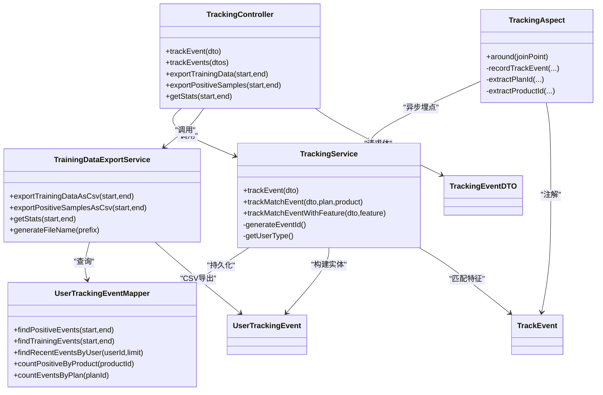

# 用户行为追踪

<cite>
**本文引用的文件**
- [TrackingController.java](file://mall-trade/src/main/java/xyh/dp/mall/trade/tracking/controller/TrackingController.java)
- [TrackingService.java](file://mall-trade/src/main/java/xyh/dp/mall/trade/tracking/service/TrackingService.java)
- [TrainingDataExportService.java](file://mall-trade/src/main/java/xyh/dp/mall/trade/tracking/service/TrainingDataExportService.java)
- [TrackingAspect.java](file://mall-trade/src/main/java/xyh/dp/mall/trade/tracking/aspect/TrackingAspect.java)
- [TrackEvent.java](file://mall-trade/src/main/java/xyh/dp/mall/trade/tracking/annotation/TrackEvent.java)
- [TrackingEventDTO.java](file://mall-trade/src/main/java/xyh/dp/mall/trade/tracking/dto/TrackingEventDTO.java)
- [UserTrackingEvent.java](file://mall-trade/src/main/java/xyh/dp/mall/trade/tracking/entity/UserTrackingEvent.java)
- [UserTrackingEventMapper.java](file://mall-trade/src/main/java/xyh/dp/mall/trade/tracking/mapper/UserTrackingEventMapper.java)
- [application.yml](file://mall-trade/src/main/resources/application.yml)
- [mall_trade.sql](file://sql/mall_trade.sql)
- [TrackingServiceTest.java](file://mall-trade/src/test/java/xyh/dp/mall/trade/tracking/service/TrackingServiceTest.java)
</cite>

## 目录
1. [简介](#简介)
2. [项目结构](#项目结构)
3. [核心组件](#核心组件)
4. [架构总览](#架构总览)
5. [详细组件分析](#详细组件分析)
6. [依赖关系分析](#依赖关系分析)
7. [性能考量](#性能考量)
8. [故障排查指南](#故障排查指南)
9. [结论](#结论)
10. [附录](#附录)

## 简介
本模块提供“用户行为追踪”能力，围绕“匹配与交易”场景采集用户行为事件，支持：
- 前端主动上报埋点事件
- 基于注解的自动埋点（AOP切面）
- 匹配过程中的特征快照采集
- 正负样本标注（确认/下单等为正样本）
- 训练数据导出与统计

这些数据用于后续机器学习模型训练，提升“作物品种-区域-气候-季节-质量-供需意图”的匹配效果。

## 项目结构
用户行为追踪位于 mall-trade 模块内，采用按功能分层组织：
- 控制器层：对外暴露埋点上报与训练数据导出接口
- 服务层：埋点记录、匹配特征快照、训练数据导出与统计
- 切面层：基于注解的自动埋点
- DTO/Entity/Mapper：数据传输对象、实体与持久化访问
- 配置：应用配置与数据库表结构

图表来源
- [TrackingController.java](file://mall-trade/src/main/java/xyh/dp/mall/trade/tracking/controller/TrackingController.java#L1-L141)
- [TrackingService.java](file://mall-trade/src/main/java/xyh/dp/mall/trade/tracking/service/TrackingService.java#L1-L198)
- [TrainingDataExportService.java](file://mall-trade/src/main/java/xyh/dp/mall/trade/tracking/service/TrainingDataExportService.java#L1-L137)
- [TrackingAspect.java](file://mall-trade/src/main/java/xyh/dp/mall/trade/tracking/aspect/TrackingAspect.java#L1-L228)
- [TrackingEventDTO.java](file://mall-trade/src/main/java/xyh/dp/mall/trade/tracking/dto/TrackingEventDTO.java#L1-L75)
- [UserTrackingEvent.java](file://mall-trade/src/main/java/xyh/dp/mall/trade/tracking/entity/UserTrackingEvent.java#L1-L188)
- [UserTrackingEventMapper.java](file://mall-trade/src/main/java/xyh/dp/mall/trade/tracking/mapper/UserTrackingEventMapper.java#L1-L79)
- [application.yml](file://mall-trade/src/main/resources/application.yml#L1-L28)

章节来源
- [TrackingController.java](file://mall-trade/src/main/java/xyh/dp/mall/trade/tracking/controller/TrackingController.java#L1-L141)
- [TrackingService.java](file://mall-trade/src/main/java/xyh/dp/mall/trade/tracking/service/TrackingService.java#L1-L198)
- [TrainingDataExportService.java](file://mall-trade/src/main/java/xyh/dp/mall/trade/tracking/service/TrainingDataExportService.java#L1-L137)
- [TrackingAspect.java](file://mall-trade/src/main/java/xyh/dp/mall/trade/tracking/aspect/TrackingAspect.java#L1-L228)
- [TrackingEventDTO.java](file://mall-trade/src/main/java/xyh/dp/mall/trade/tracking/dto/TrackingEventDTO.java#L1-L75)
- [UserTrackingEvent.java](file://mall-trade/src/main/java/xyh/dp/mall/trade/tracking/entity/UserTrackingEvent.java#L1-L188)
- [UserTrackingEventMapper.java](file://mall-trade/src/main/java/xyh/dp/mall/trade/tracking/mapper/UserTrackingEventMapper.java#L1-L79)
- [application.yml](file://mall-trade/src/main/resources/application.yml#L1-L28)

## 核心组件
- 控制器：提供埋点上报、批量上报、训练数据导出、正样本导出、统计查询等接口
- 服务：负责事件落库、匹配特征快照、正负样本标记、异步与事务控制
- 切面：基于 @TrackEvent 注解自动埋点，记录方法、参数、耗时、错误等上下文
- 数据模型：事件实体包含匹配特征快照、上下文信息、正负样本标记
- 导出服务：按时间窗口导出训练数据CSV，支持正样本导出与统计

章节来源
- [TrackingController.java](file://mall-trade/src/main/java/xyh/dp/mall/trade/tracking/controller/TrackingController.java#L1-L141)
- [TrackingService.java](file://mall-trade/src/main/java/xyh/dp/mall/trade/tracking/service/TrackingService.java#L1-L198)
- [TrainingDataExportService.java](file://mall-trade/src/main/java/xyh/dp/mall/trade/tracking/service/TrainingDataExportService.java#L1-L137)
- [TrackingAspect.java](file://mall-trade/src/main/java/xyh/dp/mall/trade/tracking/aspect/TrackingAspect.java#L1-L228)
- [UserTrackingEvent.java](file://mall-trade/src/main/java/xyh/dp/mall/trade/tracking/entity/UserTrackingEvent.java#L1-L188)

## 架构总览
用户行为追踪的整体调用链路如下：

图表来源
- [TrackingController.java](file://mall-trade/src/main/java/xyh/dp/mall/trade/tracking/controller/TrackingController.java#L36-L65)
- [TrackingService.java](file://mall-trade/src/main/java/xyh/dp/mall/trade/tracking/service/TrackingService.java#L49-L75)
- [UserTrackingEventMapper.java](file://mall-trade/src/main/java/xyh/dp/mall/trade/tracking/mapper/UserTrackingEventMapper.java#L18-L47)

## 详细组件分析

### 控制器层：TrackingController
- 接口职责
  - 上报单个/批量埋点事件
  - 导出训练数据CSV（全量/正样本）
  - 获取训练数据统计（总数、正样本数、负样本数、正样本比例）

- 关键点
  - 使用统一返回包装 Result
  - 导出接口以附件形式返回CSV，文件名包含时间戳
  - 统一使用日期时间参数绑定

章节来源
- [TrackingController.java](file://mall-trade/src/main/java/xyh/dp/mall/trade/tracking/controller/TrackingController.java#L36-L140)

### 服务层：TrackingService
- 功能
  - 记录基础埋点事件（含正负样本标记）
  - 记录匹配相关事件（自动计算匹配特征快照并落库）
  - 记录已给定特征的匹配事件
  - 异步+事务：通过线程池异步写库，保证主流程不阻塞；事务回滚保护一致性
  - 事件ID生成策略：时间戳+随机数，确保全局唯一
  - 用户类型与业务用户ID：从上下文获取，兜底未知

- 正负样本规则
  - 正样本：MATCH_CONFIRM、ORDER_CREATE、ORDER_PAY
  - 其他浏览/点击等默认为负样本

- 匹配特征快照
  - 包含：品种一致性、区域适配、气候匹配、季节匹配、种子质量、供需意图、综合得分、匹配等级

- 异常处理
  - 写库异常被捕获并记录日志，不影响主流程

图表来源
- [TrackingService.java](file://mall-trade/src/main/java/xyh/dp/mall/trade/tracking/service/TrackingService.java#L49-L124)

章节来源
- [TrackingService.java](file://mall-trade/src/main/java/xyh/dp/mall/trade/tracking/service/TrackingService.java#L1-L198)

### 切面层：TrackingAspect
- 功能
  - 自动埋点：拦截带有 @TrackEvent 的方法，在方法执行完成后异步记录埋点
  - 自动提取 planId、productId（优先从参数名识别）
  - 自动记录方法签名、执行时长、是否成功、错误信息、可选参数与返回值摘要
  - 过滤敏感参数（如密码、token等），避免泄露

- 执行顺序
  - 使用较低优先级，确保在事务之后执行，避免事务回滚导致埋点丢失

章节来源
- [TrackingAspect.java](file://mall-trade/src/main/java/xyh/dp/mall/trade/tracking/aspect/TrackingAspect.java#L1-L228)
- [TrackEvent.java](file://mall-trade/src/main/java/xyh/dp/mall/trade/tracking/annotation/TrackEvent.java#L1-L45)

### 数据模型：UserTrackingEvent
- 字段说明
  - 事件标识：eventId、id
  - 用户标识：userId、userType
  - 事件类型：eventType（匹配/浏览/点击/确认/下单等）
  - 关联标识：planId、productId、supplierId
  - 匹配特征快照：varietyScore、regionScore、climateScore、seasonScore、qualityScore、intentScore、totalScore、matchGrade
  - 上下文信息：deviceType、channel、stayDuration、extData
  - 标记：isPositive（1=正样本，0=负样本）
  - 时间：eventTime、createTime
  - 工具：CSV导出行与表头

- 导出格式
  - CSV列：plan_id,product_id,variety_score,region_score,climate_score,season_score,quality_score,intent_score,total_score,match_grade,is_positive

章节来源
- [UserTrackingEvent.java](file://mall-trade/src/main/java/xyh/dp/mall/trade/tracking/entity/UserTrackingEvent.java#L1-L188)

### 数据访问：UserTrackingEventMapper
- 查询能力
  - 指定时间范围内的正样本事件
  - 指定时间范围内的训练事件（过滤空关联ID）
  - 指定用户最近事件
  - 统计某商品确认次数
  - 统计某计划事件总数

章节来源
- [UserTrackingEventMapper.java](file://mall-trade/src/main/java/xyh/dp/mall/trade/tracking/mapper/UserTrackingEventMapper.java#L1-L79)

### 训练数据导出：TrainingDataExportService
- 功能
  - 导出训练数据CSV（全量/正样本）
  - 生成带时间戳的文件名
  - 统计总数、正样本数、负样本数、正样本比例

章节来源
- [TrainingDataExportService.java](file://mall-trade/src/main/java/xyh/dp/mall/trade/tracking/service/TrainingDataExportService.java#L1-L137)

### 数据库表结构
- 表名：user_tracking_event
- 关键索引：事件ID唯一、用户ID、计划ID、商品ID、事件类型、事件时间、正负样本标记
- 字段要点：匹配特征、上下文、正负样本标记、时间戳、扩展数据

章节来源
- [mall_trade.sql](file://sql/mall_trade.sql#L128-L154)

## 依赖关系分析

图表来源
- [TrackingController.java](file://mall-trade/src/main/java/xyh/dp/mall/trade/tracking/controller/TrackingController.java#L1-L141)
- [TrackingService.java](file://mall-trade/src/main/java/xyh/dp/mall/trade/tracking/service/TrackingService.java#L1-L198)
- [TrainingDataExportService.java](file://mall-trade/src/main/java/xyh/dp/mall/trade/tracking/service/TrainingDataExportService.java#L1-L137)
- [TrackingAspect.java](file://mall-trade/src/main/java/xyh/dp/mall/trade/tracking/aspect/TrackingAspect.java#L1-L228)
- [UserTrackingEventMapper.java](file://mall-trade/src/main/java/xyh/dp/mall/trade/tracking/mapper/UserTrackingEventMapper.java#L1-L79)
- [UserTrackingEvent.java](file://mall-trade/src/main/java/xyh/dp/mall/trade/tracking/entity/UserTrackingEvent.java#L1-L188)
- [TrackingEventDTO.java](file://mall-trade/src/main/java/xyh/dp/mall/trade/tracking/dto/TrackingEventDTO.java#L1-L75)
- [TrackEvent.java](file://mall-trade/src/main/java/xyh/dp/mall/trade/tracking/annotation/TrackEvent.java#L1-L45)

## 性能考量
- 异步写库：埋点写入使用异步线程池，避免阻塞主业务流程
- 事务隔离：埋点写入在独立事务中进行，防止主流程异常影响埋点
- 批量上报：提供批量接口，减少网络往返与数据库压力
- 导出优化：导出CSV采用流式写入，避免大内存占用
- 索引设计：针对常用查询字段建立索引，提高导出与统计效率

## 故障排查指南
- 埋点未入库
  - 检查数据库连接与表是否存在
  - 查看服务日志中埋点记录失败的日志
  - 确认事件DTO字段是否完整（事件类型、planId、productId等）
- 正负样本标记异常
  - 确认事件类型是否属于正样本集合
  - 参考单元测试断言验证
- 导出数据为空
  - 检查时间范围参数是否正确
  - 确认筛选条件（如训练事件需 plan_id/product_id 非空）
- 自动埋点无效
  - 确认目标方法是否添加 @TrackEvent 注解
  - 检查切面是否启用（AOP）
  - 确认方法参数中存在 planId/productId

章节来源
- [TrackingServiceTest.java](file://mall-trade/src/test/java/xyh/dp/mall/trade/tracking/service/TrackingServiceTest.java#L1-L200)
- [TrackingServiceTest.java](file://mall-trade/src/test/java/xyh/dp/mall/trade/tracking/service/TrackingServiceTest.java#L280-L384)
- [TrackingServiceTest.java](file://mall-trade/src/test/java/xyh/dp/mall/trade/tracking/service/TrackingServiceTest.java#L310-L362)
- [TrackingServiceTest.java](file://mall-trade/src/test/java/xyh/dp/mall/trade/tracking/service/TrackingServiceTest.java#L430-L447)

## 结论
该模块通过“控制器-服务-切面-数据模型-持久化”的清晰分层，实现了面向匹配与交易场景的用户行为追踪。其核心价值在于：
- 事件上报灵活（主动上报+自动埋点）
- 匹配特征快照便于模型训练
- 正负样本标注明确，利于监督学习
- 导出与统计接口完备，支撑数据驱动优化

建议在生产环境关注：
- 埋点上报限流与去重
- 大规模导出的并发与资源控制
- 特征字段的稳定性与版本演进

## 附录

### 事件类型与正负样本对照
- 正样本：MATCH_CONFIRM、ORDER_CREATE、ORDER_PAY
- 负样本：MATCH_VIEW、MATCH_CLICK、PAGE_VIEW、SEARCH 等

章节来源
- [TrackingService.java](file://mall-trade/src/main/java/xyh/dp/mall/trade/tracking/service/TrackingService.java#L37-L43)
- [TrackingServiceTest.java](file://mall-trade/src/test/java/xyh/dp/mall/trade/tracking/service/TrackingServiceTest.java#L310-L362)

### 接口清单（控制器）
- POST /tracking/event：上报单个埋点事件
- POST /tracking/events/batch：批量上报埋点事件
- GET /tracking/export/training-data：导出训练数据CSV
- GET /tracking/export/positive-samples：导出正样本CSV
- GET /tracking/stats：获取训练数据统计

章节来源
- [TrackingController.java](file://mall-trade/src/main/java/xyh/dp/mall/trade/tracking/controller/TrackingController.java#L36-L140)

### 应用配置要点
- 端口与Nacos配置导入
- 日志级别对调试有帮助

章节来源
- [application.yml](file://mall-trade/src/main/resources/application.yml#L1-L28)