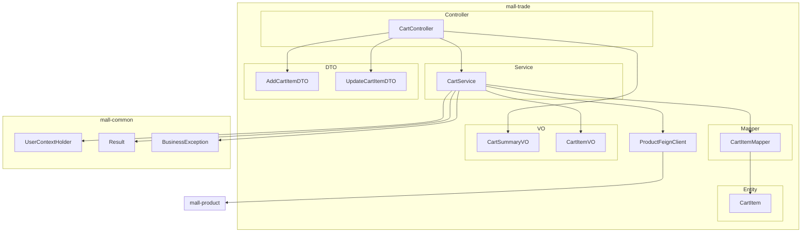
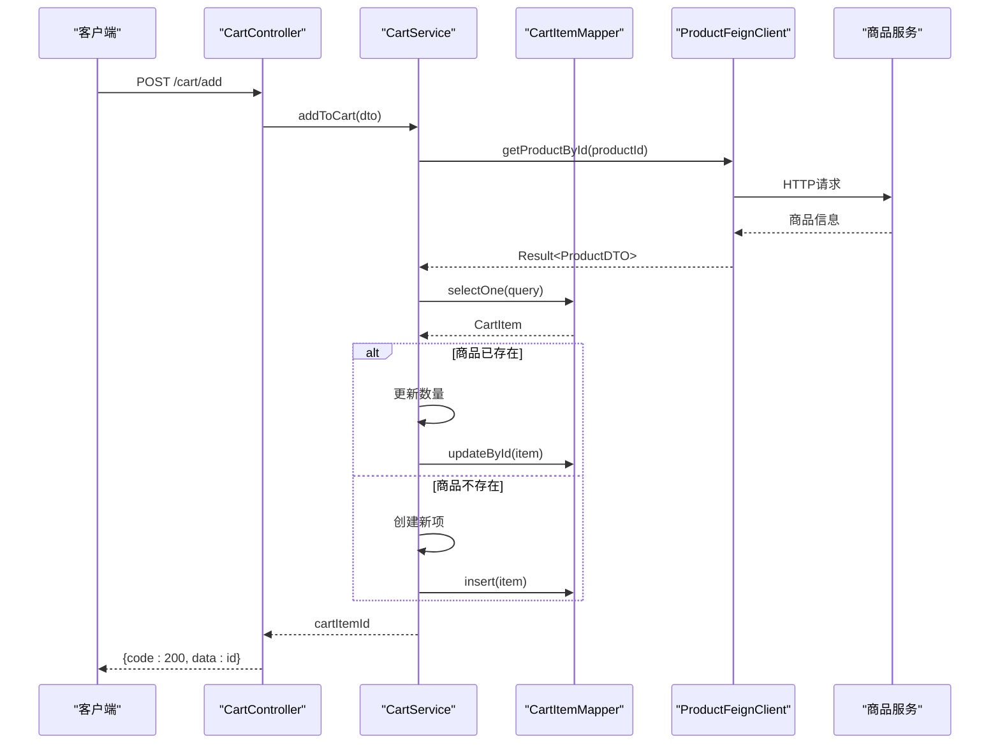
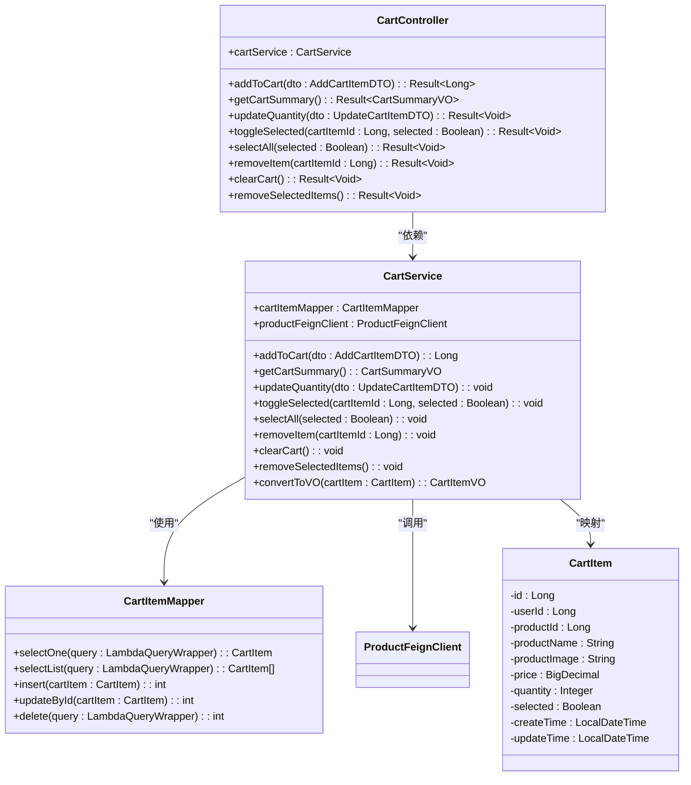
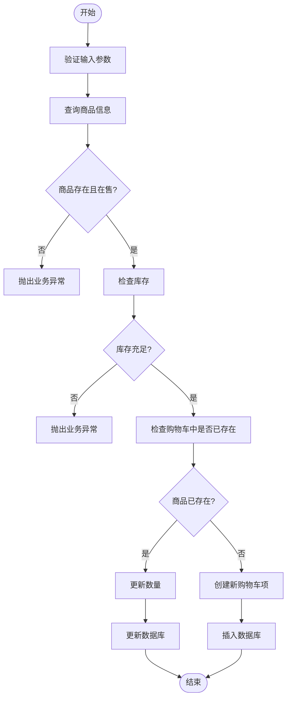
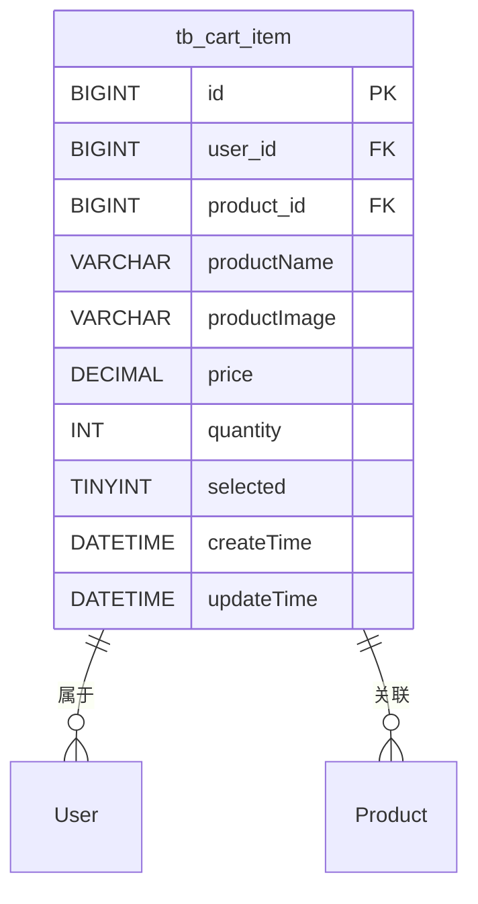
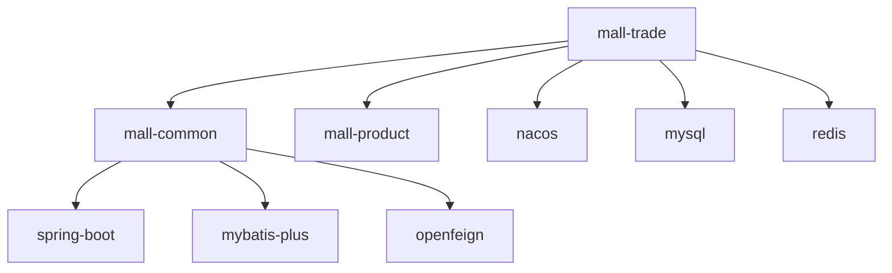

# 购物车系统

<cite>
**本文档引用文件**  
- [CartController.java](file://mall-trade\src\main\java\xyh\dp\mall\trade\controller\CartController.java)
- [CartService.java](file://mall-trade\src\main\java\xyh\dp\mall\trade\service\CartService.java)
- [CartItem.java](file://mall-trade\src\main\java\xyh\dp\mall\trade\entity\CartItem.java)
- [CartItemMapper.java](file://mall-trade\src\main\java\xyh\dp\mall\trade\mapper\CartItemMapper.java)
- [AddCartItemDTO.java](file://mall-trade\src\main\java\xyh\dp\mall\trade\dto\AddCartItemDTO.java)
- [UpdateCartItemDTO.java](file://mall-trade\src\main\java\xyh\dp\mall\trade\dto\UpdateCartItemDTO.java)
- [CartSummaryVO.java](file://mall-trade\src\main\java\xyh\dp\mall\trade\vo\CartSummaryVO.java)
- [CartItemVO.java](file://mall-trade\src\main\java\xyh\dp\mall\trade\vo\CartItemVO.java)
- [ProductFeignClient.java](file://mall-trade\src\main\java\xyh\dp\mall\trade\feign\ProductFeignClient.java)
- [UserContextHolder.java](file://mall-common\src\main\java\xyh\dp\mall\common\context\UserContextHolder.java)
- [Result.java](file://mall-common\src\main\java\xyh\dp\mall\common\result\Result.java)
- [BusinessException.java](file://mall-common\src\main\java\xyh\dp\mall\common\exception\BusinessException.java)
- [mall_trade.sql](file://sql\mall_trade.sql)
</cite>

## 目录
1. [简介](#简介)
2. [项目结构](#项目结构)
3. [核心组件](#核心组件)
4. [架构概览](#架构概览)
5. [详细组件分析](#详细组件分析)
6. [依赖分析](#依赖分析)
7. [性能考虑](#性能考虑)
8. [故障排除指南](#故障排除指南)
9. [结论](#结论)

## 简介
本系统是“三创赛小程序”中的购物车模块，属于微服务架构中的交易服务（mall-trade）的一部分。该模块实现了完整的购物车功能，包括添加商品、查询购物车、更新数量、选中状态管理、删除和清空等操作。系统采用Spring Boot + MyBatis-Plus技术栈，通过Feign实现服务间通信，并与商品服务（mall-product）紧密集成，确保库存和价格的实时性。

## 项目结构
购物车系统位于`mall-trade`模块中，其核心代码位于`xyh.dp.mall.trade`包下。主要结构如下：
- `controller`：提供RESTful API接口
- `service`：实现业务逻辑
- `entity`：数据库实体类
- `mapper`：MyBatis-Plus Mapper接口
- `dto`：数据传输对象
- `vo`：视图对象

**图示来源**
- [CartController.java](file://mall-trade\src\main\java\xyh\dp\mall\trade\controller\CartController.java)
- [CartService.java](file://mall-trade\src\main\java\xyh\dp\mall\trade\service\CartService.java)
- [CartItem.java](file://mall-trade\src\main\java\xyh\dp\mall\trade\entity\CartItem.java)
- [CartItemMapper.java](file://mall-trade\src\main\java\xyh\dp\mall\trade\mapper\CartItemMapper.java)
- [AddCartItemDTO.java](file://mall-trade\src\main\java\xyh\dp\mall\trade\dto\AddCartItemDTO.java)
- [UpdateCartItemDTO.java](file://mall-trade\src\main\java\xyh\dp\mall\trade\dto\UpdateCartItemDTO.java)
- [CartSummaryVO.java](file://mall-trade\src\main\java\xyh\dp\mall\trade\vo\CartSummaryVO.java)
- [CartItemVO.java](file://mall-trade\src\main\java\xyh\dp\mall\trade\vo\CartItemVO.java)
- [ProductFeignClient.java](file://mall-trade\src\main\java\xyh\dp\mall\trade\feign\ProductFeignClient.java)
- [UserContextHolder.java](file://mall-common\src\main\java\xyh\dp\mall\common\context\UserContextHolder.java)
- [Result.java](file://mall-common\src\main\java\xyh\dp\mall\common\result\Result.java)
- [BusinessException.java](file://mall-common\src\main\java\xyh\dp\mall\common\exception\BusinessException.java)

**本节来源**
- [CartController.java](file://mall-trade\src\main\java\xyh\dp\mall\trade\controller\CartController.java)
- [CartService.java](file://mall-trade\src\main\java\xyh\dp\mall\trade\service\CartService.java)

## 核心组件
购物车系统的核心组件包括控制器、服务、实体、数据访问层和数据传输对象。`CartController`负责处理HTTP请求，`CartService`实现核心业务逻辑，`CartItem`是数据库实体，`CartItemMapper`提供数据访问接口，DTO和VO用于前后端数据交换。

**本节来源**
- [CartController.java](file://mall-trade\src\main\java\xyh\dp\mall\trade\controller\CartController.java)
- [CartService.java](file://mall-trade\src\main\java\xyh\dp\mall\trade\service\CartService.java)
- [CartItem.java](file://mall-trade\src\main\java\xyh\dp\mall\trade\entity\CartItem.java)
- [CartItemMapper.java](file://mall-trade\src\main\java\xyh\dp\mall\trade\mapper\CartItemMapper.java)

## 架构概览
购物车系统采用典型的分层架构，包括表现层（Controller）、业务逻辑层（Service）、数据访问层（Mapper）和实体层（Entity）。系统通过Feign客户端与商品服务通信，获取商品信息和库存状态。用户身份通过`UserContextHolder`中的ThreadLocal进行管理，确保线程安全。

**图示来源**
- [CartController.java](file://mall-trade\src\main\java\xyh\dp\mall\trade\controller\CartController.java#L39-L47)
- [CartService.java](file://mall-trade\src\main\java\xyh\dp\mall\trade\service\CartService.java#L47-L106)
- [ProductFeignClient.java](file://mall-trade\src\main\java\xyh\dp\mall\trade\feign\ProductFeignClient.java#L28-L29)

## 详细组件分析

### 购物车控制器分析
`CartController`是购物车系统的入口，提供了RESTful API接口。它使用`@RestController`和`@RequestMapping("/cart")`注解，将所有请求映射到`/cart`路径下。控制器中的每个方法都使用了`@RequireLogin`注解，确保只有登录用户才能访问。同时，关键操作如添加和更新使用了`@RateLimit`注解进行限流保护。

**图示来源**
- [CartController.java](file://mall-trade\src\main\java\xyh\dp\mall\trade\controller\CartController.java)
- [CartService.java](file://mall-trade\src\main\java\xyh\dp\mall\trade\service\CartService.java)
- [CartItemMapper.java](file://mall-trade\src\main\java\xyh\dp\mall\trade\mapper\CartItemMapper.java)
- [CartItem.java](file://mall-trade\src\main\java\xyh\dp\mall\trade\entity\CartItem.java)

**本节来源**
- [CartController.java](file://mall-trade\src\main\java\xyh\dp\mall\trade\controller\CartController.java)
- [CartService.java](file://mall-trade\src\main\java\xyh\dp\mall\trade\service\CartService.java)

### 购物车服务分析
`CartService`是购物车系统的核心，实现了所有业务逻辑。服务使用`@Transactional`注解确保数据一致性。在添加商品时，会检查商品状态和库存；在更新数量时，会实时查询最新库存。服务还通过`convertToVO`方法将实体转换为VO，同时查询最新商品信息，确保前端显示的数据是最新的。

**图示来源**
- [CartService.java](file://mall-trade\src\main\java\xyh\dp\mall\trade\service\CartService.java#L47-L106)

**本节来源**
- [CartService.java](file://mall-trade\src\main\java\xyh\dp\mall\trade\service\CartService.java)

### 数据模型分析
购物车系统的核心数据模型是`CartItem`实体，对应数据库中的`tb_cart_item`表。该表设计了冗余字段（商品名称、图片、价格），以避免商品信息变更对已添加到购物车的商品产生影响。表通过`user_id`和`product_id`的唯一索引确保每个用户对每个商品只能有一个购物车项。

**图示来源**
- [CartItem.java](file://mall-trade\src\main\java\xyh\dp\mall\trade\entity\CartItem.java)
- [mall_trade.sql](file://sql\mall_trade.sql#L32-L46)

**本节来源**
- [CartItem.java](file://mall-trade\src\main\java\xyh\dp\mall\trade\entity\CartItem.java)
- [mall_trade.sql](file://sql\mall_trade.sql)

## 依赖分析
购物车系统依赖于多个内部和外部组件。内部依赖包括`mall-common`模块中的通用工具类和`mall-product`模块中的商品服务。外部依赖通过Maven的`pom.xml`文件管理，包括Spring Boot、MyBatis-Plus、OpenFeign等。系统通过Nacos进行服务发现和配置管理。

**图示来源**
- [MallTradeApplication.java](file://mall-trade\src\main\java\xyh\dp\mall\trade\MallTradeApplication.java)
- [pom.xml](file://mall-trade\pom.xml)
- [application.yml](file://mall-trade\src\main\resources\application.yml)

**本节来源**
- [MallTradeApplication.java](file://mall-trade\src\main\java\xyh\dp\mall\trade\MallTradeApplication.java)
- [application.yml](file://mall-trade\src\main\resources\application.yml)

## 性能考虑
购物车系统在设计时考虑了性能优化。首先，通过冗余存储商品关键信息，减少了对商品服务的频繁调用。其次，使用MyBatis-Plus的LambdaQueryWrapper构建查询条件，提高了查询效率。此外，系统实现了合理的索引策略，在`user_id`和`product_id`上创建了索引，加快了查询速度。对于高并发场景，系统通过`@RateLimit`注解实现了接口限流，防止恶意请求。

## 故障排除指南
常见问题及解决方案：
1. **添加商品失败**：检查商品是否下架或库存不足。
2. **购物车数据不一致**：确认用户登录状态和`UserContextHolder`是否正确设置。
3. **接口调用超时**：检查商品服务是否正常运行，网络是否通畅。
4. **库存扣减失败**：查看商品服务的日志，确认库存是否充足。

**本节来源**
- [CartService.java](file://mall-trade\src\main\java\xyh\dp\mall\trade\service\CartService.java)
- [BusinessException.java](file://mall-common\src\main\java\xyh\dp\mall\common\exception\BusinessException.java)

## 结论
购物车系统是一个功能完整、设计合理的微服务模块。它通过分层架构实现了关注点分离，通过Feign实现了服务间通信，通过冗余字段和实时查询保证了数据的准确性和一致性。系统具有良好的扩展性和维护性，为电商平台提供了稳定可靠的购物车功能。