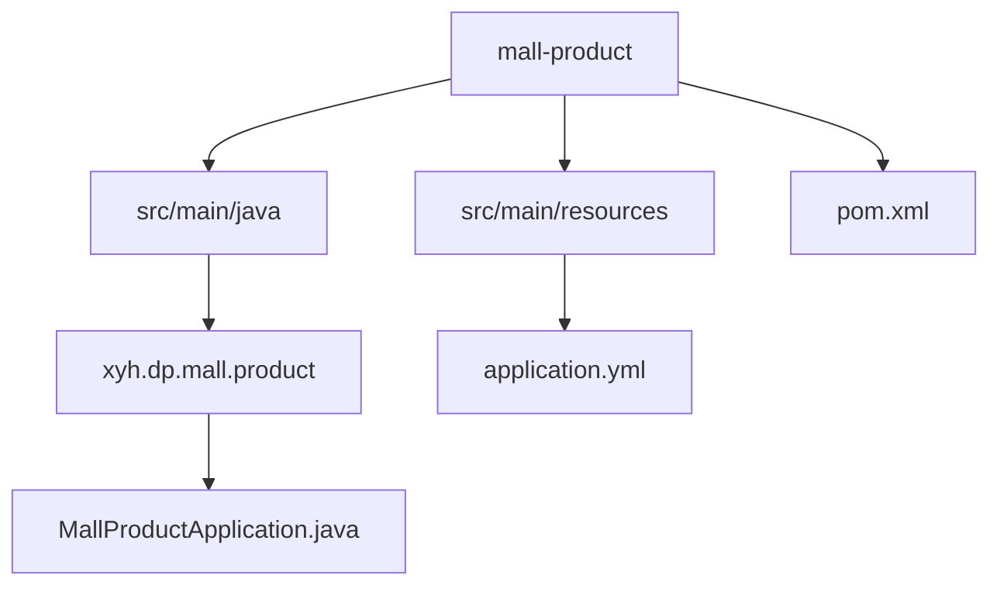
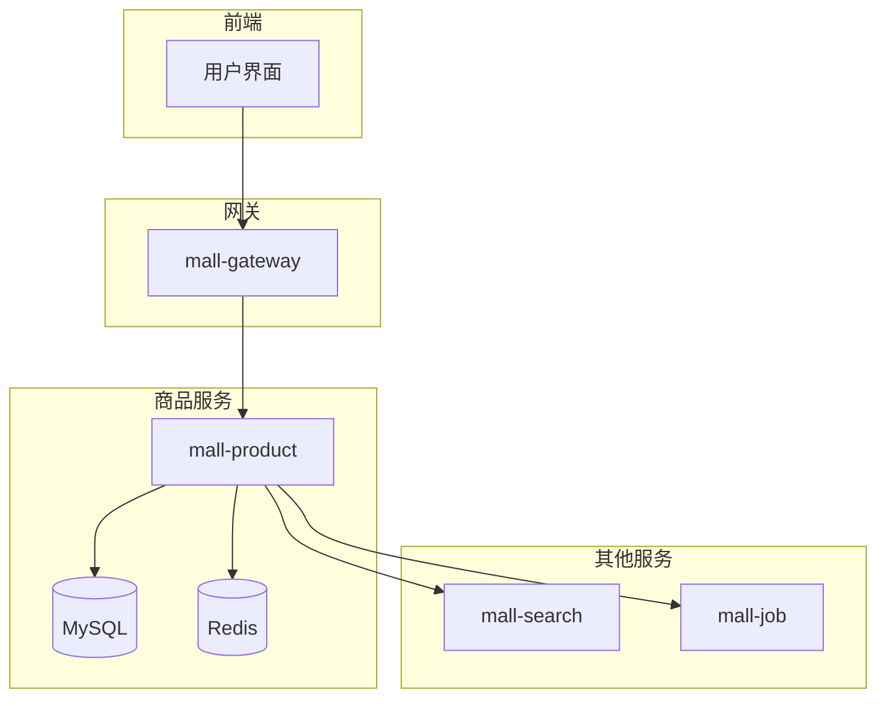
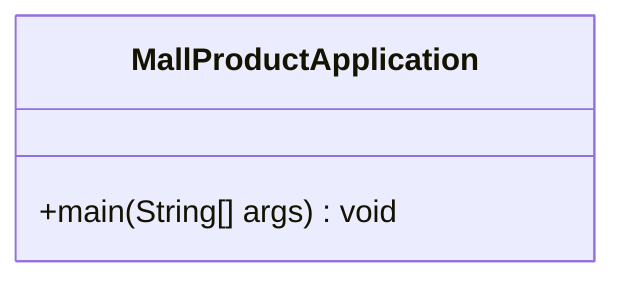
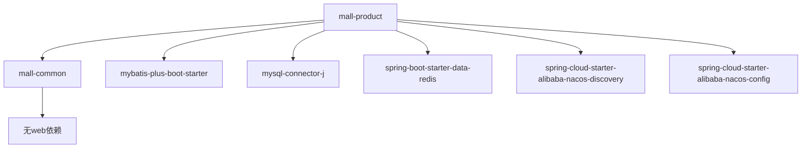

# 商品服务

<cite>
**本文档引用的文件**  
- [MallProductApplication.java](file://mall-product/src/main/java/xyh/dp/mall/product/MallProductApplication.java)
- [application.yml](file://mall-product/src/main/resources/application.yml)
- [pom.xml](file://mall-product/pom.xml)
- [mail-cloud/pom.xml](file://pom.xml)
</cite>

## 目录
1. [简介](#简介)
2. [项目结构](#项目结构)
3. [核心组件](#核心组件)
4. [架构概述](#架构概述)
5. [详细组件分析](#详细组件分析)
6. [依赖分析](#依赖分析)
7. [性能考虑](#性能考虑)
8. [故障排除指南](#故障排除指南)
9. [结论](#结论)

## 简介
商品服务（mall-product）是电商平台的核心模块之一，负责管理商品信息、分类树形结构和品牌数据。该服务通过Spring Boot和Spring Cloud Alibaba技术栈构建，使用Nacos进行服务注册与配置管理，通过MyBatis-Plus与MySQL数据库交互，并利用Redis实现缓存以提升查询性能。此外，商品服务还为搜索服务提供数据同步接口，支持高并发场景下的高效数据访问。

## 项目结构
mall-product模块遵循标准的Spring Boot项目结构，包含启动类、资源配置和Maven构建配置。尽管当前代码库中未发现具体的业务实现类（如Controller、Service、Repository），但从配置文件可推断其设计意图和集成方式。



**Diagram sources**
- [MallProductApplication.java](file://mall-product/src/main/java/xyh/dp/mall/product/MallProductApplication.java)
- [application.yml](file://mall-product/src/main/resources/application.yml)

**Section sources**
- [MallProductApplication.java](file://mall-product/src/main/java/xyh/dp/mall/product/MallProductApplication.java)
- [application.yml](file://mall-product/src/main/resources/application.yml)

## 核心组件

商品服务的核心组件包括启动类`MallProductApplication`，它通过`@SpringBootApplication`注解启用自动配置、组件扫描和配置属性加载，并通过`@EnableDiscoveryClient`注册到Nacos服务注册中心。虽然当前未发现具体业务类，但根据命名规范和配置推测，未来将包含商品、分类、品牌的增删改查功能。

**Section sources**
- [MallProductApplication.java](file://mall-product/src/main/java/xyh/dp/mall/product/MallProductApplication.java)

## 架构概述

商品服务采用微服务架构，作为独立服务运行在8082端口，通过Nacos实现服务发现与配置管理。数据层使用MyBatis-Plus连接MySQL数据库，缓存层集成Redis提升读取性能。服务间通信通过HTTP或消息队列实现与搜索服务的数据同步。



**Diagram sources**
- [application.yml](file://mall-product/src/main/resources/application.yml)
- [pom.xml](file://mall-product/pom.xml)

## 详细组件分析

### 启动类分析
`MallProductApplication`是商品服务的入口点，负责初始化Spring应用上下文并启动嵌入式Web服务器。该类使用`SpringApplication.run()`方法启动应用，支持命令行参数传入。

#### 类图


**Diagram sources**
- [MallProductApplication.java](file://mall-product/src/main/java/xyh/dp/mall/product/MallProductApplication.java)

### 配置文件分析
`application.yml`定义了服务名称、端口、数据库连接、Redis配置和日志级别。其中数据源配置指定了MySQL连接URL、用户名和密码，MyBatis-Plus配置启用了驼峰命名转换和SQL日志输出。

#### 数据源配置
```yaml
spring:
  datasource:
    url: jdbc:mysql://localhost:3306/mall_product?useUnicode=true&characterEncoding=utf-8&useSSL=false&serverTimezone=Asia/Shanghai
    username: root
    password: Abc0224
```

#### MyBatis-Plus配置
```yaml
mybatis-plus:
  mapper-locations: classpath*:/mapper/**/*.xml
  type-aliases-package: xyh.dp.mall.product.entity
  configuration:
    map-underscore-to-camel-case: true
```

**Section sources**
- [application.yml](file://mall-product/src/main/resources/application.yml)

## 依赖分析

商品服务依赖于mall-common模块以共享通用工具和实体类，并通过根pom.xml继承了MyBatis-Plus、MySQL驱动、Redis客户端、Elasticsearch等关键依赖。这些依赖由Spring Cloud Alibaba和Spring Boot版本管理统一控制。



**Diagram sources**
- [pom.xml](file://mall-product/pom.xml)
- [mail-cloud/pom.xml](file://pom.xml)

**Section sources**
- [pom.xml](file://mall-product/pom.xml)
- [mail-cloud/pom.xml](file://pom.xml)

## 性能考虑

尽管当前代码库中未实现具体业务逻辑，但可通过配置推断性能优化策略：
- 使用Redis缓存高频查询的商品数据，减少数据库压力
- MyBatis-Plus提供分页查询和条件构造器，支持高效的数据检索
- 通过Nacos动态配置可调整缓存策略和数据库连接池参数
- 日志级别设置为debug，便于生产环境问题排查

## 故障排除指南

当商品服务出现异常时，可按以下步骤排查：
1. 检查Nacos注册中心是否正常运行，服务是否成功注册
2. 验证数据库连接配置，确保MySQL服务可访问且账号密码正确
3. 查看Redis连接状态，确认缓存服务正常
4. 检查日志输出，定位具体错误信息
5. 验证MyBatis-Plus的mapper文件路径是否正确映射

**Section sources**
- [application.yml](file://mall-product/src/main/resources/application.yml)
- [pom.xml](file://mall-product/pom.xml)

## 结论

mall-product商品服务目前处于基础架构搭建阶段，已配置好核心依赖和运行环境，但尚未实现具体业务逻辑。建议后续开发中补充商品、分类、品牌等实体类及对应的CRUD接口，实现与搜索服务的数据同步机制，并完善缓存策略以应对高并发场景。整体架构设计合理，具备良好的扩展性和维护性。