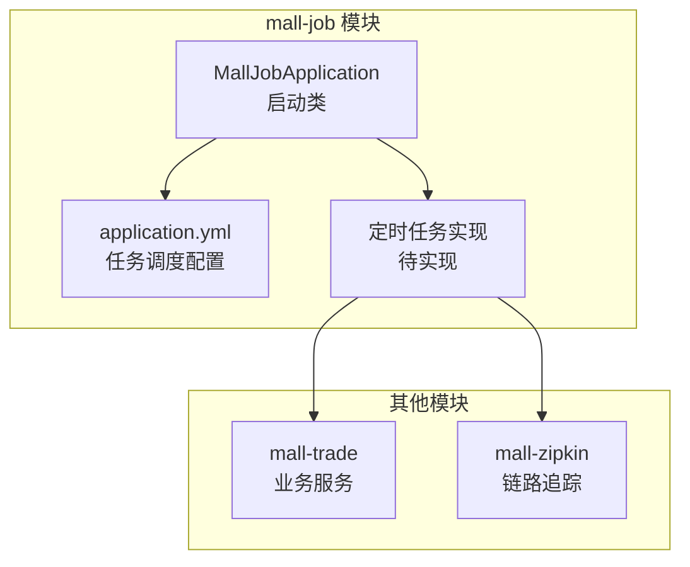
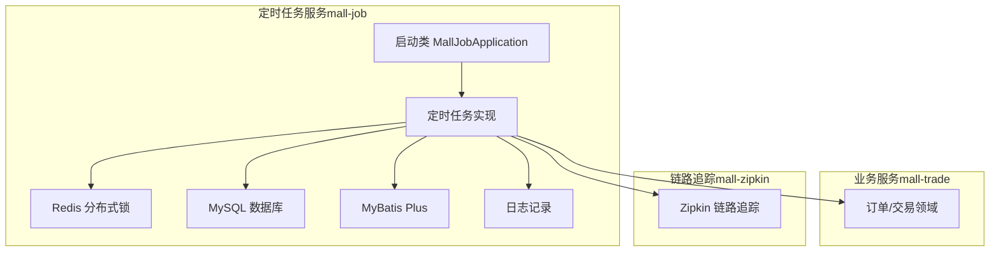
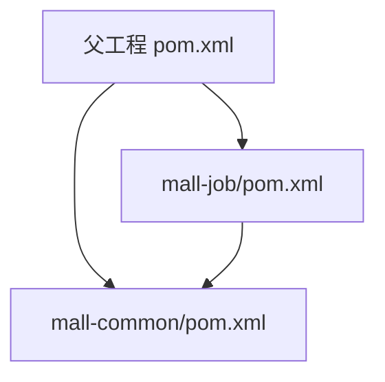

# 定时任务服务

<cite>
**本文引用的文件**
- [MallJobApplication.java](file://mall-job/src/main/java/xiyh/dp/mall/job/MallJobApplication.java)
- [application.yml](file://mall-job/src/main/resources/application.yml)
- [pom.xml](file://mall-job/pom.xml)
- [pom.xml](file://pom.xml)
- [MallTradeApplication.java](file://mall-trade/src/main/java/xyh/dp/mall/trade/MallTradeApplication.java)
- [MallZipkinApplication.java](file://mall-zipkin/src/main/java/xyh/dp/mall/zipkin/MallZipkinApplication.java)
- [AGENTS.md](file://AGENTS.md)
</cite>

## 目录
1. [引言](#引言)
2. [项目结构](#项目结构)
3. [核心组件](#核心组件)
4. [架构总览](#架构总览)
5. [详细组件分析](#详细组件分析)
6. [依赖分析](#依赖分析)
7. [性能考虑](#性能考虑)
8. [故障排查指南](#故障排查指南)
9. [结论](#结论)
10. [附录](#附录)

## 引言
本文件围绕 mall-job 定时任务服务展开，基于 MallJobApplication 启动类，说明其如何通过 Spring 的 @EnableScheduling 与 @Scheduled 注解实现周期性任务调度；结合 application.yml 中的任务调度相关配置，解释任务执行频率、线程池配置与异常处理策略；并针对典型业务场景（每日数据统计、过期订单自动关闭、库存状态同步）给出实现思路与最佳实践。同时，提供清理过期订单的定时任务代码示例路径，并分析分布式环境下的任务重复执行问题与分布式锁方案。

## 项目结构
mall-job 是一个独立的微服务模块，负责定时任务编排与执行。其核心入口为 MallJobApplication，启用 Spring 定时任务能力后，可按需在该模块内定义多个定时任务。

图表来源
- [MallJobApplication.java](file://mall-job/src/main/java/xiyh/dp/mall/job/MallJobApplication.java#L1-L28)
- [application.yml](file://mall-job/src/main/resources/application.yml#L1-L35)
- [MallTradeApplication.java](file://mall-trade/src/main/java/xyh/dp/mall/trade/MallTradeApplication.java#L1-L26)
- [MallZipkinApplication.java](file://mall-zipkin/src/main/java/xyh/dp/mall/zipkin/MallZipkinApplication.java#L1-L26)

章节来源
- [MallJobApplication.java](file://mall-job/src/main/java/xiyh/dp/mall/job/MallJobApplication.java#L1-L28)
- [application.yml](file://mall-job/src/main/resources/application.yml#L1-L35)

## 核心组件
- 启动类 MallJobApplication：启用服务发现与定时任务能力，作为定时任务服务的入口。
- 配置文件 application.yml：提供数据库、Redis、MyBatis Plus、日志级别等基础配置，为定时任务提供数据访问与缓存支持。
- 依赖管理：父工程 pom.xml 统一管理 Spring Cloud、Spring Cloud Alibaba、MyBatis Plus 等版本，mall-job 通过引入 mall-common 实现通用能力复用。

章节来源
- [MallJobApplication.java](file://mall-job/src/main/java/xiyh/dp/mall/job/MallJobApplication.java#L1-L28)
- [application.yml](file://mall-job/src/main/resources/application.yml#L1-L35)
- [pom.xml](file://mall-job/pom.xml#L1-L28)
- [pom.xml](file://pom.xml#L1-L223)

## 架构总览
mall-job 作为定时任务服务，主要职责包括：
- 使用 Spring 定时任务框架（@EnableScheduling + @Scheduled）或 Quartz 框架进行任务调度；
- 通过 Redis 进行分布式锁控制，避免重复执行；
- 通过数据库与缓存完成数据统计、订单状态更新、库存同步等操作；
- 通过链路追踪服务（mall-zipkin）记录任务执行链路，便于监控与排障。

图表来源
- [MallJobApplication.java](file://mall-job/src/main/java/xiyh/dp/mall/job/MallJobApplication.java#L1-L28)
- [application.yml](file://mall-job/src/main/resources/application.yml#L1-L35)
- [MallTradeApplication.java](file://mall-trade/src/main/java/xyh/dp/mall/trade/MallTradeApplication.java#L1-L26)
- [MallZipkinApplication.java](file://mall-zipkin/src/main/java/xyh/dp/mall/zipkin/MallZipkinApplication.java#L1-L26)

## 详细组件分析

### 启动类与任务调度入口
- MallJobApplication 通过 @SpringBootApplication、@EnableDiscoveryClient、@EnableScheduling 启用服务注册、配置中心与定时任务能力。
- 任务调度的触发方式：
  - Spring @Scheduled：适用于简单周期任务，基于固定延迟、固定速率或 Cron 表达式。
  - Quartz：适用于复杂调度需求（如持久化、集群、动态任务管理），可通过 Quartz Scheduler 集成。

章节来源
- [MallJobApplication.java](file://mall-job/src/main/java/xiyh/dp/mall/job/MallJobApplication.java#L1-L28)

### 典型任务场景与实现思路

#### 场景一：每日数据统计
- 触发时机：使用 @Scheduled 或 Quartz 的 Cron 表达式，按天执行。
- 执行流程：
  1) 读取前一日数据范围；
  2) 调用业务服务接口或直接查询数据库生成统计报表；
  3) 写入统计结果至统计表或缓存；
  4) 记录执行日志与链路信息。
- 幂等性保障：以“日期+统计维度”作为唯一键，先查后写，避免重复覆盖。
- 容错策略：捕获异常并重试有限次数，失败告警通知。

章节来源
- [application.yml](file://mall-job/src/main/resources/application.yml#L1-L35)

#### 场景二：过期订单自动关闭
- 触发时机：使用 @Scheduled 或 Quartz 的 Cron 表达式，按分钟级轮询。
- 执行流程：
  1) 查询超时未支付订单（基于下单时间阈值）；
  2) 调用交易服务关闭订单并释放库存；
  3) 更新订单状态与库存状态；
  4) 记录执行日志与链路信息。
- 幂等性保障：对已关闭的订单不再处理；使用分布式锁确保单实例执行。
- 容错策略：分批处理、失败重试、异常告警。

章节来源
- [application.yml](file://mall-job/src/main/resources/application.yml#L1-L35)

#### 场景三：库存状态同步
- 触发时机：使用 @Scheduled 或 Quartz 的 Cron 表达式，按小时或分钟级执行。
- 执行流程：
  1) 对比库存源系统与本地库存差异；
  2) 同步差异至本地库存表；
  3) 更新商品状态与销售统计；
  4) 记录执行日志与链路信息。
- 幂等性保障：以商品编码+批次号作为唯一键，去重处理。
- 容错策略：批量处理、失败回滚、重试与补偿。

章节来源
- [application.yml](file://mall-job/src/main/resources/application.yml#L1-L35)

### 清理过期订单的定时任务代码示例（路径指引）
以下为清理过期订单定时任务的实现路径指引（不展示具体代码内容）：
- 示例路径：[定时任务实现示例](file://mall-job/src/main/java/xiyh/dp/mall/job/OrderExpireCleanTask.java)
- 关键点：
  - 使用 @Scheduled 或 Quartz 触发；
  - 通过 Redis 分布式锁防止重复执行；
  - 调用交易服务关闭订单并释放库存；
  - 记录执行日志与链路信息。

章节来源
- [MallJobApplication.java](file://mall-job/src/main/java/xiyh/dp/mall/job/MallJobApplication.java#L1-L28)
- [application.yml](file://mall-job/src/main/resources/application.yml#L1-L35)

### 分布式环境下的任务重复执行解决方案
- 分布式锁：使用 Redis 实现分布式锁，任务开始前尝试加锁，成功后再执行业务逻辑，结束后释放锁。
- 锁粒度：建议按任务类型+机器标识组合键，避免跨机误判。
- 超时与续期：设置合理超时时间与自动续期，防止死锁。
- 幂等设计：业务层以唯一键幂等，即使重复执行也不产生副作用。

章节来源
- [application.yml](file://mall-job/src/main/resources/application.yml#L1-L35)

### 任务执行日志与链路追踪
- 日志记录：使用 SLF4J 记录任务执行开始、结束、异常与关键指标。
- 链路追踪：通过 mall-zipkin 提供的链路追踪能力，将任务执行纳入统一链路视图，便于定位问题。
- 日志规范：遵循团队规范，方法粒度记录，参数封装，异常描述清晰。

章节来源
- [application.yml](file://mall-job/src/main/resources/application.yml#L1-L35)
- [MallZipkinApplication.java](file://mall-zipkin/src/main/java/xyh/dp/mall/zipkin/MallZipkinApplication.java#L1-L26)
- [AGENTS.md](file://AGENTS.md#L23-L31)

## 依赖分析
mall-job 通过 mall-common 实现通用能力复用，父工程 pom.xml 统一管理 Spring Cloud、Spring Cloud Alibaba、MyBatis Plus 等依赖版本，确保各模块一致性。

图表来源
- [pom.xml](file://pom.xml#L1-L223)
- [pom.xml](file://mall-job/pom.xml#L1-L28)
- [pom.xml](file://mall-common/pom.xml#L1-L24)

章节来源
- [pom.xml](file://pom.xml#L1-L223)
- [pom.xml](file://mall-job/pom.xml#L1-L28)
- [pom.xml](file://mall-common/pom.xml#L1-L24)

## 性能考虑
- 线程池配置：根据任务数量与 CPU 核数设置合理的并发线程数，避免过度竞争导致上下文切换开销。
- 批量处理：对大批量数据采用分页/分批处理，降低单次执行耗时。
- 缓存命中：优先使用缓存减少数据库压力，注意缓存失效与一致性。
- I/O 优化：合并数据库事务、减少网络往返，必要时使用异步调用。
- 监控与告警：对任务执行时延、失败率、重试次数进行监控，及时发现性能瓶颈。

## 故障排查指南
- 任务未触发：
  - 检查 @EnableScheduling 是否启用；
  - 校验 Cron 表达式是否正确；
  - 查看日志级别与输出位置。
- 任务重复执行：
  - 检查分布式锁是否正确加锁/释放；
  - 校验任务键是否唯一；
  - 查看锁超时与续期策略。
- 任务执行失败：
  - 捕获异常并记录堆栈；
  - 设置重试次数与退避策略；
  - 告警通知与人工干预。
- 链路追踪：
  - 确认 mall-zipkin 服务可用；
  - 校验链路上报配置；
  - 在任务中埋点关键节点。

章节来源
- [MallJobApplication.java](file://mall-job/src/main/java/xiyh/dp/mall/job/MallJobApplication.java#L1-L28)
- [application.yml](file://mall-job/src/main/resources/application.yml#L1-L35)
- [MallZipkinApplication.java](file://mall-zipkin/src/main/java/xyh/dp/mall/zipkin/MallZipkinApplication.java#L1-L26)
- [AGENTS.md](file://AGENTS.md#L23-L31)

## 结论
mall-job 通过 MallJobApplication 启用 Spring 定时任务能力，结合 Redis 分布式锁与链路追踪，能够稳定地执行各类周期性任务。典型场景包括每日数据统计、过期订单自动关闭与库存状态同步。通过合理的幂等设计、异常处理与性能优化，可在分布式环境下可靠运行。后续可在 mall-job 模块内完善具体的定时任务实现，并补充 Quartz 集成与更丰富的监控告警。

## 附录
- 任务调度配置参考项（来自 application.yml）：
  - 数据源与 MyBatis Plus：用于任务执行过程中的数据读写。
  - Redis：用于分布式锁与缓存。
  - 日志级别：便于调试与生产观察。
- 任务实现建议：
  - 使用 @Scheduled 或 Quartz；
  - 明确 Cron 表达式与执行频率；
  - 设计幂等键与分布式锁；
  - 记录执行日志与链路信息；
  - 设置重试与告警。

章节来源
- [application.yml](file://mall-job/src/main/resources/application.yml#L1-L35)