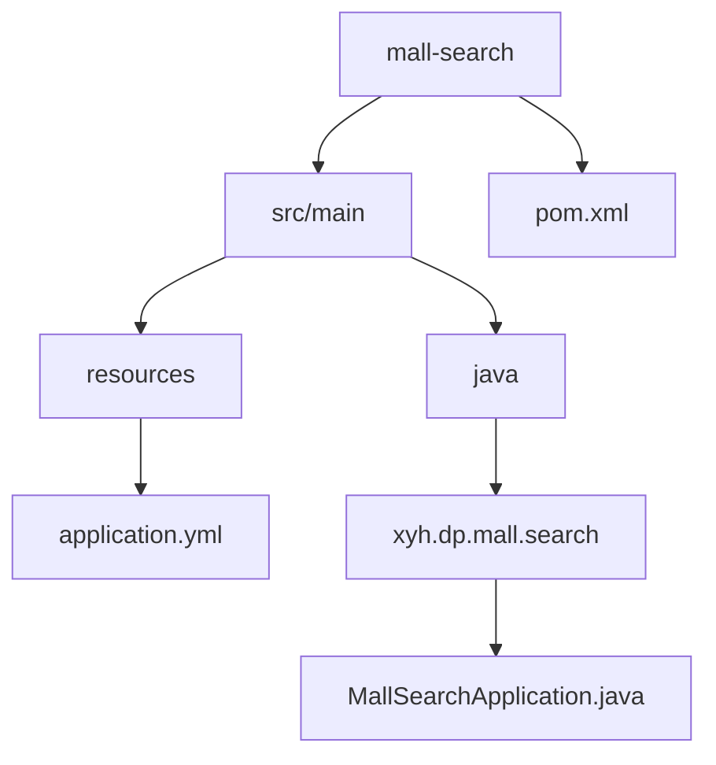
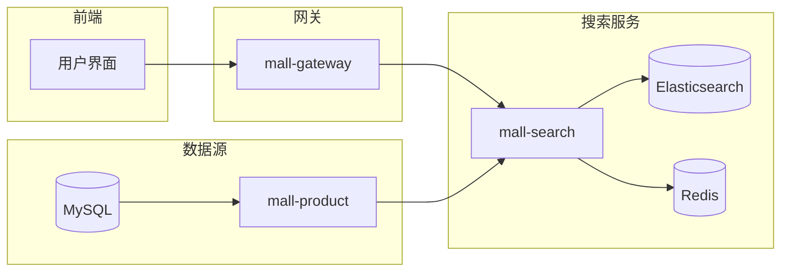
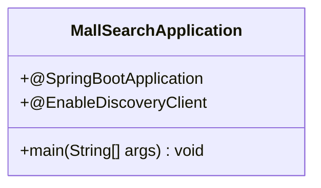
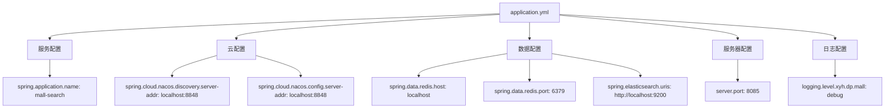
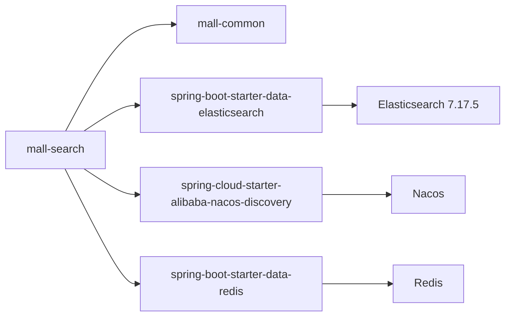

# 搜索服务

<cite>
**本文档引用文件**  
- [MallSearchApplication.java](file://mall-search/src/main/java/xyh/dp/mall/search/MallSearchApplication.java)
- [application.yml](file://mall-search/src/main/resources/application.yml)
- [pom.xml](file://mall-search/pom.xml)
- [catalogue.md](file://catalogue.md)
- [AGENTS.md](file://AGENTS.md)
- [version.md](file://qoder/rules/version.md)
</cite>

## 目录
1. [简介](#简介)
2. [项目结构](#项目结构)
3. [核心组件](#核心组件)
4. [架构概述](#架构概述)
5. [详细组件分析](#详细组件分析)
6. [依赖分析](#依赖分析)
7. [性能考虑](#性能考虑)
8. [故障排除指南](#故障排除指南)
9. [结论](#结论)

## 简介
本项目旨在系统性地分析 `mall-search` 搜索服务的技术架构与实现细节。该服务基于 `MallSearchApplication.java` 启动类，集成 Elasticsearch 实现商品的全文检索功能。通过分析其配置、依赖关系和系统集成方式，揭示其在微服务架构中的角色与职责，重点说明商品数据同步、搜索功能实现及高可用部署方案。

## 项目结构

`mall-search` 模块是整个电商系统中负责商品搜索的核心服务，其结构简洁清晰，遵循典型的 Spring Boot 微服务设计模式。

**图示来源**  
- [MallSearchApplication.java](file://mall-search/src/main/java/xyh/dp/mall/search/MallSearchApplication.java)
- [application.yml](file://mall-search/src/main/resources/application.yml)
- [pom.xml](file://mall-search/pom.xml)

**本节来源**  
- [mall-search](file://mall-search)

## 核心组件

`mall-search` 服务的核心组件包括启动类 `MallSearchApplication.java` 和配置文件 `application.yml`。启动类通过 `@SpringBootApplication` 和 `@EnableDiscoveryClient` 注解实现自动配置和 Nacos 服务注册发现功能，是服务的入口点。配置文件则定义了服务名称、端口、Nacos、Redis 和 Elasticsearch 的连接信息，是服务运行的基础。

**本节来源**  
- [MallSearchApplication.java](file://mall-search/src/main/java/xyh/dp/mall/search/MallSearchApplication.java#L1-L26)
- [application.yml](file://mall-search/src/main/resources/application.yml#L1-L24)

## 架构概述

`mall-search` 服务在整体微服务架构中扮演着商品搜索网关的角色。它通过 Nacos 进行服务注册与发现，使用 Redis 作为缓存层提升查询性能，并通过 Spring Data Elasticsearch 与 Elasticsearch 集群交互，实现高效的全文检索功能。

**图示来源**  
- [application.yml](file://mall-search/src/main/resources/application.yml#L1-L24)
- [MallSearchApplication.java](file://mall-search/src/main/java/xyh/dp/mall/search/MallSearchApplication.java#L1-L26)
- [catalogue.md](file://catalogue.md#L7)

## 详细组件分析

### 搜索服务启动类分析

`MallSearchApplication.java` 是搜索服务的主启动类，采用标准的 Spring Boot 应用结构。该类使用 `@SpringBootApplication` 注解启用自动配置、组件扫描和配置属性功能，同时通过 `@EnableDiscoveryClient` 注解实现与 Nacos 服务注册中心的集成，确保服务启动后能被网关和其他服务发现。

**图示来源**  
- [MallSearchApplication.java](file://mall-search/src/main/java/xyh/dp/mall/search/MallSearchApplication.java#L1-L26)

**本节来源**  
- [MallSearchApplication.java](file://mall-search/src/main/java/xyh/dp/mall/search/MallSearchApplication.java#L1-L26)

### 配置文件分析

`application.yml` 文件配置了搜索服务的关键参数，包括服务名称、端口、Nacos 注册中心地址、Redis 缓存配置以及 Elasticsearch 集群连接地址。其中 `spring.elasticsearch.uris: http://localhost:9200` 明确指定了 Elasticsearch 的访问端点，是实现商品搜索功能的基础。

**图示来源**  
- [application.yml](file://mall-search/src/main/resources/application.yml#L1-L24)

**本节来源**  
- [application.yml](file://mall-search/src/main/resources/application.yml#L1-L24)

## 依赖分析

`mall-search` 模块的依赖关系清晰，主要依赖 `mall-common` 模块以共享通用工具类和配置。虽然当前 `pom.xml` 文件中未显式声明 `spring-boot-starter-data-elasticsearch`，但根据根 `pom.xml` 的全局依赖管理，项目使用了 Spring Boot 4.0.0-M1 版本的 Spring Data Elasticsearch 和 Elasticsearch 7.17.5 版本，确保了与 Elasticsearch 集群的兼容性和功能完整性。

**图示来源**  
- [pom.xml](file://mall-search/pom.xml#L1-L28)
- [pom.xml](file://pom.xml#L90-L95)
- [version.md](file://qoder/rules/version.md#L11-L12)

**本节来源**  
- [pom.xml](file://mall-search/pom.xml#L1-L28)
- [pom.xml](file://pom.xml#L90-L95)

## 性能考虑

为提升搜索性能，系统设计中采用了多层优化策略。首先，通过 Redis 缓存热门查询结果，减少对 Elasticsearch 的直接访问压力。其次，Elasticsearch 索引设计应考虑使用 IK 分词器进行中文分词，以提高搜索准确率。此外，合理的索引分片和副本策略可确保高可用性和查询性能。模糊搜索、条件筛选和分页功能的实现也需优化查询 DSL，避免深度分页带来的性能问题。

## 故障排除指南

当搜索服务出现异常时，可按以下步骤排查：
1. 检查 `mall-search` 服务是否成功注册到 Nacos。
2. 验证 Elasticsearch 集群是否正常运行且可通过 `http://localhost:9200` 访问。
3. 检查 Redis 服务是否可用。
4. 查看服务日志（`logging.level.xyh.dp.mall: debug`）获取详细错误信息。
5. 确认商品数据是否已正确同步至 Elasticsearch 索引。

**本节来源**  
- [application.yml](file://mall-search/src/main/resources/application.yml#L22-L24)
- [MallSearchApplication.java](file://mall-search/src/main/java/xyh/dp/mall/search/MallSearchApplication.java#L8-L9)

## 结论

`mall-search` 服务通过集成 Elasticsearch 实现了高效的商品全文检索功能。其架构设计合理，依赖清晰，通过 Nacos 实现服务治理，利用 Redis 提升缓存性能。尽管当前代码库中未包含具体的搜索业务逻辑实现，但从配置和依赖关系可推断，该服务具备实现模糊搜索、条件筛选、排序和分页等核心搜索功能的技术基础。未来应进一步完善商品数据同步机制和搜索权重配置，以提供更精准的搜索体验。