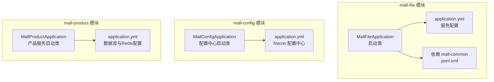
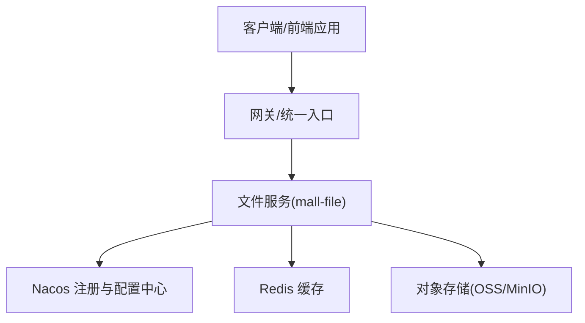
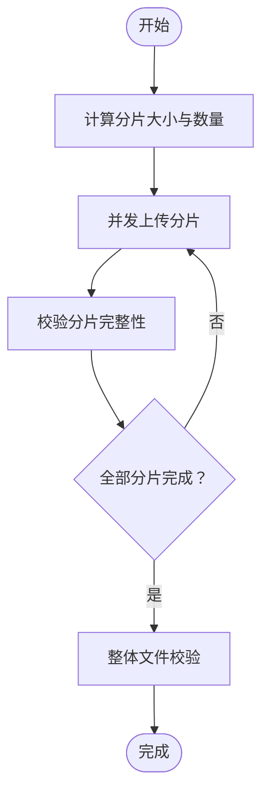
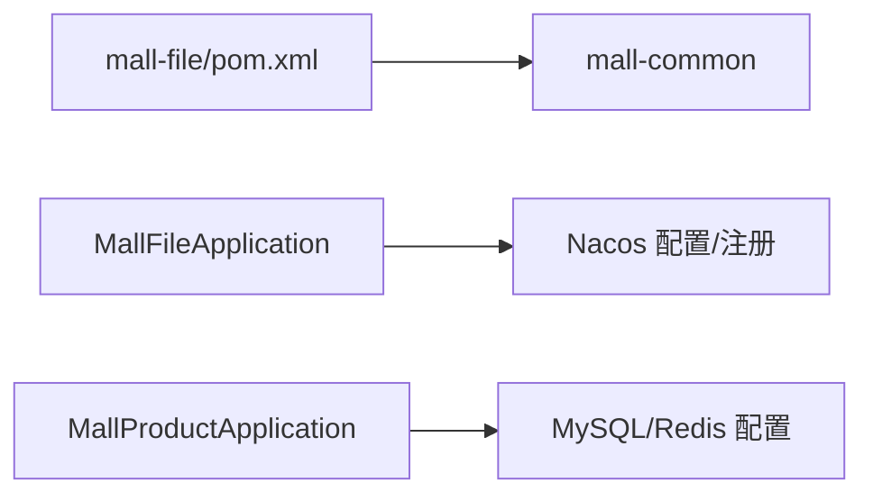

# 文件服务

<cite>
**本文引用的文件**
- [MallFileApplication.java](file://mall-file/src/main/java/xiyh/dp/mall/file/MallFileApplication.java)
- [application.yml](file://mall-file/src/main/resources/application.yml)
- [pom.xml](file://mall-file/pom.xml)
- [MallConfigApplication.java](file://mall-config/src/main/java/xyh/dp/mall/config/MallConfigApplication.java)
- [application.yml](file://mall-config/src/main/resources/application.yml)
- [MallProductApplication.java](file://mall-product/src/main/java/xyh/dp/mall/product/MallProductApplication.java)
- [application.yml](file://mall-product/src/main/resources/application.yml)
</cite>

## 目录
1. [简介](#简介)
2. [项目结构](#项目结构)
3. [核心组件](#核心组件)
4. [架构总览](#架构总览)
5. [详细组件分析](#详细组件分析)
6. [依赖分析](#依赖分析)
7. [性能考虑](#性能考虑)
8. [故障排查指南](#故障排查指南)
9. [结论](#结论)
10. [附录](#附录)

## 简介
本文件围绕 mall-file 文件服务进行系统化文档化说明，目标是帮助读者理解该服务如何通过统一的文件上传接口对外提供能力，并支持将图片、视频等文件存储至 OSS 或 MinIO 对象存储系统；同时解释文件元数据的管理方式（文件名、路径、大小、类型等）以及持久化存储策略；结合 application.yml 中的存储配置，说明如何动态切换不同的存储后端；并给出文件上传的安全控制机制（类型校验、大小限制、防恶意上传等），最后提供上传 API 的使用示例，并分析大文件分片上传、断点续传等高级功能的实现思路。

## 项目结构
mall-file 是一个独立的服务模块，采用 Spring Boot + Spring Cloud 的微服务架构风格，通过 Nacos 进行注册与配置管理。当前仓库中，mall-file 的启动类和配置文件是最主要的可见实现入口，其余模块（如 mall-config、mall-product 等）用于对比服务发现与配置中心的通用配置模式。

图表来源
- [MallFileApplication.java](file://mall-file/src/main/java/xiyh/dp/mall/file/MallFileApplication.java#L1-L26)
- [application.yml](file://mall-file/src/main/resources/application.yml#L1-L27)
- [pom.xml](file://mall-file/pom.xml#L1-L28)
- [MallConfigApplication.java](file://mall-config/src/main/java/xyh/dp/mall/config/MallConfigApplication.java#L1-L26)
- [application.yml](file://mall-config/src/main/resources/application.yml#L1-L20)
- [MallProductApplication.java](file://mall-product/src/main/java/xyh/dp/mall/product/MallProductApplication.java#L1-L34)
- [application.yml](file://mall-product/src/main/resources/application.yml#L1-L34)

章节来源
- [MallFileApplication.java](file://mall-file/src/main/java/xiyh/dp/mall/file/MallFileApplication.java#L1-L26)
- [application.yml](file://mall-file/src/main/resources/application.yml#L1-L27)
- [pom.xml](file://mall-file/pom.xml#L1-L28)
- [MallConfigApplication.java](file://mall-config/src/main/java/xyh/dp/mall/config/MallConfigApplication.java#L1-L26)
- [application.yml](file://mall-config/src/main/resources/application.yml#L1-L20)
- [MallProductApplication.java](file://mall-product/src/main/java/xyh/dp/mall/product/MallProductApplication.java#L1-L34)
- [application.yml](file://mall-product/src/main/resources/application.yml#L1-L34)

## 核心组件
- 启动类：负责应用引导与服务注册，启用 Spring Cloud 客户端发现能力，便于在微服务体系中被网关或其他服务调用。
- 配置中心集成：通过 Nacos 发现与配置加载，使文件服务具备动态配置能力（例如存储后端切换、日志级别等）。
- 存储配置：在 application.yml 中定义了 Servlet 多部分上传限制（单文件大小、请求总大小）、Redis 连接信息、服务端口与日志级别等。
- 依赖模块：mall-file 依赖 mall-common 工具模块，为后续扩展通用工具与常量提供基础。

章节来源
- [MallFileApplication.java](file://mall-file/src/main/java/xiyh/dp/mall/file/MallFileApplication.java#L1-L26)
- [application.yml](file://mall-file/src/main/resources/application.yml#L1-L27)
- [pom.xml](file://mall-file/pom.xml#L1-L28)

## 架构总览
mall-file 在微服务架构中的定位是“文件服务”，对外提供统一的文件上传接口，内部可对接 OSS 或 MinIO 等对象存储系统。其运行时依赖 Nacos 注册与配置中心，通过 Redis 进行缓存或会话相关能力（具体取决于业务实现）。下图展示了服务启动、配置加载与外部依赖的关系。

图表来源
- [MallFileApplication.java](file://mall-file/src/main/java/xiyh/dp/mall/file/MallFileApplication.java#L1-L26)
- [application.yml](file://mall-file/src/main/resources/application.yml#L1-L27)
- [MallConfigApplication.java](file://mall-config/src/main/java/xyh/dp/mall/config/MallConfigApplication.java#L1-L26)
- [application.yml](file://mall-config/src/main/resources/application.yml#L1-L20)

## 详细组件分析

### 启动类与服务注册
- 启动类承担应用引导职责，启用 Spring Cloud 客户端发现，使服务能够注册到 Nacos 并被其他服务发现。
- 该设计使得文件服务可以作为微服务生态中的一个独立节点，由网关统一接入。

章节来源
- [MallFileApplication.java](file://mall-file/src/main/java/xiyh/dp/mall/file/MallFileApplication.java#L1-L26)

### 配置与存储后端切换
- 当前仓库中，mall-file 的 application.yml 明确了以下关键配置：
  - 服务端口与日志级别
  - Nacos 注册与配置中心地址
  - Redis 连接信息
  - Servlet 多部分上传限制（单文件大小与请求总大小）
- 关于对象存储后端（OSS/MinIO）的切换，通常通过配置中心下发的存储策略（如存储类型、访问密钥、桶名、域名等）来实现。由于当前仓库未包含具体的存储实现代码，建议通过以下方式实现：
  - 在配置中心新增存储后端配置项（如存储类型、Endpoint、Bucket、AccessKey、SecretKey 等）
  - 在文件服务中根据配置动态选择存储实现（OSS 或 MinIO），并通过工厂或条件装配进行切换
  - 使用 Spring Profile 或配置开关控制不同环境下的存储后端

章节来源
- [application.yml](file://mall-file/src/main/resources/application.yml#L1-L27)
- [MallConfigApplication.java](file://mall-config/src/main/java/xyh/dp/mall/config/MallConfigApplication.java#L1-L26)
- [application.yml](file://mall-config/src/main/resources/application.yml#L1-L20)

### 文件元数据管理
- 元数据字段建议包含：原始文件名、存储路径、文件大小、文件类型（MIME）、存储后端标识、创建时间、业务关联标识（如订单号、用户ID）等。
- 持久化建议：
  - 数据库存储：使用关系型数据库记录元数据，便于查询与审计
  - 缓存层：对热点查询（如按业务ID查询）使用 Redis 缓存，降低数据库压力
  - 索引设计：为业务ID、创建时间、文件类型建立索引，提升检索效率

章节来源
- [application.yml](file://mall-file/src/main/resources/application.yml#L1-L27)

### 安全性控制
- 类型校验：仅允许白名单内的文件类型（如 image/*、video/*、application/pdf 等），拒绝未知或危险类型
- 大小限制：结合 Servlet 配置与业务规则，限制单文件与总请求大小
- 防恶意上传：
  - 文件名清洗：去除路径遍历字符、重命名避免冲突
  - 内容检测：对图片进行魔数校验，视频进行容器合法性校验
  - 访问鉴权：上传接口需鉴权，防止匿名上传
  - 存储隔离：按业务维度划分目录或桶，避免跨业务访问

章节来源
- [application.yml](file://mall-file/src/main/resources/application.yml#L1-L27)

### 大文件分片上传与断点续传（实现思路）
- 分片策略：
  - 固定分片大小（如 10MB、50MB），或按文件大小动态计算分片数量
  - 生成分片唯一标识（如 md5(文件名+分片序号)），便于去重与续传
- 断点续传：
  - 客户端记录已上传分片列表，服务端维护分片清单与完整性校验
  - 支持并发上传多个分片，完成后合并为完整文件
- 完整性校验：
  - 服务端对每个分片进行校验，最终对整体文件做二次校验（如 md5）
- 清理策略：
  - 超时未完成的分片清理，避免磁盘/存储空间浪费

图表来源
- [MallFileApplication.java](file://mall-file/src/main/java/xiyh/dp/mall/file/MallFileApplication.java#L1-L26)
- [application.yml](file://mall-file/src/main/resources/application.yml#L1-L27)

### 统一上传接口与使用示例
- 接口设计建议：
  - POST /file/upload
    - 参数：multipart/form-data，支持单文件或多文件
    - 返回：文件元数据（含访问URL、存储路径、大小、类型等）
- 使用示例（概念性说明）：
  - 单文件上传：选择本地文件，设置 Content-Type 为 multipart/form-data，提交到 /file/upload
  - 多文件上传：一次请求携带多个文件字段，服务端逐个处理并返回对应元数据
  - 断点续传：先上传分片，再发起合并请求，服务端完成校验与合并

章节来源
- [application.yml](file://mall-file/src/main/resources/application.yml#L1-L27)

## 依赖分析
- mall-file 依赖 mall-common 工具模块，便于复用通用工具与常量
- mall-file 通过 Nacos 实现服务注册与配置中心集成，便于动态切换存储后端与调整运行参数
- mall-product 模块展示了典型的微服务配置模式（数据库与 Redis），可作为 mall-file 在存储与缓存方面的参考

图表来源
- [pom.xml](file://mall-file/pom.xml#L1-L28)
- [MallFileApplication.java](file://mall-file/src/main/java/xiyh/dp/mall/file/MallFileApplication.java#L1-L26)
- [MallProductApplication.java](file://mall-product/src/main/java/xyh/dp/mall/product/MallProductApplication.java#L1-L34)
- [application.yml](file://mall-product/src/main/resources/application.yml#L1-L34)

章节来源
- [pom.xml](file://mall-file/pom.xml#L1-L28)
- [MallFileApplication.java](file://mall-file/src/main/java/xiyh/dp/mall/file/MallFileApplication.java#L1-L26)
- [MallProductApplication.java](file://mall-product/src/main/java/xyh/dp/mall/product/MallProductApplication.java#L1-L34)
- [application.yml](file://mall-product/src/main/resources/application.yml#L1-L34)

## 性能考虑
- 上传限流与并发控制：限制同时上传的连接数与分片数，避免资源耗尽
- CDN 加速：对静态资源开启 CDN，减少源站压力
- 异步处理：对非关键链路（如缩略图生成、水印处理）采用异步队列
- 缓存命中：热点文件元数据与访问URL缓存，降低数据库与存储压力
- 存储优化：分层存储（热/温/冷），按访问频率选择不同存储介质

## 故障排查指南
- 上传失败
  - 检查 Servlet 上传限制是否过小（单文件/总请求大小）
  - 查看 Nacos 配置是否正确下发（存储后端、桶名、密钥等）
  - 校验 Redis 连接状态与权限
- 访问异常
  - 确认对象存储的访问域名与签名策略
  - 检查防火墙与安全组放通情况
- 日志定位
  - 将日志级别调整为 debug，定位上传流程中的异常节点

章节来源
- [application.yml](file://mall-file/src/main/resources/application.yml#L1-L27)

## 结论
mall-file 当前以启动类与基础配置为核心，具备对接 Nacos 注册与配置中心的能力，并预留了通过配置中心动态切换存储后端的空间。结合合理的文件元数据管理、安全性控制与大文件分片/断点续传策略，可构建稳定高效的文件服务能力。建议尽快完善存储实现与接口定义，以便在微服务生态中发挥更大价值。

## 附录
- 术语
  - OSS：阿里云对象存储
  - MinIO：开源对象存储
  - CDN：内容分发网络
  - Nacos：阿里巴巴开源的动态服务发现、配置管理平台