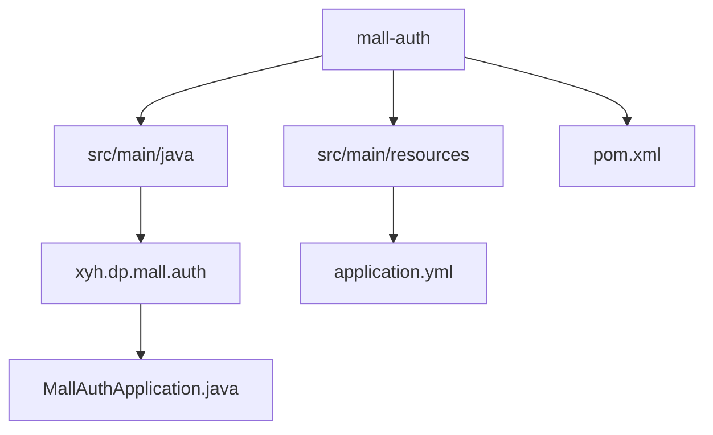
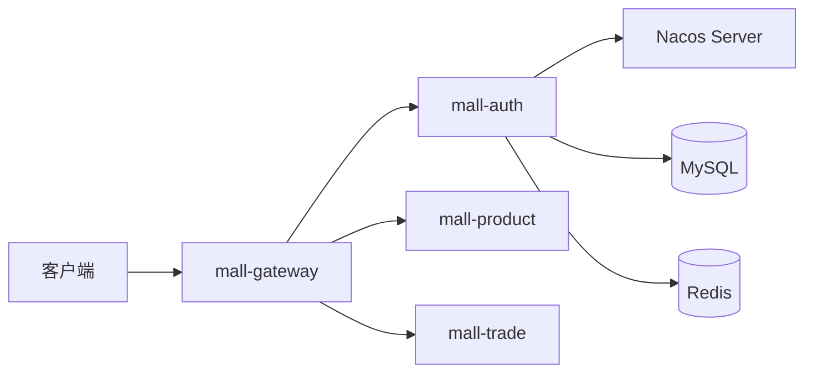
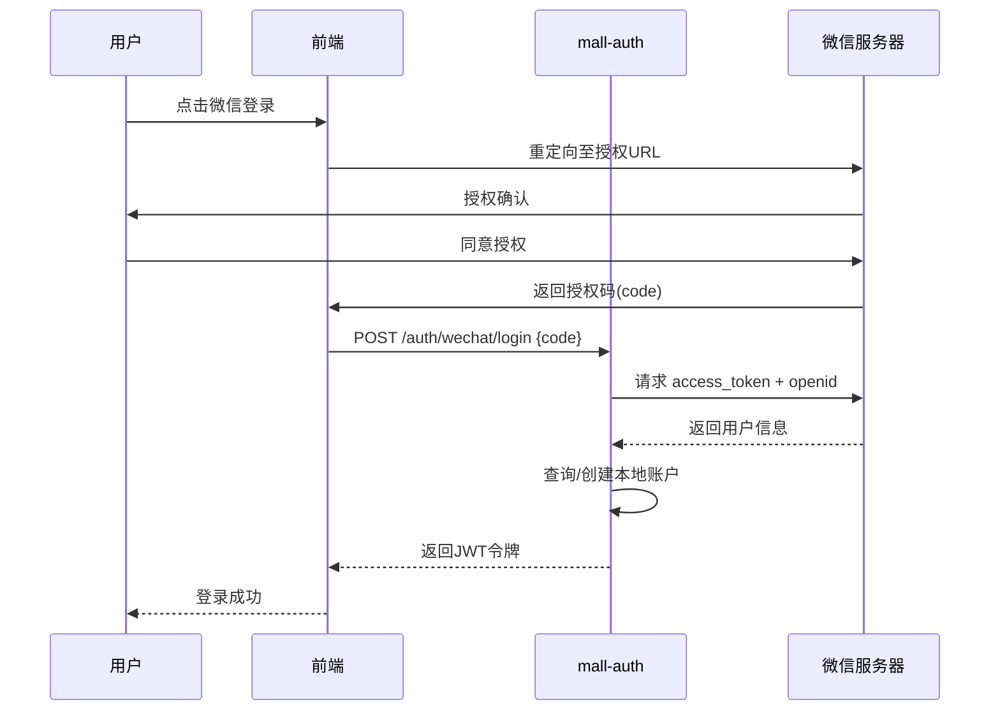
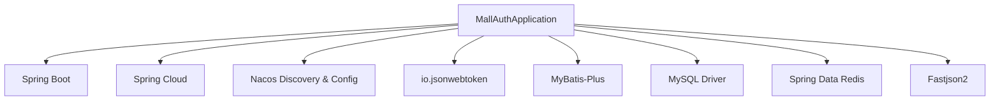

# 认证授权服务

<cite>
**本文档引用的文件**  
- [MallAuthApplication.java](file://mall-auth/src/main/java/xyh/dp/mall/auth/MallAuthApplication.java)
- [application.yml](file://mall-auth/src/main/resources/application.yml)
- [pom.xml](file://mall-auth/pom.xml)
- [pom.xml](file://pom.xml)
- [mall-gateway\src\main\resources\application.yml](file://mall-gateway/src/main/resources/application.yml)
</cite>

## 目录
1. [简介](#简介)
2. [项目结构](#项目结构)
3. [核心组件](#核心组件)
4. [架构概览](#架构概览)
5. [详细组件分析](#详细组件分析)
6. [依赖分析](#依赖分析)
7. [性能考虑](#性能考虑)
8. [故障排除指南](#故障排除指南)
9. [结论](#结论)

## 简介
mall-auth 是一个基于 Spring Boot 和 Spring Cloud 的认证授权微服务，负责处理用户身份验证、权限控制以及与第三方平台（如微信）的集成。该服务通过 JWT 实现无状态认证，并结合 Nacos 进行服务发现和配置管理。它为整个 mall-cloud 系统提供统一的身份认证入口，支持微信登录等 OAuth2.0 授权模式。

## 项目结构
mall-auth 模块遵循标准的 Maven 多模块结构，包含 Java 源码、资源文件和构建配置。其主要功能集中在 `src/main/java/xyh/dp/mall/auth` 包下，配置文件位于 `src/main/resources` 目录。



**图示来源**  
- [MallAuthApplication.java](file://mall-auth/src/main/java/xyh/dp/mall/auth/MallAuthApplication.java)
- [application.yml](file://mall-auth/src/main/resources/application.yml)

**本节来源**  
- [MallAuthApplication.java](file://mall-auth/src/main/java/xyh/dp/mall/auth/MallAuthApplication.java)
- [application.yml](file://mall-auth/src/main/resources/application.yml)

## 核心组件
认证服务的核心是 `MallAuthApplication.java`，作为 Spring Boot 应用的启动类，它通过 `@SpringBootApplication` 注解启用自动配置、组件扫描和配置注入功能。同时，`@EnableDiscoveryClient` 注解使其能够注册到 Nacos 服务注册中心，实现服务的动态发现与治理。

该服务集成了 JWT、MyBatis-Plus、Redis 和 MySQL，支持基于数据库的用户信息存储和基于 Redis 的会话缓存。虽然当前代码中未显式展示 Spring Security 配置类，但从项目依赖和命名可推断其存在用于处理认证逻辑的安全配置。

**本节来源**  
- [MallAuthApplication.java](file://mall-auth/src/main/java/xyh/dp/mall/auth/MallAuthApplication.java)
- [pom.xml](file://pom.xml)

## 架构概览
mall-auth 作为独立的认证中心，与其他微服务（如 product、trade、file）协同工作，通过 mall-gateway 统一网关对外暴露 API。客户端请求首先经过网关，网关根据路由规则将 `/auth/**` 请求转发至认证服务。



**图示来源**  
- [application.yml](file://mall-auth/src/main/resources/application.yml)
- [mall-gateway\src\main\resources\application.yml](file://mall-gateway/src/main/resources/application.yml)
- [pom.xml](file://pom.xml)

## 详细组件分析

### 认证流程分析
尽管具体的 Spring Security 配置类未在当前上下文中显示，但可以推断系统使用了基于 JWT 的无状态认证机制。用户登录后，服务生成包含用户身份信息的 JWT 令牌，并通过 HTTP 响应头返回给客户端。后续请求需在 `Authorization` 头中携带 `Bearer <token>` 形式的令牌，由网关或资源服务进行验证。

JWT 的生成与验证依赖于 `io.jsonwebtoken` 库，已在根 `pom.xml` 中声明。密钥管理、过期时间等参数可能通过 Nacos 配置中心动态加载。

**本节来源**  
- [pom.xml](file://pom.xml)
- [application.yml](file://mall-auth/src/main/resources/application.yml)

### 微信登录集成分析
微信登录采用 OAuth2.0 授权码模式。用户在前端触发微信登录后，被重定向至微信授权页面。授权成功后，微信返回授权码（code），前端将 code 发送至 mall-auth 的登录接口。认证服务使用该 code 向微信服务器请求 access_token 和 openid，进而获取用户基本信息。

若用户首次登录，系统会创建本地账户并将 openid 作为唯一标识进行绑定；若已存在绑定记录，则直接生成 JWT 并返回。用户信息可能存储于 `mall_auth` 数据库中，通过 MyBatis-Plus 操作。



**图示来源**  
- [MallAuthApplication.java](file://mall-auth/src/main/java/xyh/dp/mall/auth/MallAuthApplication.java)
- [application.yml](file://mall-auth/src/main/resources/application.yml)

**本节来源**  
- [MallAuthApplication.java](file://mall-auth/src/main/java/xyh/dp/mall/auth/MallAuthApplication.java)
- [application.yml](file://mall-auth/src/main/resources/application.yml)

### JWT 令牌机制分析
JWT 令牌由三部分组成：Header、Payload 和 Signature。Payload 中包含用户 ID、角色、过期时间等声明（claims）。服务使用 HS256 或 RS256 算法对令牌进行签名，确保其不可篡改。

令牌在请求头中的传递方式如下：
```
Authorization: Bearer <JWT_TOKEN>
```
mall-gateway 或各微服务通过拦截请求，解析并验证 JWT 的有效性，实现统一的权限控制。

**本节来源**  
- [pom.xml](file://pom.xml)
- [application.yml](file://mall-auth/src/main/resources/application.yml)

## 依赖分析
mall-auth 依赖多个核心组件，形成完整的认证体系。



**图示来源**  
- [pom.xml](file://pom.xml)
- [application.yml](file://mall-auth/src/main/resources/application.yml)

**本节来源**  
- [pom.xml](file://pom.xml)
- [application.yml](file://mall-auth/src/main/resources/application.yml)

## 性能考虑
- **Redis 缓存**：用户会话、令牌黑名单等高频访问数据应缓存至 Redis，减少数据库压力。
- **JWT 无状态性**：避免服务器端存储会话信息，提升横向扩展能力。
- **Nacos 配置热更新**：安全策略、密钥等可通过 Nacos 动态调整，无需重启服务。
- **数据库连接池**：使用 HikariCP 等高性能连接池优化数据库访问。

## 故障排除指南
### 常见证书失败场景及解决方案
1. **微信登录失败：授权码无效或过期**
   - 原因：code 被重复使用或超时（通常为5分钟）
   - 解决方案：确保前端及时提交 code，服务端处理后立即失效

2. **JWT 验证失败：签名不匹配**
   - 原因：服务端密钥与签发时不一致
   - 解决方案：检查 Nacos 配置中的密钥是否正确，确保所有服务使用相同密钥

3. **数据库连接失败**
   - 原因：URL、用户名或密码错误
   - 解决方案：核对 `application.yml` 中的 datasource 配置，确认数据库服务正常运行

4. **Nacos 注册失败**
   - 原因：网络不通或 Nacos 服务未启动
   - 解决方案：检查 `server-addr` 配置，确认 Nacos 服务在 `localhost:8848` 可访问

5. **Redis 连接超时**
   - 原因：Redis 服务未启动或配置错误
   - 解决方案：确认 Redis 服务运行状态，检查 host 和 port 配置

**本节来源**  
- [application.yml](file://mall-auth/src/main/resources/application.yml)
- [pom.xml](file://pom.xml)

## 结论
mall-auth 作为 mall-cloud 系统的认证中心，基于 Spring Boot 和 Spring Cloud 技术栈，实现了安全、可扩展的用户认证机制。通过集成微信 OAuth2.0 登录和 JWT 令牌技术，支持现代移动应用的无状态认证需求。服务通过 Nacos 实现配置与服务发现，具备良好的运维灵活性。未来可进一步完善 Spring Security 配置细节，增强日志审计与异常处理机制，提升系统的安全性与可观测性。