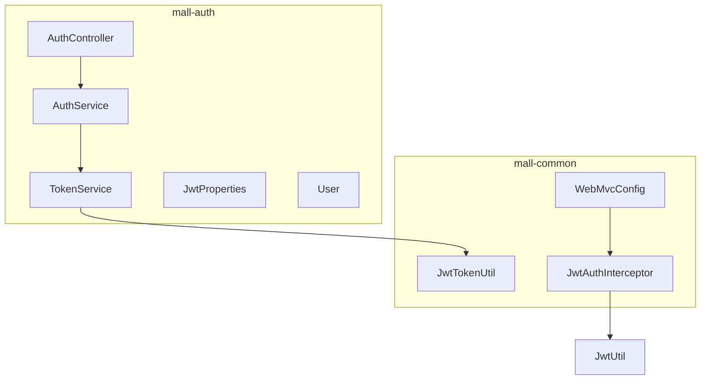
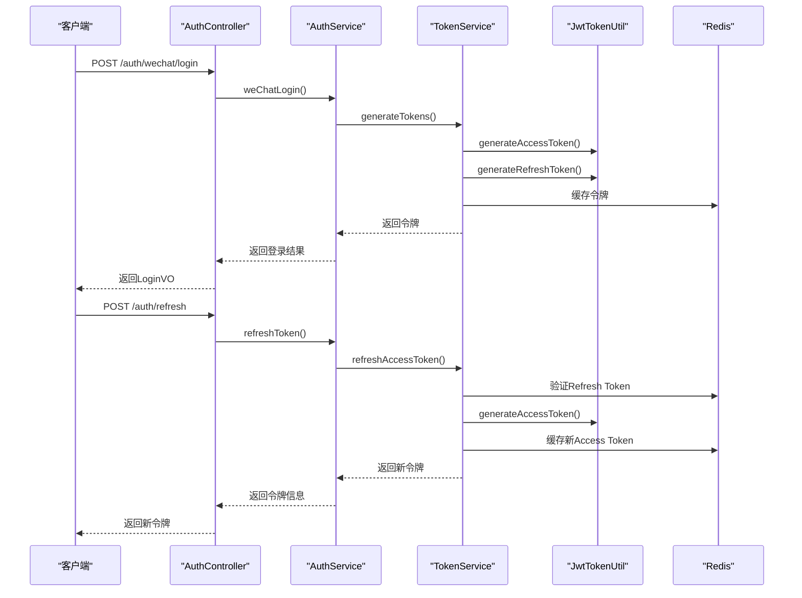
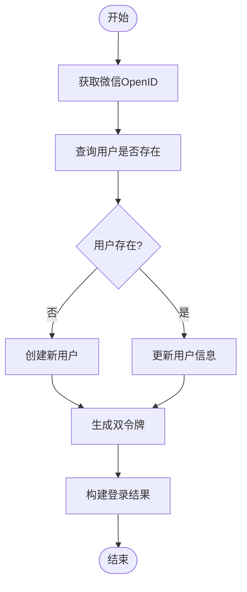
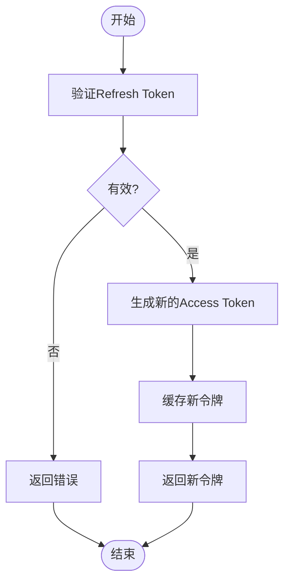
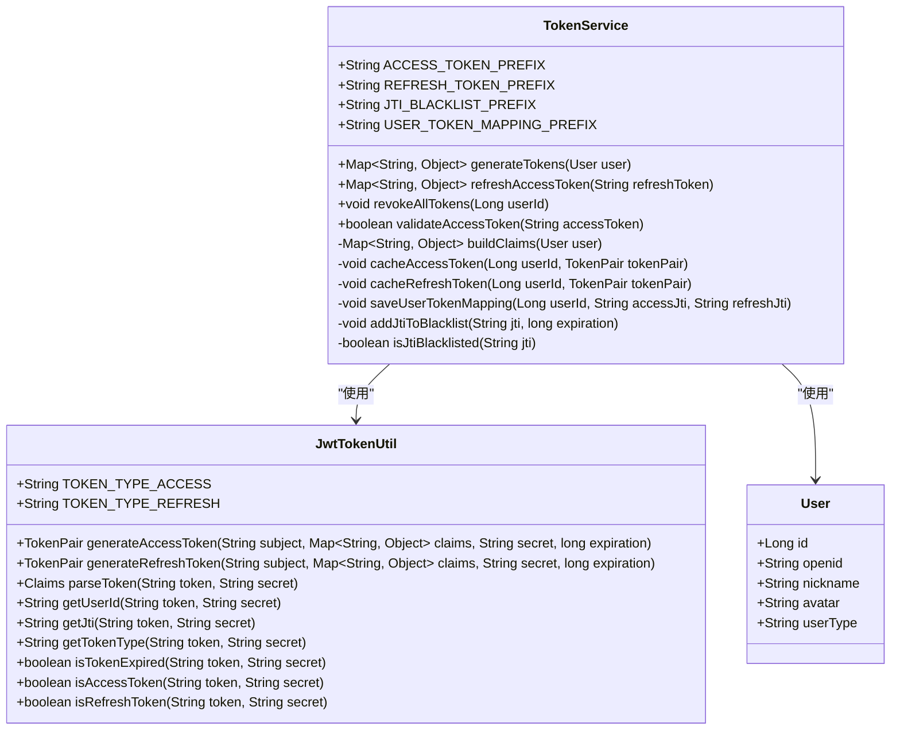
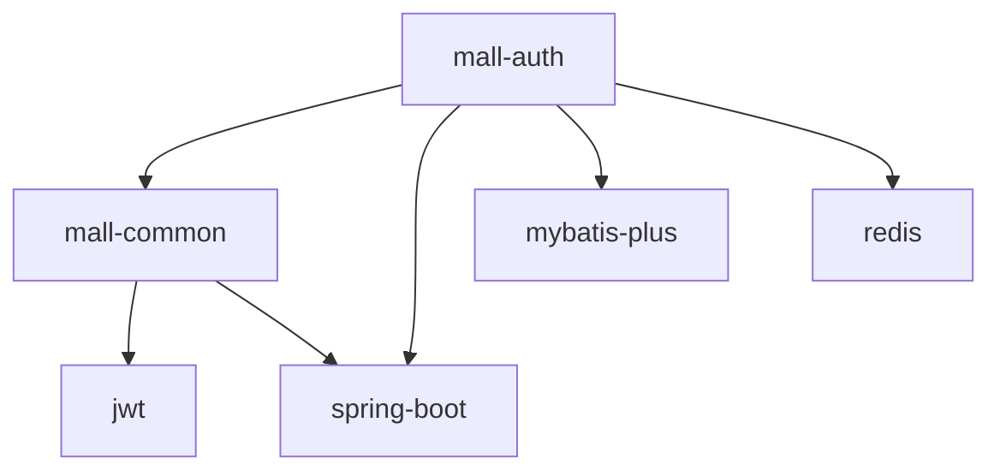

# 双令牌机制

<cite>
**本文档引用的文件**  
- [AuthService.java](file://mall-auth\src\main\java\xyh\dp\mall\auth\service\AuthService.java)
- [TokenService.java](file://mall-auth\src\main\java\xyh\dp\mall\auth\service\TokenService.java)
- [AuthController.java](file://mall-auth\src\main\java\xyh\dp\mall\auth\controller\AuthController.java)
- [JwtTokenUtil.java](file://mall-common\src\main\java\xyh\dp\mall\common\util\JwtTokenUtil.java)
- [JwtProperties.java](file://mall-auth\src\main\java\xyh\dp\mall\auth\config\JwtProperties.java)
- [JwtAuthInterceptor.java](file://mall-common\src\main\java\xyh\dp\mall\common\interceptor\JwtAuthInterceptor.java)
- [WebMvcConfig.java](file://mall-common\src\main\java\xyh\dp\mall\common\config\WebMvcConfig.java)
- [LoginVO.java](file://mall-auth\src\main\java\xyh\dp\mall\auth\vo\LoginVO.java)
- [RefreshTokenDTO.java](file://mall-auth\src\main\java\xyh\dp\mall\auth\dto\RefreshTokenDTO.java)
- [WeChatLoginDTO.java](file://mall-auth\src\main\java\xyh\dp\mall\auth\dto\WeChatLoginDTO.java)
- [User.java](file://mall-auth\src\main\java\xyh\dp\mall\auth\entity\User.java)
</cite>

## 目录
1. [引言](#引言)
2. [项目结构](#项目结构)
3. [核心组件](#核心组件)
4. [架构概述](#架构概述)
5. [详细组件分析](#详细组件分析)
6. [依赖分析](#依赖分析)
7. [性能考虑](#性能考虑)
8. [故障排除指南](#故障排除指南)
9. [结论](#结论)

## 引言
本文档详细描述了“双令牌机制”的实现，该机制用于微信小程序的用户认证系统。系统采用JWT（JSON Web Token）技术，结合Access Token和Refresh Token，实现了安全、高效的用户身份验证和会话管理。通过Redis缓存和JTI（JWT ID）黑名单机制，系统支持令牌的撤销和强制登出功能，增强了安全性。

## 项目结构
项目结构清晰，主要分为`mall-auth`认证模块和`mall-common`公共模块。`mall-auth`模块负责用户认证和令牌管理，`mall-common`模块提供通用的JWT工具类和拦截器。

**图示来源**
- [AuthController.java](file://mall-auth\src\main\java\xyh\dp\mall\auth\controller\AuthController.java)
- [AuthService.java](file://mall-auth\src\main\java\xyh\dp\mall\auth\service\AuthService.java)
- [TokenService.java](file://mall-auth\src\main\java\xyh\dp\mall\auth\service\TokenService.java)
- [JwtTokenUtil.java](file://mall-common\src\main\java\xyh\dp\mall\common\util\JwtTokenUtil.java)
- [WebMvcConfig.java](file://mall-common\src\main\java\xyh\dp\mall\common\config\WebMvcConfig.java)

**章节来源**
- [AuthController.java](file://mall-auth\src\main\java\xyh\dp\mall\auth\controller\AuthController.java)
- [AuthService.java](file://mall-auth\src\main\java\xyh\dp\mall\auth\service\AuthService.java)
- [TokenService.java](file://mall-auth\src\main\java\xyh\dp\mall\auth\service\TokenService.java)
- [JwtTokenUtil.java](file://mall-common\src\main\java\xyh\dp\mall\common\util\JwtTokenUtil.java)
- [WebMvcConfig.java](file://mall-common\src\main\java\xyh\dp\mall\common\config\WebMvcConfig.java)

## 核心组件
核心组件包括`AuthService`、`TokenService`、`JwtTokenUtil`和`JwtAuthInterceptor`。`AuthService`处理用户登录和登出逻辑，`TokenService`管理令牌的生成、刷新和撤销，`JwtTokenUtil`提供JWT操作的底层工具，`JwtAuthInterceptor`在请求处理前解析令牌并设置用户上下文。

**章节来源**
- [AuthService.java](file://mall-auth\src\main\java\xyh\dp\mall\auth\service\AuthService.java)
- [TokenService.java](file://mall-auth\src\main\java\xyh\dp\mall\auth\service\TokenService.java)
- [JwtTokenUtil.java](file://mall-common\src\main\java\xyh\dp\mall\common\util\JwtTokenUtil.java)
- [JwtAuthInterceptor.java](file://mall-common\src\main\java\xyh\dp\mall\common\interceptor\JwtAuthInterceptor.java)

## 架构概述
系统采用分层架构，控制器层处理HTTP请求，服务层实现业务逻辑，工具层提供通用功能。认证流程包括微信登录、令牌生成、令牌刷新和用户登出。

**图示来源**
- [AuthController.java](file://mall-auth\src\main\java\xyh\dp\mall\auth\controller\AuthController.java)
- [AuthService.java](file://mall-auth\src\main\java\xyh\dp\mall\auth\service\AuthService.java)
- [TokenService.java](file://mall-auth\src\main\java\xyh\dp\mall\auth\service\TokenService.java)
- [JwtTokenUtil.java](file://mall-common\src\main\java\xyh\dp\mall\common\util\JwtTokenUtil.java)

## 详细组件分析
### AuthService分析
`AuthService`是认证服务的核心，处理微信登录、令牌刷新和用户登出。

#### 微信登录流程

**图示来源**
- [AuthService.java](file://mall-auth\src\main\java\xyh\dp\mall\auth\service\AuthService.java)

#### 令牌刷新流程

**图示来源**
- [TokenService.java](file://mall-auth\src\main\java\xyh\dp\mall\auth\service\TokenService.java)

**章节来源**
- [AuthService.java](file://mall-auth\src\main\java\xyh\dp\mall\auth\service\AuthService.java)
- [TokenService.java](file://mall-auth\src\main\java\xyh\dp\mall\auth\service\TokenService.java)

### TokenService分析
`TokenService`负责令牌的全生命周期管理。

#### 类图

**图示来源**
- [TokenService.java](file://mall-auth\src\main\java\xyh\dp\mall\auth\service\TokenService.java)
- [JwtTokenUtil.java](file://mall-common\src\main\java\xyh\dp\mall\common\util\JwtTokenUtil.java)
- [User.java](file://mall-auth\src\main\java\xyh\dp\mall\auth\entity\User.java)

**章节来源**
- [TokenService.java](file://mall-auth\src\main\java\xyh\dp\mall\auth\service\TokenService.java)

## 依赖分析
系统依赖于Spring Boot、MyBatis-Plus、JWT和Redis。`mall-auth`模块依赖`mall-common`模块的JWT工具类和拦截器。

**图示来源**
- [pom.xml](file://mall-auth\pom.xml)
- [pom.xml](file://mall-common\pom.xml)

**章节来源**
- [pom.xml](file://mall-auth\pom.xml)
- [pom.xml](file://mall-common\pom.xml)

## 性能考虑
- 使用Redis缓存令牌信息，提高验证效率。
- Access Token有效期短（15分钟），减少安全风险。
- Refresh Token有效期长（7天），减少用户频繁登录。
- JTI黑名单机制确保令牌撤销的即时性。

## 故障排除指南
- **登录失败**：检查微信AppID和AppSecret配置。
- **令牌刷新失败**：检查Refresh Token是否过期或已被撤销。
- **Redis连接失败**：检查Redis服务是否正常运行。
- **JWT密钥错误**：确保`jwt.secret`配置正确。

**章节来源**
- [AuthService.java](file://mall-auth\src\main\java\xyh\dp\mall\auth\service\AuthService.java)
- [TokenService.java](file://mall-auth\src\main\java\xyh\dp\mall\auth\service\TokenService.java)
- [application.yml](file://mall-auth\src\main\resources\application.yml)

## 结论
双令牌机制通过Access Token和Refresh Token的组合，实现了安全、高效的用户认证。系统设计合理，代码结构清晰，易于维护和扩展。通过Redis和JTI黑名单机制，增强了系统的安全性和可靠性。