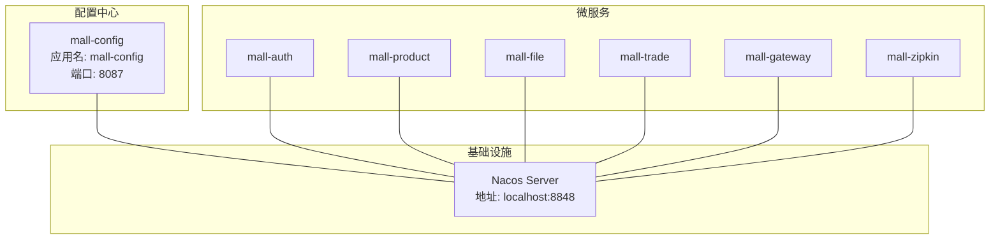
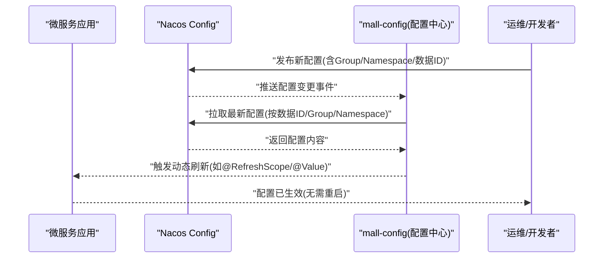
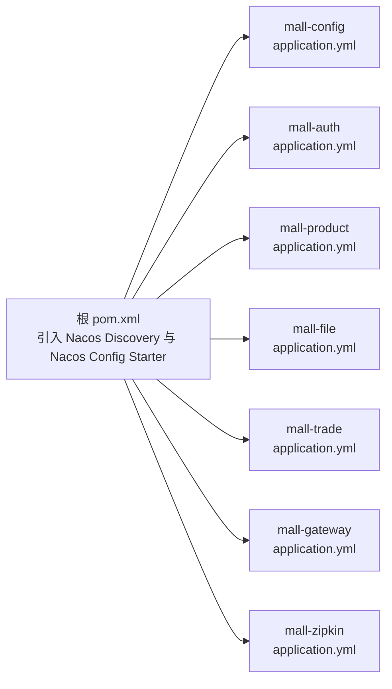

# 配置中心服务

<cite>
**本文引用的文件**
- [MallConfigApplication.java](file://mall-config/src/main/java/xiyh/dp/mall/config/MallConfigApplication.java)
- [application.yml](file://mall-config/src/main/resources/application.yml)
- [pom.xml](file://pom.xml)
- [application.yml](file://mall-auth/src/main/resources/application.yml)
- [application.yml](file://mall-product/src/main/resources/application.yml)
- [application.yml](file://mall-file/src/main/resources/application.yml)
- [application.yml](file://mall-trade/src/main/resources/application.yml)
- [application.yml](file://mall-gateway/src/main/resources/application.yml)
- [application.yml](file://mall-zipkin/src/main/resources/application.yml)
- [catalogue.md](file://catalogue.md)
- [AGENTS.md](file://AGENTS.md)
</cite>

## 目录
1. [简介](#简介)
2. [项目结构](#项目结构)
3. [核心组件](#核心组件)
4. [架构总览](#架构总览)
5. [详细组件分析](#详细组件分析)
6. [依赖关系分析](#依赖关系分析)
7. [性能考虑](#性能考虑)
8. [故障排查指南](#故障排查指南)
9. [结论](#结论)
10. [附录](#附录)

## 简介
本文件围绕 mall-config 配置中心服务展开，基于 MallConfigApplication 启动类，系统性阐述其如何通过 Nacos 实现集中化配置管理，覆盖以下主题：
- 如何基于 Nacos Config 在启动阶段从配置中心拉取配置
- 动态刷新能力（不重启服务即可更新配置项）
- 分组（Group）与命名空间（Namespace）的管理策略，支撑多环境隔离（dev/test/prod）
- 结合各微服务 application.yml 中的 Nacos 客户端配置，说明服务如何从配置中心拉取配置
- 配置更新的实践示例与推送失败的监控与告警机制建议

## 项目结构
mall-cloud 是一个基于 Spring Cloud Alibaba 的多模块工程，mall-config 作为配置中心模块，与其他微服务模块共同协作，形成统一的配置管理与动态刷新体系。

图表来源
- [MallConfigApplication.java](file://mall-config/src/main/java/xiyh/dp/mall/config/MallConfigApplication.java#L1-L26)
- [application.yml](file://mall-config/src/main/resources/application.yml#L1-L17)
- [application.yml](file://mall-auth/src/main/resources/application.yml#L1-L34)
- [application.yml](file://mall-product/src/main/resources/application.yml#L1-L34)
- [application.yml](file://mall-file/src/main/resources/application.yml#L1-L26)
- [application.yml](file://mall-trade/src/main/resources/application.yml#L1-L34)
- [application.yml](file://mall-gateway/src/main/resources/application.yml#L1-L36)
- [application.yml](file://mall-zipkin/src/main/resources/application.yml#L1-L25)

章节来源
- [catalogue.md](file://catalogue.md#L1-L13)
- [MallConfigApplication.java](file://mall-config/src/main/java/xiyh/dp/mall/config/MallConfigApplication.java#L1-L26)
- [application.yml](file://mall-config/src/main/resources/application.yml#L1-L17)

## 核心组件
- mall-config 启动类：启用 Spring Boot 应用与服务发现能力，作为 Nacos Config 的客户端参与配置拉取与动态刷新。
- Nacos 客户端依赖：通过 Spring Cloud Alibaba 的 Nacos Discovery 与 Nacos Config Starter 引入。
- 各微服务的 Nacos 客户端配置：统一指向本地 Nacos Server 地址，指定配置文件扩展名为 yml，确保从配置中心按需拉取配置。

章节来源
- [MallConfigApplication.java](file://mall-config/src/main/java/xiyh/dp/mall/config/MallConfigApplication.java#L1-L26)
- [pom.xml](file://pom.xml#L55-L95)
- [application.yml](file://mall-config/src/main/resources/application.yml#L1-L17)
- [application.yml](file://mall-auth/src/main/resources/application.yml#L1-L34)
- [application.yml](file://mall-product/src/main/resources/application.yml#L1-L34)
- [application.yml](file://mall-file/src/main/resources/application.yml#L1-L26)
- [application.yml](file://mall-trade/src/main/resources/application.yml#L1-L34)
- [application.yml](file://mall-gateway/src/main/resources/application.yml#L1-L36)
- [application.yml](file://mall-zipkin/src/main/resources/application.yml#L1-L25)

## 架构总览
mall-config 作为配置中心服务，主要职责是：
- 为各微服务提供统一的配置源，避免分散在各服务内的配置文件
- 通过 Nacos Config 的动态刷新能力，使配置变更无需重启即可生效
- 通过 Group 与 Namespace 实现多环境隔离与权限控制

图表来源
- [MallConfigApplication.java](file://mall-config/src/main/java/xiyh/dp/mall/config/MallConfigApplication.java#L1-L26)
- [application.yml](file://mall-config/src/main/resources/application.yml#L1-L17)
- [application.yml](file://mall-auth/src/main/resources/application.yml#L1-L34)
- [application.yml](file://mall-product/src/main/resources/application.yml#L1-L34)
- [application.yml](file://mall-file/src/main/resources/application.yml#L1-L26)
- [application.yml](file://mall-trade/src/main/resources/application.yml#L1-L34)
- [application.yml](file://mall-gateway/src/main/resources/application.yml#L1-L36)
- [application.yml](file://mall-zipkin/src/main/resources/application.yml#L1-L25)

## 详细组件分析

### mall-config 启动类与 Nacos 客户端集成
- 启动类注解：启用 Spring Boot 应用与服务发现，使应用具备注册与发现能力，同时作为 Nacos Config 客户端参与配置拉取。
- Nacos 客户端依赖：在根 pom 中引入 Nacos Discovery 与 Nacos Config Starter，确保应用具备从 Nacos 拉取配置的能力。
- mall-config 自身的 application.yml：定义应用名、Nacos 服务器地址、配置文件扩展名与端口，保证配置中心自身也能正确接入 Nacos。

章节来源
- [MallConfigApplication.java](file://mall-config/src/main/java/xiyh/dp/mall/config/MallConfigApplication.java#L1-L26)
- [pom.xml](file://pom.xml#L55-L95)
- [application.yml](file://mall-config/src/main/resources/application.yml#L1-L17)

### 微服务如何从配置中心拉取配置
- 统一配置入口：各微服务的 application.yml 中均配置了 Nacos Config 的 server-addr 与 file-extension，确保以 yml 扩展名从配置中心拉取配置。
- 数据 ID 规则：通常由“应用名 + 文件扩展名”构成；若需区分环境或业务域，可通过 Group 与 Namespace 进行隔离。
- 配置加载顺序：优先加载本地配置，再由 Nacos Config 覆盖同名键值，实现“本地兜底 + 远程动态”的双层保障。

章节来源
- [application.yml](file://mall-auth/src/main/resources/application.yml#L1-L34)
- [application.yml](file://mall-product/src/main/resources/application.yml#L1-L34)
- [application.yml](file://mall-file/src/main/resources/application.yml#L1-L26)
- [application.yml](file://mall-trade/src/main/resources/application.yml#L1-L34)
- [application.yml](file://mall-gateway/src/main/resources/application.yml#L1-L36)
- [application.yml](file://mall-zipkin/src/main/resources/application.yml#L1-L25)

### 动态刷新机制（不重启更新配置）
- 刷新触发方式：当配置中心推送配置变更后，微服务端通过 Nacos 客户端监听并触发刷新，典型场景包括：
  - 使用 @RefreshScope 对 Bean 进行刷新
  - 使用 @Value 或 @ConfigurationProperties 获取最新值
- 刷新范围：可针对特定配置项进行局部刷新，避免全量重启带来的业务中断。
- 最佳实践：对敏感配置（如数据库连接、开关策略）采用动态刷新，减少停机窗口。

章节来源
- [pom.xml](file://pom.xml#L55-L95)

### 分组（Group）与命名空间（Namespace）管理策略
- Group：用于区分业务域或租户，例如按模块划分（如 mall-auth、mall-product），便于权限控制与配置隔离。
- Namespace：用于区分环境（dev/test/prod），确保不同环境的配置互不干扰。
- 数据 ID：通常为“应用名 + 文件扩展名”，结合 Group 与 Namespace 形成唯一配置标识，便于运维检索与回滚。

章节来源
- [application.yml](file://mall-auth/src/main/resources/application.yml#L1-L34)
- [application.yml](file://mall-product/src/main/resources/application.yml#L1-L34)
- [application.yml](file://mall-file/src/main/resources/application.yml#L1-L26)
- [application.yml](file://mall-trade/src/main/resources/application.yml#L1-L34)
- [application.yml](file://mall-gateway/src/main/resources/application.yml#L1-L36)
- [application.yml](file://mall-zipkin/src/main/resources/application.yml#L1-L25)

### 多环境配置隔离（dev/test/prod）
- 建议策略：
  - dev：开发联调环境，配置可频繁变更，Group 可按功能模块划分
  - test：测试验证环境，配置与 prod 接近，但允许差异化的开关策略
  - prod：生产环境，严格控制变更流程，使用只读或受控写入策略
- 隔离手段：通过 Namespace 区分环境，Group 区分业务域，数据 ID 保持一致以便统一管理。

章节来源
- [application.yml](file://mall-auth/src/main/resources/application.yml#L1-L34)
- [application.yml](file://mall-product/src/main/resources/application.yml#L1-L34)
- [application.yml](file://mall-file/src/main/resources/application.yml#L1-L26)
- [application.yml](file://mall-trade/src/main/resources/application.yml#L1-L34)
- [application.yml](file://mall-gateway/src/main/resources/application.yml#L1-L36)
- [application.yml](file://mall-zipkin/src/main/resources/application.yml#L1-L25)

### 配置更新实践示例
- 示例一：数据库连接参数
  - 在配置中心创建数据 ID，设置 Group 为业务域，Namespace 为当前环境
  - 修改数据库连接 URL、用户名、密码等敏感字段
  - 观察微服务端是否自动刷新并生效
- 示例二：功能开关策略
  - 新增开关键值，如 enable_feature_xxx
  - 通过 @RefreshScope 控制受影响的 Bean
  - 在网关或业务服务中按开关动态调整行为

章节来源
- [application.yml](file://mall-auth/src/main/resources/application.yml#L1-L34)
- [application.yml](file://mall-product/src/main/resources/application.yml#L1-L34)
- [application.yml](file://mall-file/src/main/resources/application.yml#L1-L26)
- [application.yml](file://mall-trade/src/main/resources/application.yml#L1-L34)
- [application.yml](file://mall-gateway/src/main/resources/application.yml#L1-L36)
- [application.yml](file://mall-zipkin/src/main/resources/application.yml#L1-L25)

### 配置推送失败的监控与告警机制
- 建议方案：
  - 配置中心侧：记录推送日志，对失败重试与幂等处理
  - 微服务侧：监听刷新失败事件，上报监控系统（如 Prometheus/Grafana）
  - 运维侧：建立变更审批流程与回滚预案，确保问题可追溯
- 关键指标：推送成功率、刷新延迟、回滚次数、告警触达率

章节来源
- [pom.xml](file://pom.xml#L55-L95)

## 依赖关系分析
mall-config 与各微服务共享 Nacos 客户端依赖，形成统一的配置拉取与动态刷新生态。

图表来源
- [pom.xml](file://pom.xml#L55-L95)
- [application.yml](file://mall-config/src/main/resources/application.yml#L1-L17)
- [application.yml](file://mall-auth/src/main/resources/application.yml#L1-L34)
- [application.yml](file://mall-product/src/main/resources/application.yml#L1-L34)
- [application.yml](file://mall-file/src/main/resources/application.yml#L1-L26)
- [application.yml](file://mall-trade/src/main/resources/application.yml#L1-L34)
- [application.yml](file://mall-gateway/src/main/resources/application.yml#L1-L36)
- [application.yml](file://mall-zipkin/src/main/resources/application.yml#L1-L25)

章节来源
- [pom.xml](file://pom.xml#L55-L95)
- [application.yml](file://mall-config/src/main/resources/application.yml#L1-L17)
- [application.yml](file://mall-auth/src/main/resources/application.yml#L1-L34)
- [application.yml](file://mall-product/src/main/resources/application.yml#L1-L34)
- [application.yml](file://mall-file/src/main/resources/application.yml#L1-L26)
- [application.yml](file://mall-trade/src/main/resources/application.yml#L1-L34)
- [application.yml](file://mall-gateway/src/main/resources/application.yml#L1-L36)
- [application.yml](file://mall-zipkin/src/main/resources/application.yml#L1-L25)

## 性能考虑
- 配置拉取频率：合理设置拉取周期，避免频繁请求 Nacos 造成压力
- 缓存策略：对热点配置进行本地缓存，降低网络抖动影响
- 刷新粒度：按需刷新，避免全量 Bean 重建导致的瞬时开销
- 环境隔离：通过 Namespace 与 Group 减少不必要的配置广播

## 故障排查指南
- 确认 Nacos Server 地址与端口正确，且网络可达
- 检查各微服务 application.yml 中的 server-addr 与 file-extension 是否一致
- 核对数据 ID、Group、Namespace 是否匹配，避免找不到配置
- 观察刷新是否生效，必要时检查 @RefreshScope 使用是否正确
- 若推送失败，查看配置中心日志与微服务侧错误栈，定位具体原因

章节来源
- [application.yml](file://mall-config/src/main/resources/application.yml#L1-L17)
- [application.yml](file://mall-auth/src/main/resources/application.yml#L1-L34)
- [application.yml](file://mall-product/src/main/resources/application.yml#L1-L34)
- [application.yml](file://mall-file/src/main/resources/application.yml#L1-L26)
- [application.yml](file://mall-trade/src/main/resources/application.yml#L1-L34)
- [application.yml](file://mall-gateway/src/main/resources/application.yml#L1-L36)
- [application.yml](file://mall-zipkin/src/main/resources/application.yml#L1-L25)

## 结论
mall-config 通过 Nacos Config 实现了集中化配置管理与动态刷新，配合 Group 与 Namespace 的多环境隔离策略，有效提升了配置治理效率与安全性。各微服务通过统一的 Nacos 客户端配置接入，实现了“本地兜底 + 远程动态”的双层保障。建议在生产环境中完善监控与告警机制，确保配置变更的可观测与可回溯。

## 附录
- 技术栈概览：Java 25、Spring Boot 4.0.0-M1、Spring Cloud Alibaba 2025.0.0.0-preview、Nacos 2.5.1
- 工具与规范：Slf4j、AssertJ、OpenAPI 等

章节来源
- [AGENTS.md](file://AGENTS.md#L1-L31)