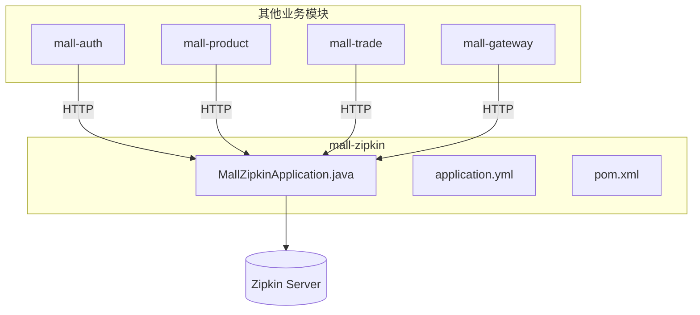
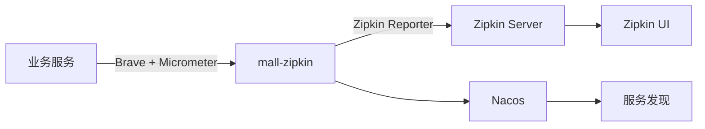
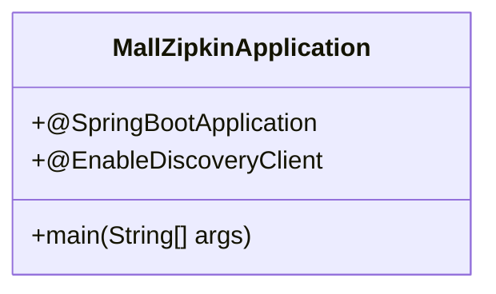
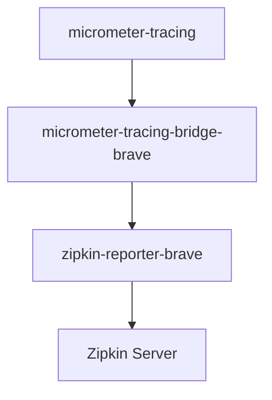
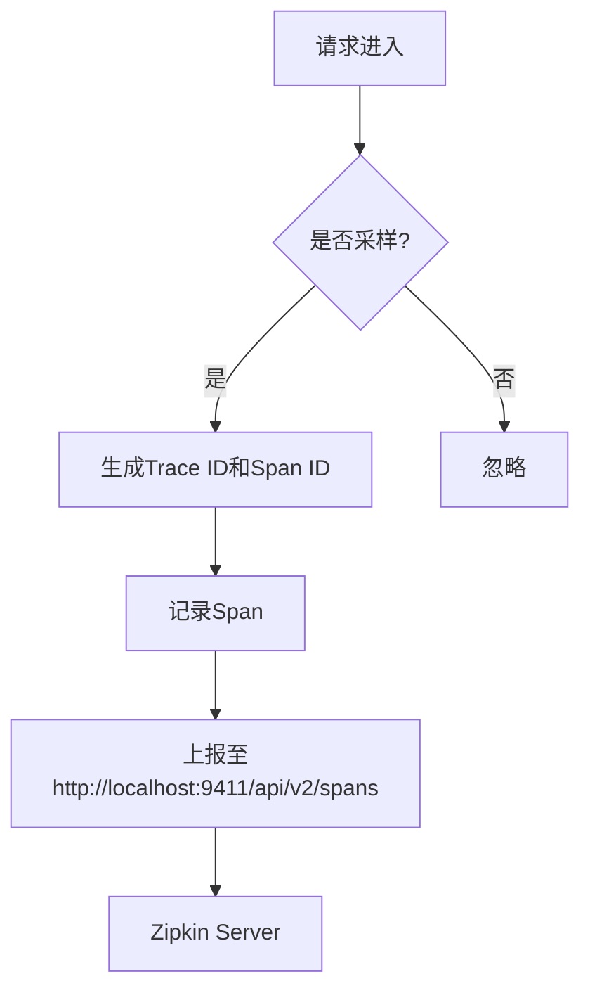
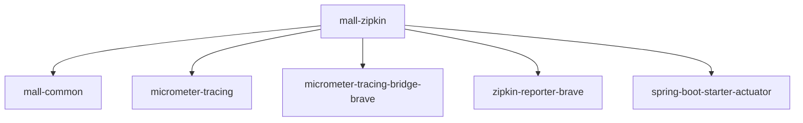

# 链路追踪服务

<cite>
**本文档引用的文件**
- [MallZipkinApplication.java](file://mall-zipkin/src/main/java/xyh/dp/mall/zipkin/MallZipkinApplication.java)
- [pom.xml](file://mall-zipkin/pom.xml)
- [application.yml](file://mall-zipkin/src/main/resources/application.yml)
- [AGENTS.md](file://AGENTS.md)
- [pom.xml](file://pom.xml)
</cite>

## 目录
1. [简介](#简介)
2. [项目结构](#项目结构)
3. [核心组件](#核心组件)
4. [架构概述](#架构概述)
5. [详细组件分析](#详细组件分析)
6. [依赖分析](#依赖分析)
7. [性能考虑](#性能考虑)
8. [故障排除指南](#故障排除指南)
9. [结论](#结论)

## 简介
本文档全面解析 mall-zipkin 链路追踪服务的集成与应用。基于 MallZipkinApplication.java 启动类和 pom.xml 中的 Micrometer Tracing、Brave、Zipkin Reporter 依赖，说明其如何实现分布式系统的调用链监控。描述追踪数据的采集、上报与可视化流程，包括 Trace ID、Span ID 的生成与传递机制。结合 AGENTS.md 中的日志规范，解释 AOP 切面如何精确记录方法级调用日志，并与链路追踪数据关联。说明 Zipkin Server 的部署与访问方式，以及如何通过 UI 界面分析服务间的调用延迟与瓶颈。提供链路追踪在定位跨服务性能问题中的实际应用案例。

## 项目结构
mall-zipkin 模块是整个系统中负责链路追踪的核心服务。它作为独立的微服务运行，接收来自其他业务模块（如 mall-auth、mall-product、mall-trade 等）的追踪数据，并通过 Zipkin 协议进行处理和展示。该模块遵循标准的 Spring Boot 项目结构，包含启动类、资源配置和依赖管理。

**图示来源**
- [MallZipkinApplication.java](file://mall-zipkin/src/main/java/xyh/dp/mall/zipkin/MallZipkinApplication.java#L1-L26)
- [application.yml](file://mall-zipkin/src/main/resources/application.yml#L1-L25)

**本节来源**
- [mall-zipkin](file://mall-zipkin)

## 核心组件
mall-zipkin 模块的核心组件包括启动类 MallZipkinApplication.java、配置文件 application.yml 和依赖管理文件 pom.xml。这些组件共同协作，实现链路追踪功能。

**本节来源**
- [MallZipkinApplication.java](file://mall-zipkin/src/main/java/xyh/dp/mall/zipkin/MallZipkinApplication.java#L1-L26)
- [pom.xml](file://mall-zipkin/pom.xml#L1-L47)
- [application.yml](file://mall-zipkin/src/main/resources/application.yml#L1-L25)

## 架构概述
mall-zipkin 服务基于 Spring Cloud 生态构建，利用 Micrometer Tracing 作为通用的追踪抽象层，通过 Brave 作为具体的追踪实现，并使用 Zipkin Reporter 将追踪数据上报至 Zipkin Server。服务通过 Nacos 进行服务注册与发现，确保其在网络中的可访问性。

**图示来源**
- [pom.xml](file://mall-zipkin/pom.xml#L28-L44)
- [application.yml](file://mall-zipkin/src/main/resources/application.yml#L1-L25)
- [MallZipkinApplication.java](file://mall-zipkin/src/main/java/xyh/dp/mall/zipkin/MallZipkinApplication.java#L1-L26)

## 详细组件分析

### 启动类分析
MallZipkinApplication.java 是链路追踪服务的入口点。它使用 @SpringBootApplication 注解启用 Spring Boot 的自动配置功能，并通过 @EnableDiscoveryClient 注解使其能够注册到 Nacos 服务注册中心，供其他服务发现和调用。

**图示来源**
- [MallZipkinApplication.java](file://mall-zipkin/src/main/java/xyh/dp/mall/zipkin/MallZipkinApplication.java#L1-L26)

**本节来源**
- [MallZipkinApplication.java](file://mall-zipkin/src/main/java/xyh/dp/mall/zipkin/MallZipkinApplication.java#L1-L26)

### 依赖配置分析
pom.xml 文件定义了链路追踪所需的核心依赖。包括 micrometer-tracing 用于追踪抽象，micrometer-tracing-bridge-brave 作为 Brave 的桥接器，以及 zipkin-reporter-brave 用于将追踪数据上报至 Zipkin Server。

**图示来源**
- [pom.xml](file://mall-zipkin/pom.xml#L28-L44)

**本节来源**
- [pom.xml](file://mall-zipkin/pom.xml#L1-L47)

### 配置文件分析
application.yml 文件配置了链路追踪的关键参数。management.tracing.sampling.probability 设置为 1.0，表示所有请求都将被采样追踪。management.zipkin.tracing.endpoint 指定了 Zipkin Server 的上报地址。

**图示来源**
- [application.yml](file://mall-zipkin/src/main/resources/application.yml#L12-L19)

**本节来源**
- [application.yml](file://mall-zipkin/src/main/resources/application.yml#L1-L25)

### 日志与AOP规范
根据 AGENTS.md 文件的规定，系统中的日志均通过 AOP 切面实现，且需要精确到方法级别。这确保了每个方法的调用都能被记录下来，并与链路追踪数据关联，便于问题排查。

**本节来源**
- [AGENTS.md](file://AGENTS.md#L28-L31)

## 依赖分析
mall-zipkin 模块依赖于 mall-common 模块以共享通用工具和配置。同时，它依赖于 Micrometer、Brave 和 Zipkin Reporter 等库来实现链路追踪功能。这些依赖通过 Maven 进行管理，并在 pom.xml 文件中明确定义。

**图示来源**
- [pom.xml](file://mall-zipkin/pom.xml#L20-L45)

**本节来源**
- [pom.xml](file://mall-zipkin/pom.xml#L1-L47)
- [pom.xml](file://pom.xml#L55-L170)

## 性能考虑
链路追踪虽然对系统性能有一定影响，但通过合理的采样策略（如设置 sampling.probability）可以平衡监控需求与性能开销。在生产环境中，可以根据实际需要调整采样率，避免对系统造成过大负担。

## 故障排除指南
当链路追踪数据无法正常上报时，应首先检查 mall-zipkin 服务是否正常运行，并确认 Zipkin Server 的地址配置是否正确。同时，检查网络连接是否通畅，以及相关依赖是否正确引入。

**本节来源**
- [application.yml](file://mall-zipkin/src/main/resources/application.yml#L17-L19)
- [pom.xml](file://mall-zipkin/pom.xml#L28-L44)

## 结论
mall-zipkin 模块通过集成 Micrometer Tracing、Brave 和 Zipkin Reporter，实现了对分布式系统的全面链路追踪。结合 AOP 日志切面，能够精确记录方法级调用信息，并与追踪数据关联，为系统性能分析和问题排查提供了有力支持。