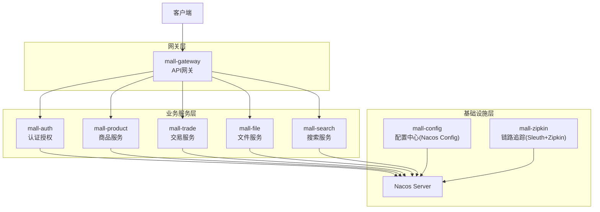
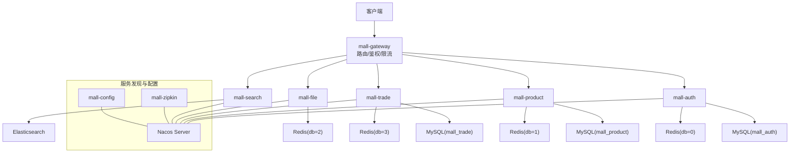
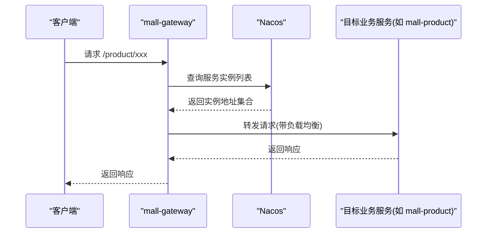
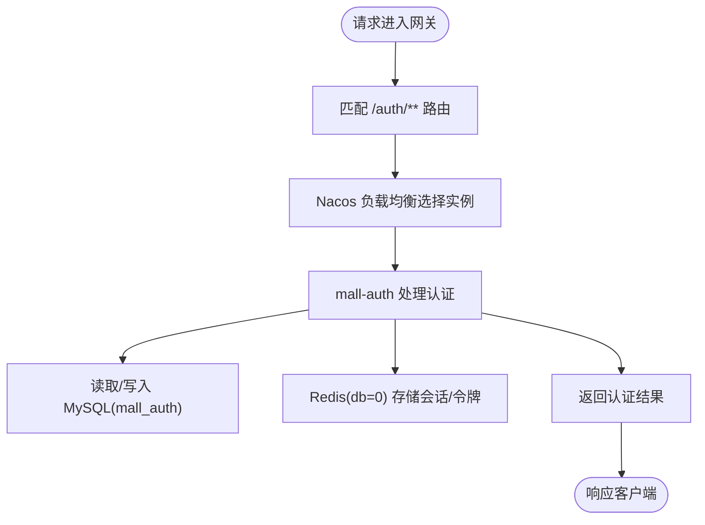
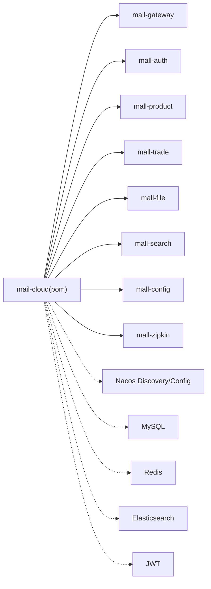

# 系统架构

<cite>
**本文引用的文件**
- [catalogue.md](file://catalogue.md)
- [pom.xml](file://pom.xml)
- [mall-gateway/src/main/resources/application.yml](file://mall-gateway/src/main/resources/application.yml)
- [mall-gateway/src/main/java/xyh/dp/mall/gateway/MallGatewayApplication.java](file://mall-gateway/src/main/java/xyh/dp/mall/gateway/MallGatewayApplication.java)
- [mall-config/src/main/resources/application.yml](file://mall-config/src/main/resources/application.yml)
- [mall-config/src/main/java/xyh/dp/mall/config/MallConfigApplication.java](file://mall-config/src/main/java/xyh/dp/mall/config/MallConfigApplication.java)
- [mall-zipkin/src/main/resources/application.yml](file://mall-zipkin/src/main/resources/application.yml)
- [mall-zipkin/src/main/java/xyh/dp/mall/zipkin/MallZipkinApplication.java](file://mall-zipkin/src/main/java/xyh/dp/mall/zipkin/MallZipkinApplication.java)
- [mall-auth/src/main/resources/application.yml](file://mall-auth/src/main/resources/application.yml)
- [mall-auth/src/main/java/xyh/dp/mall/auth/MallAuthApplication.java](file://mall-auth/src/main/java/xyh/dp/mall/auth/MallAuthApplication.java)
- [mall-product/src/main/resources/application.yml](file://mall-product/src/main/resources/application.yml)
- [mall-product/src/main/java/xyh/dp/mall/product/MallProductApplication.java](file://mall-product/src/main/java/xyh/dp/mall/product/MallProductApplication.java)
- [mall-trade/src/main/resources/application.yml](file://mall-trade/src/main/resources/application.yml)
- [mall-trade/src/main/java/xyh/dp/mall/trade/MallTradeApplication.java](file://mall-trade/src/main/java/xyh/dp/mall/trade/MallTradeApplication.java)
- [mall-file/src/main/resources/application.yml](file://mall-file/src/main/resources/application.yml)
- [mall-file/src/main/java/xyh/dp/mall/file/MallFileApplication.java](file://mall-file/src/main/java/xyh/dp/mall/file/MallFileApplication.java)
- [mall-search/src/main/resources/application.yml](file://mall-search/src/main/resources/application.yml)
- [mall-search/src/main/java/xyh/dp/mall/search/MallSearchApplication.java](file://mall-search/src/main/java/xyh/dp/mall/search/MallSearchApplication.java)
</cite>

## 目录
1. [引言](#引言)
2. [项目结构](#项目结构)
3. [核心组件](#核心组件)
4. [架构总览](#架构总览)
5. [详细组件分析](#详细组件分析)
6. [依赖分析](#依赖分析)
7. [性能考虑](#性能考虑)
8. [故障排查指南](#故障排查指南)
9. [结论](#结论)
10. [附录](#附录)

## 引言
本架构文档面向基于 Spring Cloud 的 mail-cloud 微服务系统，聚焦以下关键能力：
- 服务注册与发现：通过 Nacos 实现服务自动注册与发现
- 集中式配置管理：mall-config 使用 Nacos Config 提供统一配置
- API 网关路由：mall-gateway 基于 Spring Cloud Gateway 动态路由至各业务服务
- 分布式链路追踪：mall-zipkin 基于 Sleuth + Zipkin 进行全链路观测
- 数据流路径：客户端 → 网关 → 业务服务 → 数据库/缓存/搜索引擎
- 可用性、可扩展性与容错：通过 Nacos 负载均衡、限流降级、熔断与重试策略实现
- 安全性与监控：认证授权、令牌校验、日志与指标采集

## 项目结构
mail-cloud 采用多模块 Maven 工程组织，包含网关、认证授权、商品、交易、文件、搜索、定时任务、配置中心与链路追踪等模块。模块划分遵循“按业务域拆分”的原则，便于独立演进与治理。

图表来源
- [catalogue.md](file://catalogue.md#L1-L13)
- [pom.xml](file://pom.xml#L24-L35)
- [mall-gateway/src/main/resources/application.yml](file://mall-gateway/src/main/resources/application.yml#L1-L37)
- [mall-config/src/main/resources/application.yml](file://mall-config/src/main/resources/application.yml#L1-L18)
- [mall-zipkin/src/main/resources/application.yml](file://mall-zipkin/src/main/resources/application.yml#L1-L26)

章节来源
- [catalogue.md](file://catalogue.md#L1-L13)
- [pom.xml](file://pom.xml#L24-L35)

## 核心组件
- mall-gateway：统一入口，负责路由转发、鉴权前置、限流与熔断等横切能力
- mall-auth：提供微信登录、JWT 签发与用户认证
- mall-product：商品与分类、品牌管理
- mall-trade：购物车、订单、支付回调
- mall-file：文件上传（图片/视频），对接 OSS/MinIO
- mall-search：基于 Elasticsearch 的商品搜索
- mall-config：集中式配置中心，使用 Nacos Config
- mall-zipkin：分布式链路追踪，基于 Sleuth + Zipkin

章节来源
- [catalogue.md](file://catalogue.md#L1-L13)
- [mall-gateway/src/main/java/xyh/dp/mall/gateway/MallGatewayApplication.java](file://mall-gateway/src/main/java/xyh/dp/mall/gateway/MallGatewayApplication.java#L1-L26)
- [mall-auth/src/main/java/xyh/dp/mall/auth/MallAuthApplication.java](file://mall-auth/src/main/java/xyh/dp/mall/auth/MallAuthApplication.java#L1-L27)
- [mall-product/src/main/java/xyh/dp/mall/product/MallProductApplication.java](file://mall-product/src/main/java/xyh/dp/mall/product/MallProductApplication.java#L1-L27)
- [mall-trade/src/main/java/xyh/dp/mall/trade/MallTradeApplication.java](file://mall-trade/src/main/java/xyh/dp/mall/trade/MallTradeApplication.java#L1-L27)
- [mall-file/src/main/java/xyh/dp/mall/file/MallFileApplication.java](file://mall-file/src/main/java/xyh/dp/mall/file/MallFileApplication.java#L1-L27)
- [mall-search/src/main/java/xyh/dp/mall/search/MallSearchApplication.java](file://mall-search/src/main/java/xyh/dp/mall/search/MallSearchApplication.java#L1-L27)
- [mall-config/src/main/java/xyh/dp/mall/config/MallConfigApplication.java](file://mall-config/src/main/java/xyh/dp/mall/config/MallConfigApplication.java#L1-L27)
- [mall-zipkin/src/main/java/xyh/dp/mall/zipkin/MallZipkinApplication.java](file://mall-zipkin/src/main/java/xyh/dp/mall/zipkin/MallZipkinApplication.java#L1-L27)

## 架构总览
系统采用“网关 + 多业务服务 + Nacos + 配置中心 + 链路追踪”的整体架构。客户端请求首先进入 mall-gateway，根据路由规则将请求转发至对应业务服务；业务服务通过 Nacos 进行服务发现与负载均衡；mall-config 提供统一配置；mall-zipkin 提供全链路追踪。

图表来源
- [mall-gateway/src/main/resources/application.yml](file://mall-gateway/src/main/resources/application.yml#L1-L37)
- [mall-auth/src/main/resources/application.yml](file://mall-auth/src/main/resources/application.yml#L1-L35)
- [mall-product/src/main/resources/application.yml](file://mall-product/src/main/resources/application.yml#L1-L35)
- [mall-trade/src/main/resources/application.yml](file://mall-trade/src/main/resources/application.yml#L1-L35)
- [mall-file/src/main/resources/application.yml](file://mall-file/src/main/resources/application.yml#L1-L27)
- [mall-search/src/main/resources/application.yml](file://mall-search/src/main/resources/application.yml#L1-L25)
- [mall-config/src/main/resources/application.yml](file://mall-config/src/main/resources/application.yml#L1-L18)
- [mall-zipkin/src/main/resources/application.yml](file://mall-zipkin/src/main/resources/application.yml#L1-L26)

## 详细组件分析

### API 网关 mall-gateway
- 路由规则：基于 application.yml 中的 routes 配置，将 /auth/**、/product/**、/file/**、/trade/**、/search/** 映射到对应的下游服务
- 负载均衡：uri 使用 lb:// 协议，结合 Nacos 实现服务实例的轮询或权重负载
- 启动类：启用 DiscoveryClient，接入 Nacos 发现

图表来源
- [mall-gateway/src/main/resources/application.yml](file://mall-gateway/src/main/resources/application.yml#L1-L37)
- [mall-gateway/src/main/java/xyh/dp/mall/gateway/MallGatewayApplication.java](file://mall-gateway/src/main/java/xyh/dp/mall/gateway/MallGatewayApplication.java#L1-L26)

章节来源
- [mall-gateway/src/main/resources/application.yml](file://mall-gateway/src/main/resources/application.yml#L1-L37)
- [mall-gateway/src/main/java/xyh/dp/mall/gateway/MallGatewayApplication.java](file://mall-gateway/src/main/java/xyh/dp/mall/gateway/MallGatewayApplication.java#L1-L26)

### 认证授权 mall-auth
- 数据源：MySQL(mall_auth)，Redis(db=0)
- 启动类：启用 DiscoveryClient，接入 Nacos
- 能力：提供微信登录、JWT 签发与校验，作为统一认证入口

图表来源
- [mall-auth/src/main/resources/application.yml](file://mall-auth/src/main/resources/application.yml#L1-L35)
- [mall-auth/src/main/java/xyh/dp/mall/auth/MallAuthApplication.java](file://mall-auth/src/main/java/xyh/dp/mall/auth/MallAuthApplication.java#L1-L27)

章节来源
- [mall-auth/src/main/resources/application.yml](file://mall-auth/src/main/resources/application.yml#L1-L35)
- [mall-auth/src/main/java/xyh/dp/mall/auth/MallAuthApplication.java](file://mall-auth/src/main/java/xyh/dp/mall/auth/MallAuthApplication.java#L1-L27)

### 商品服务 mall-product
- 数据源：MySQL(mall_product)，Redis(db=1)
- 启动类：启用 DiscoveryClient，接入 Nacos
- 能力：商品、分类、品牌管理

章节来源
- [mall-product/src/main/resources/application.yml](file://mall-product/src/main/resources/application.yml#L1-L35)
- [mall-product/src/main/java/xyh/dp/mall/product/MallProductApplication.java](file://mall-product/src/main/java/xyh/dp/mall/product/MallProductApplication.java#L1-L27)

### 交易服务 mall-trade
- 数据源：MySQL(mall_trade)，Redis(db=3)
- 启动类：启用 DiscoveryClient，接入 Nacos
- 能力：购物车、订单、支付回调

章节来源
- [mall-trade/src/main/resources/application.yml](file://mall-trade/src/main/resources/application.yml#L1-L35)
- [mall-trade/src/main/java/xyh/dp/mall/trade/MallTradeApplication.java](file://mall-trade/src/main/java/xyh/dp/mall/trade/MallTradeApplication.java#L1-L27)

### 文件服务 mall-file
- Redis(db=2)，支持文件上传大小限制
- 启动类：启用 DiscoveryClient，接入 Nacos

章节来源
- [mall-file/src/main/resources/application.yml](file://mall-file/src/main/resources/application.yml#L1-L27)
- [mall-file/src/main/java/xyh/dp/mall/file/MallFileApplication.java](file://mall-file/src/main/java/xyh/dp/mall/file/MallFileApplication.java#L1-L27)

### 搜索服务 mall-search
- Elasticsearch 集成，Redis(db=4)
- 启动类：启用 DiscoveryClient，接入 Nacos

章节来源
- [mall-search/src/main/resources/application.yml](file://mall-search/src/main/resources/application.yml#L1-L25)
- [mall-search/src/main/java/xyh/dp/mall/search/MallSearchApplication.java](file://mall-search/src/main/java/xyh/dp/mall/search/MallSearchApplication.java#L1-L27)

### 配置中心 mall-config
- 基于 Nacos Config，提供集中配置管理
- 启动类：启用 DiscoveryClient，接入 Nacos

章节来源
- [mall-config/src/main/resources/application.yml](file://mall-config/src/main/resources/application.yml#L1-L18)
- [mall-config/src/main/java/xyh/dp/mall/config/MallConfigApplication.java](file://mall-config/src/main/java/xyh/dp/mall/config/MallConfigApplication.java#L1-L27)

### 链路追踪 mall-zipkin
- 基于 Sleuth + Zipkin，采样概率为 1.0
- 启动类：启用 DiscoveryClient，接入 Nacos

章节来源
- [mall-zipkin/src/main/resources/application.yml](file://mall-zipkin/src/main/resources/application.yml#L1-L26)
- [mall-zipkin/src/main/java/xyh/dp/mall/zipkin/MallZipkinApplication.java](file://mall-zipkin/src/main/java/xyh/dp/mall/zipkin/MallZipkinApplication.java#L1-L27)

## 依赖分析
- 技术栈与版本：Spring Boot 4.0.0-M1、Spring Cloud 2025.0.0、Spring Cloud Alibaba 2025.0.0.0-preview
- 关键依赖：
  - Nacos Discovery 与 Nacos Config
  - MySQL、MyBatis-Plus
  - Redis
  - Elasticsearch
  - JWT
  - OpenAPI
- 模块间耦合：通过 Nacos 服务名解耦，网关以 lb:// 方式路由，避免硬编码 IP

图表来源
- [pom.xml](file://pom.xml#L24-L35)
- [pom.xml](file://pom.xml#L61-L114)
- [pom.xml](file://pom.xml#L173-L191)

章节来源
- [pom.xml](file://pom.xml#L42-L53)
- [pom.xml](file://pom.xml#L61-L114)
- [pom.xml](file://pom.xml#L173-L191)

## 性能考虑
- 负载均衡：网关通过 lb:// 协议与 Nacos 结合，实现多实例间的轮询与健康检查
- 缓存优化：各业务服务使用 Redis 缓存热点数据，降低数据库压力
- 搜索优化：mall-search 使用 Elasticsearch，提升检索性能
- 配置热更新：mall-config 基于 Nacos Config，支持配置变更热生效
- 链路采样：mall-zipkin 设置采样概率为 1.0，便于全链路观测，生产环境可根据流量调整采样率
- 数据库连接池与 ORM：MyBatis-Plus 默认配置已启用驼峰映射与日志输出，建议结合连接池参数与慢查询日志进一步优化

[本节为通用性能建议，不直接分析具体文件]

## 故障排查指南
- 网关路由失败
  - 检查 mall-gateway 的 application.yml 路由配置是否正确，确认 Path 前缀与服务名一致
  - 确认目标服务已在 Nacos 注册成功且状态正常
- 服务无法发现
  - 检查各服务 application.yml 中 Nacos discovery.server-addr 是否可达
  - 确认服务端口未冲突，例如 mall-auth:8081、mall-product:8082、mall-trade:8084、mall-file:8083、mall-search:8085
- 配置中心异常
  - 检查 mall-config 的 Nacos Config 地址与 file-extension 配置
- 链路追踪问题
  - 检查 mall-zipkin 的采样概率与 Zipkin endpoint 地址
- 数据访问异常
  - 核对各服务的数据库 URL、用户名、密码与 Redis 连接参数
- 日志级别
  - 各服务 logging.level.xyh.dp.mall 设为 debug，便于定位问题

章节来源
- [mall-gateway/src/main/resources/application.yml](file://mall-gateway/src/main/resources/application.yml#L1-L37)
- [mall-config/src/main/resources/application.yml](file://mall-config/src/main/resources/application.yml#L1-L18)
- [mall-zipkin/src/main/resources/application.yml](file://mall-zipkin/src/main/resources/application.yml#L1-L26)
- [mall-auth/src/main/resources/application.yml](file://mall-auth/src/main/resources/application.yml#L1-L35)
- [mall-product/src/main/resources/application.yml](file://mall-product/src/main/resources/application.yml#L1-L35)
- [mall-trade/src/main/resources/application.yml](file://mall-trade/src/main/resources/application.yml#L1-L35)
- [mall-file/src/main/resources/application.yml](file://mall-file/src/main/resources/application.yml#L1-L27)
- [mall-search/src/main/resources/application.yml](file://mall-search/src/main/resources/application.yml#L1-L25)

## 结论
mail-cloud 通过 Spring Cloud 与 Nacos 的组合，实现了清晰的服务边界与高效的协作机制。网关承担统一入口与横切职责，业务服务围绕各自领域模型演进，配置中心与链路追踪保障了运维与可观测性。在保证高可用与可扩展性的前提下，系统具备良好的容错与监控能力，适合在电商类场景中持续迭代与扩展。

[本节为总结性内容，不直接分析具体文件]

## 附录
- 数据流路径示例
  - 客户端 → mall-gateway → mall-auth → MySQL(mall_auth)/Redis(db=0) → 返回认证结果
  - 客户端 → mall-gateway → mall-product → MySQL(mall_product)/Redis(db=1) → 返回商品数据
  - 客户端 → mall-gateway → mall-search → Elasticsearch → 返回搜索结果
- 跨服务调用安全
  - 建议在网关层统一鉴权与令牌校验，业务服务内部通过服务间认证或共享密钥进行安全通信
- 监控策略
  - 开启 mall-zipkin 采样，结合 Prometheus/Grafana 收集指标，建立告警阈值

[本节为概念性内容，不直接分析具体文件]