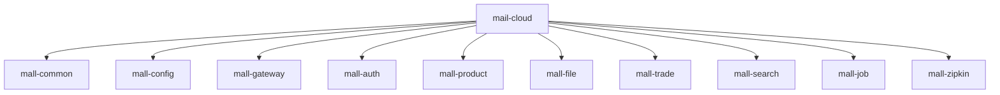
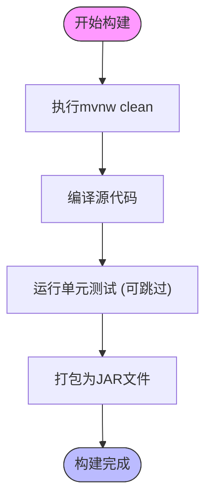
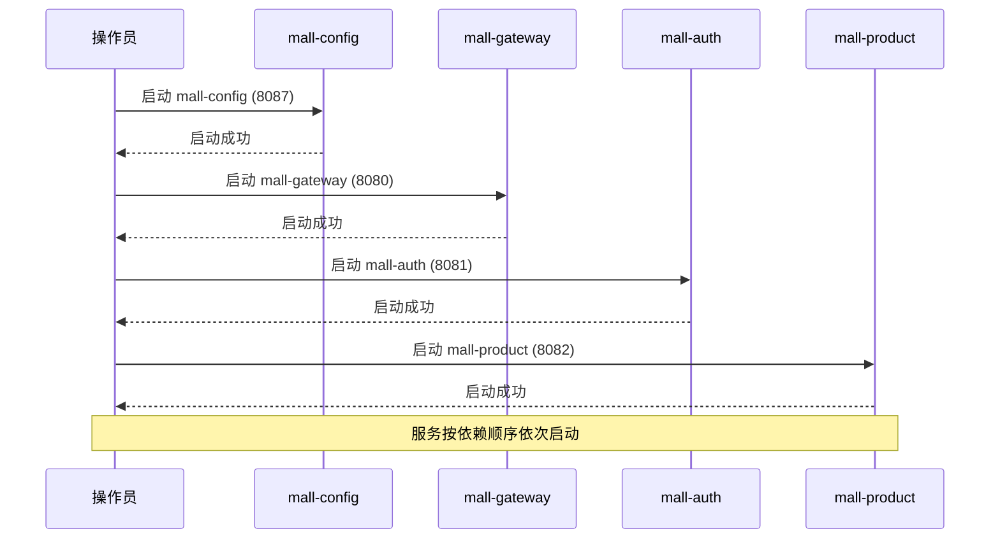
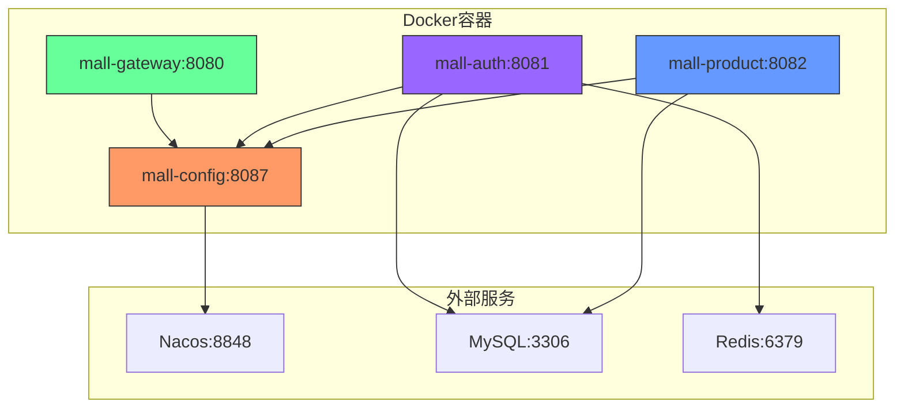
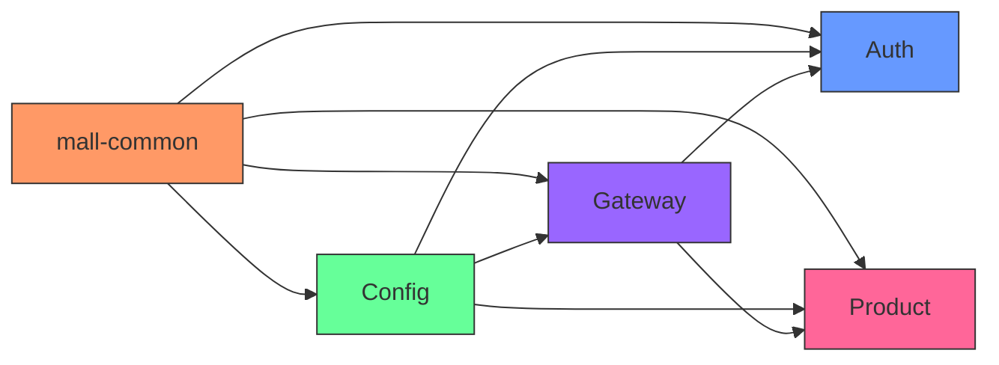
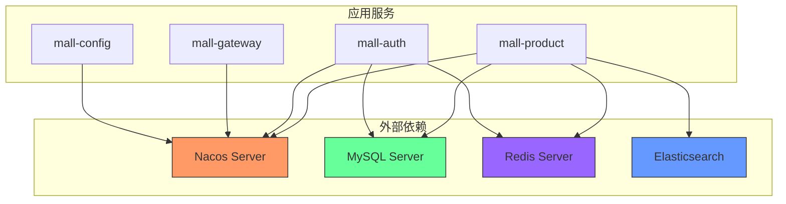

# 部署指南

<cite>
**本文档中引用的文件**  
- [pom.xml](file://pom.xml)
- [mall-config/pom.xml](file://mall-config/pom.xml)
- [mall-gateway/pom.xml](file://mall-gateway/pom.xml)
- [mall-auth/pom.xml](file://mall-auth/pom.xml)
- [mall-product/pom.xml](file://mall-product/pom.xml)
- [mall-config/src/main/resources/application.yml](file://mall-config/src/main/resources/application.yml)
- [mall-gateway/src/main/resources/application.yml](file://mall-gateway/src/main/resources/application.yml)
- [mall-auth/src/main/resources/application.yml](file://mall-auth/src/main/resources/application.yml)
- [mall-product/src/main/resources/application.yml](file://mall-product/src/main/resources/application.yml)
- [mall-config/src/main/java/xyh/dp/mall/config/MallConfigApplication.java](file://mall-config/src/main/java/xyh/dp/mall/config/MallConfigApplication.java)
- [mall-gateway/src/main/java/xyh/dp/mall/gateway/MallGatewayApplication.java](file://mall-gateway/src/main/java/xyh/dp/mall/gateway/MallGatewayApplication.java)
- [mall-auth/src/main/java/xyh/dp/mall/auth/MallAuthApplication.java](file://mall-auth/src/main/java/xyh/dp/mall/auth/MallAuthApplication.java)
- [mall-product/src/main/java/xyh/dp/mall/product/MallProductApplication.java](file://mall-product/src/main/java/xyh/dp/mall/product/MallProductApplication.java)
- [mvnw](file://mvnw)
- [mvnw.cmd](file://mvnw.cmd)
</cite>

## 目录
1. [项目结构](#项目结构)
2. [Maven编译打包](#maven编译打包)
3. [服务启动顺序](#服务启动顺序)
4. [Docker容器化部署](#docker容器化部署)
5. [模块化构建与部署](#模块化构建与部署)
6. [外部依赖服务](#外部依赖服务)

## 项目结构

mail-cloud项目是一个基于Spring Cloud Alibaba的微服务架构系统，采用多模块Maven项目结构。项目包含多个独立的微服务模块，每个模块负责特定的业务功能。



**图示来源**  
- [pom.xml](file://pom.xml#L24-L34)

**本节来源**  
- [pom.xml](file://pom.xml#L1-L223)

## Maven编译打包

使用Maven包装器脚本（mvnw/mvnw.cmd）对整个多模块项目进行编译打包。项目基于Java 25版本开发，使用Spring Boot 4.0.0-M1和Spring Cloud 2025.0.0版本。

### 全量编译打包

在项目根目录执行以下命令完成全量编译打包：

```bash
./mvnw clean package -DskipTests
```

该命令将：
- 清理之前构建的产物
- 编译所有模块的源代码
- 执行打包操作
- 跳过测试以加快构建速度
- 为每个微服务模块生成可执行的JAR文件

### 构建环境要求

- Java版本：Java 25（由pom.xml中的java.version属性指定）
- Maven：通过mvnw包装器自动下载和管理Maven版本
- 构建工具：支持Unix/Linux/macOS的sh脚本和Windows的cmd脚本



**图示来源**  
- [pom.xml](file://pom.xml#L44)
- [mvnw](file://mvnw#L1-L296)

**本节来源**  
- [pom.xml](file://pom.xml#L1-L223)
- [mvnw](file://mvnw#L1-L296)

## 服务启动顺序

微服务系统的启动需要遵循特定的顺序，以确保服务发现和配置中心正常工作。

### 启动顺序要求

1. **首先启动配置中心服务**（mall-config）
2. **然后启动网关服务**（mall-gateway）
3. **最后启动业务服务**（mall-auth, mall-product等）

### 服务端口分配

| 服务名称 | 端口号 | 服务功能 |
|---------|-------|---------|
| mall-config | 8087 | Nacos配置中心客户端 |
| mall-gateway | 8080 | API网关服务 |
| mall-auth | 8081 | 认证授权服务 |
| mall-product | 8082 | 商品管理服务 |
| mall-file | 8083 | 文件存储服务 |
| mall-trade | 8084 | 交易订单服务 |
| mall-search | 8085 | 搜索服务 |
| mall-job | 8086 | 定时任务服务 |



**图示来源**  
- [mall-config/src/main/resources/application.yml](file://mall-config/src/main/resources/application.yml#L13)
- [mall-gateway/src/main/resources/application.yml](file://mall-gateway/src/main/resources/application.yml#L32)
- [mall-auth/src/main/resources/application.yml](file://mall-auth/src/main/resources/application.yml#L30)
- [mall-product/src/main/resources/application.yml](file://mall-product/src/main/resources/application.yml#L30)

**本节来源**  
- [mall-config/src/main/resources/application.yml](file://mall-config/src/main/resources/application.yml#L1-L18)
- [mall-gateway/src/main/resources/application.yml](file://mall-gateway/src/main/resources/application.yml#L1-L37)
- [mall-auth/src/main/resources/application.yml](file://mall-auth/src/main/resources/application.yml#L1-L35)
- [mall-product/src/main/resources/application.yml](file://mall-product/src/main/resources/application.yml#L1-L35)

## Docker容器化部署

为每个微服务提供Docker容器化部署方案，确保环境一致性并简化部署流程。

### 基础Dockerfile模板

```dockerfile
FROM openjdk:25-jdk-slim

# 创建应用目录
WORKDIR /app

# 复制JAR文件
COPY target/*.jar app.jar

# 暴露端口
EXPOSE 8080

# 启动应用
ENTRYPOINT ["java", "-jar", "app.jar"]
```

### Docker部署建议配置

#### 基础镜像选择
- 推荐使用`openjdk:25-jdk-slim`作为基础镜像
- 该镜像体积小，安全性高，且支持Java 25

#### 端口映射
- mall-config: 8087 → 8087
- mall-gateway: 8080 → 8080
- mall-auth: 8081 → 8081
- mall-product: 8082 → 8082

#### 环境变量注入
- 可通过环境变量覆盖application.yml中的配置
- 例如：`SPRING_DATASOURCE_URL`, `SPRING_REDIS_HOST`等



**图示来源**  
- [pom.xml](file://pom.xml#L44)
- [mall-config/src/main/resources/application.yml](file://mall-config/src/main/resources/application.yml#L7)
- [mall-auth/src/main/resources/application.yml](file://mall-auth/src/main/resources/application.yml#L13)
- [mall-auth/src/main/resources/application.yml](file://mall-auth/src/main/resources/application.yml#L18)

**本节来源**  
- [pom.xml](file://pom.xml#L44)
- [mall-config/src/main/resources/application.yml](file://mall-config/src/main/resources/application.yml#L1-L18)
- [mall-auth/src/main/resources/application.yml](file://mall-auth/src/main/resources/application.yml#L1-L35)
- [mall-product/src/main/resources/application.yml](file://mall-product/src/main/resources/application.yml#L1-L35)

## 模块化构建与部署

根据pom.xml中的模块定义，可以单独构建和部署特定服务。

### 单独构建特定服务

在项目根目录执行以下命令构建特定模块：

```bash
# 构建配置中心服务
./mvnw clean package -pl mall-config -am -DskipTests

# 构建网关服务
./mvnw clean package -pl mall-gateway -am -DskipTests

# 构建认证服务
./mvnw clean package -pl mall-auth -am -DskipTests

# 构建商品服务
./mvnw clean package -pl mall-product -am -DskipTests
```

参数说明：
- `-pl`：指定要构建的项目列表
- `-am`：同时构建所选项目的依赖模块
- `-DskipTests`：跳过测试

### 模块依赖关系



**图示来源**  
- [pom.xml](file://pom.xml#L24-L34)
- [mall-config/pom.xml](file://mall-config/pom.xml#L23)
- [mall-gateway/pom.xml](file://mall-gateway/pom.xml#L28)
- [mall-auth/pom.xml](file://mall-auth/pom.xml#L23)
- [mall-product/pom.xml](file://mall-product/pom.xml#L23)

**本节来源**  
- [pom.xml](file://pom.xml#L1-L223)
- [mall-config/pom.xml](file://mall-config/pom.xml#L1-L28)
- [mall-gateway/pom.xml](file://mall-gateway/pom.xml#L1-L33)
- [mall-auth/pom.xml](file://mall-auth/pom.xml#L1-L28)
- [mall-product/pom.xml](file://mall-product/pom.xml#L1-L28)

## 外部依赖服务

部署前必须准备以下外部依赖服务，并满足相应的版本要求。

### 必需的外部服务

| 服务名称 | 版本要求 | 连接地址 | 用途 |
|---------|---------|---------|------|
| Nacos | 2.4.0+ | localhost:8848 | 服务注册与配置中心 |
| MySQL | 8.0+ | localhost:3306 | 数据持久化存储 |
| Redis | 7.0+ | localhost:6379 | 缓存与会话管理 |
| Elasticsearch | 8.0+ | localhost:9200 | 搜索功能支持 |

### 数据库配置

- **mall_auth数据库**：用于存储用户认证信息
  - URL: jdbc:mysql://localhost:3306/mall_auth
  - 用户名: root
  - 密码: Abc0224

- **mall_product数据库**：用于存储商品相关信息
  - URL: jdbc:mysql://localhost:3306/mall_product
  - 用户名: root
  - 密码: Abc0224

### 服务连接配置



**图示来源**  
- [pom.xml](file://pom.xml#L61-L69)
- [mall-config/src/main/resources/application.yml](file://mall-config/src/main/resources/application.yml#L7)
- [mall-auth/src/main/resources/application.yml](file://mall-auth/src/main/resources/application.yml#L13)
- [mall-auth/src/main/resources/application.yml](file://mall-auth/src/main/resources/application.yml#L18)
- [pom.xml](file://pom.xml#L91-L95)

**本节来源**  
- [pom.xml](file://pom.xml#L61-L173)
- [mall-config/src/main/resources/application.yml](file://mall-config/src/main/resources/application.yml#L1-L18)
- [mall-auth/src/main/resources/application.yml](file://mall-auth/src/main/resources/application.yml#L1-L35)
- [mall-product/src/main/resources/application.yml](file://mall-product/src/main/resources/application.yml#L1-L35)