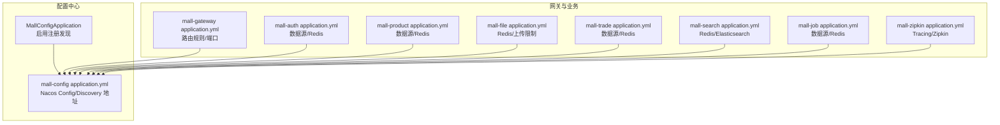
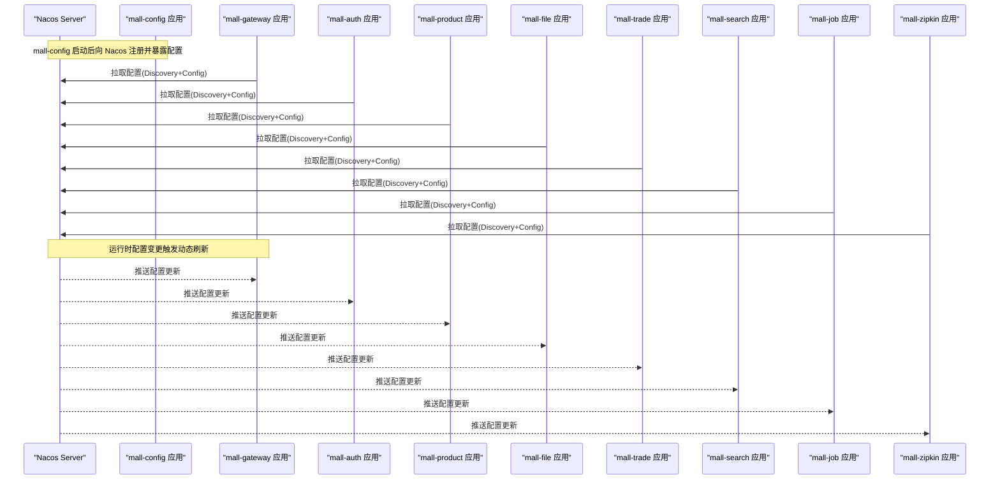
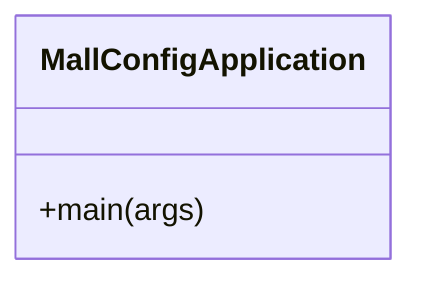
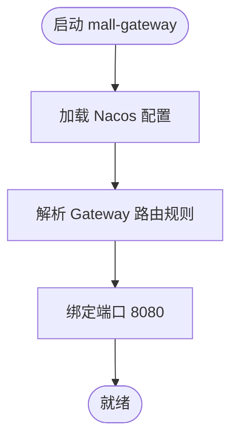
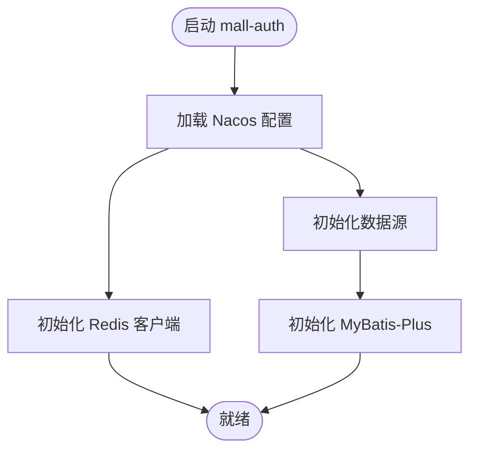
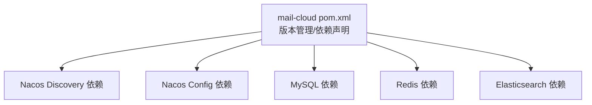

# 配置管理

<cite>
**本文引用的文件**
- [MallConfigApplication.java](file://mall-config/src/main/java/xyh/dp/mall/config/MallConfigApplication.java)
- [mall-config application.yml](file://mall-config/src/main/resources/application.yml)
- [mall-auth application.yml](file://mall-auth/src/main/resources/application.yml)
- [mall-gateway application.yml](file://mall-gateway/src/main/resources/application.yml)
- [mall-product application.yml](file://mall-product/src/main/resources/application.yml)
- [mall-file application.yml](file://mall-file/src/main/resources/application.yml)
- [mall-trade application.yml](file://mall-trade/src/main/resources/application.yml)
- [mall-search application.yml](file://mall-search/src/main/resources/application.yml)
- [mall-job application.yml](file://mall-job/src/main/resources/application.yml)
- [mall-zipkin application.yml](file://mall-zipkin/src/main/resources/application.yml)
- [mail-cloud pom.xml](file://pom.xml)
</cite>

## 目录
1. [引言](#引言)
2. [项目结构](#项目结构)
3. [核心组件](#核心组件)
4. [架构总览](#架构总览)
5. [详细组件分析](#详细组件分析)
6. [依赖分析](#依赖分析)
7. [性能考虑](#性能考虑)
8. [故障排查指南](#故障排查指南)
9. [结论](#结论)
10. [附录](#附录)

## 引言
本文件系统性阐述 mail-cloud 项目的配置管理体系，重点聚焦 mall-config 作为配置中心服务的作用与实现方式，说明各微服务（mall-gateway、mall-auth 等）如何通过 Nacos Config 实现集中配置管理与动态刷新；并结合各模块的 application.yml 文件，解释配置项优先级与覆盖机制、运行时变更流程，以及面向不同环境（dev/test/prod）的配置分离策略与敏感信息保护建议。

## 项目结构
mail-cloud 采用多模块 Maven 结构，mall-config 为独立的配置中心服务模块，其他业务模块（如 mall-gateway、mall-auth、mall-product、mall-file、mall-trade、mall-search、mall-job、mall-zipkin）均以 Spring Cloud Alibaba 的 Nacos Discovery 与 Nacos Config 作为配置与注册发现基础。

图表来源
- [MallConfigApplication.java](file://mall-config/src/main/java/xyh/dp/mall/config/MallConfigApplication.java#L1-L26)
- [mall-config application.yml](file://mall-config/src/main/resources/application.yml#L1-L18)
- [mall-gateway application.yml](file://mall-gateway/src/main/resources/application.yml#L1-L37)
- [mall-auth application.yml](file://mall-auth/src/main/resources/application.yml#L1-L35)
- [mall-product application.yml](file://mall-product/src/main/resources/application.yml#L1-L35)
- [mall-file application.yml](file://mall-file/src/main/resources/application.yml#L1-L27)
- [mall-trade application.yml](file://mall-trade/src/main/resources/application.yml#L1-L35)
- [mall-search application.yml](file://mall-search/src/main/resources/application.yml#L1-L25)
- [mall-job application.yml](file://mall-job/src/main/resources/application.yml#L1-L35)
- [mall-zipkin application.yml](file://mall-zipkin/src/main/resources/application.yml#L1-L26)

章节来源
- [mail-cloud pom.xml](file://pom.xml#L24-L35)
- [mall-config application.yml](file://mall-config/src/main/resources/application.yml#L1-L18)
- [mall-gateway application.yml](file://mall-gateway/src/main/resources/application.yml#L1-L37)
- [mall-auth application.yml](file://mall-auth/src/main/resources/application.yml#L1-L35)

## 核心组件
- mall-config：作为配置中心服务，启用注册发现能力，通过 Nacos Config 提供集中配置管理与动态刷新能力。
- 各业务模块：统一声明 Nacos Discovery 与 Nacos Config 的 server-addr，并设置 file-extension 为 yml，确保从 Nacos 拉取 YAML 配置。

关键点
- mall-config 的 application.yml 明确了 Nacos Config/Discovery 的 server-addr 与 file-extension，保证各模块能正确拉取配置。
- 各业务模块的 application.yml 中均包含 spring.cloud.nacos.discovery.server-addr 与 spring.cloud.nacos.config.server-addr，且 file-extension 为 yml，体现统一的配置拉取策略。

章节来源
- [MallConfigApplication.java](file://mall-config/src/main/java/xyh/dp/mall/config/MallConfigApplication.java#L1-L26)
- [mall-config application.yml](file://mall-config/src/main/resources/application.yml#L1-L18)
- [mall-auth application.yml](file://mall-auth/src/main/resources/application.yml#L1-L16)
- [mall-gateway application.yml](file://mall-gateway/src/main/resources/application.yml#L1-L10)

## 架构总览
下图展示配置中心与各微服务之间的交互关系，以及配置拉取与动态刷新的关键路径。

图表来源
- [MallConfigApplication.java](file://mall-config/src/main/java/xyh/dp/mall/config/MallConfigApplication.java#L1-L26)
- [mall-config application.yml](file://mall-config/src/main/resources/application.yml#L1-L18)
- [mall-gateway application.yml](file://mall-gateway/src/main/resources/application.yml#L1-L10)
- [mall-auth application.yml](file://mall-auth/src/main/resources/application.yml#L1-L10)
- [mall-product application.yml](file://mall-product/src/main/resources/application.yml#L1-L10)
- [mall-file application.yml](file://mall-file/src/main/resources/application.yml#L1-L10)
- [mall-trade application.yml](file://mall-trade/src/main/resources/application.yml#L1-L10)
- [mall-search application.yml](file://mall-search/src/main/resources/application.yml#L1-L10)
- [mall-job application.yml](file://mall-job/src/main/resources/application.yml#L1-L10)
- [mall-zipkin application.yml](file://mall-zipkin/src/main/resources/application.yml#L1-L11)

## 详细组件分析

### mall-config：配置中心服务
- 角色定位：启用注册发现，作为 Nacos Config 的承载者，为各业务模块提供统一配置源。
- 关键配置：
  - Nacos Config/Discovery 地址：用于配置拉取与服务注册。
  - file-extension：指定配置文件扩展名为 yml，确保 YAML 解析。
  - 服务端口：用于对外提供服务或健康检查等。

图表来源
- [MallConfigApplication.java](file://mall-config/src/main/java/xyh/dp/mall/config/MallConfigApplication.java#L1-L26)
- [mall-config application.yml](file://mall-config/src/main/resources/application.yml#L1-L18)

章节来源
- [MallConfigApplication.java](file://mall-config/src/main/java/xyh/dp/mall/config/MallConfigApplication.java#L1-L26)
- [mall-config application.yml](file://mall-config/src/main/resources/application.yml#L1-L18)

### mall-gateway：路由与网关配置
- 关键配置：
  - Nacos Discovery/Config 地址与 file-extension。
  - Gateway 路由规则：将 /auth/** 转发到 mall-auth，/product/** 转发到 mall-product，依此类推。
  - 服务端口：8080。

图表来源
- [mall-gateway application.yml](file://mall-gateway/src/main/resources/application.yml#L1-L37)

章节来源
- [mall-gateway application.yml](file://mall-gateway/src/main/resources/application.yml#L1-L37)

### mall-auth：认证服务配置
- 关键配置：
  - Nacos Discovery/Config 地址与 file-extension。
  - 数据库连接：驱动、URL、用户名、密码。
  - Redis 连接：host、port、database。
  - MyBatis-Plus：Mapper 扫描、类型别名包、驼峰映射与日志实现。
  - 服务端口：8081。

图表来源
- [mall-auth application.yml](file://mall-auth/src/main/resources/application.yml#L1-L35)

章节来源
- [mall-auth application.yml](file://mall-auth/src/main/resources/application.yml#L1-L35)

### 其他业务模块（示例）
- mall-product：与 mall-auth 类似，包含数据源与 Redis 配置，端口 8082。
- mall-file：包含 Redis 配置与文件上传大小限制，端口 8083。
- mall-trade：包含数据源与 Redis 配置，端口 8084。
- mall-search：包含 Redis 与 Elasticsearch 配置，端口 8085。
- mall-job：包含数据源与 Redis 配置，端口 8086。
- mall-zipkin：包含 Zipkin Tracing 配置，端口 8088。

章节来源
- [mall-product application.yml](file://mall-product/src/main/resources/application.yml#L1-L35)
- [mall-file application.yml](file://mall-file/src/main/resources/application.yml#L1-L27)
- [mall-trade application.yml](file://mall-trade/src/main/resources/application.yml#L1-L35)
- [mall-search application.yml](file://mall-search/src/main/resources/application.yml#L1-L25)
- [mall-job application.yml](file://mall-job/src/main/resources/application.yml#L1-L35)
- [mall-zipkin application.yml](file://mall-zipkin/src/main/resources/application.yml#L1-L26)

## 依赖分析
- 依赖管理：父 POM 统一引入 Spring Cloud 与 Spring Cloud Alibaba 版本，确保各模块在相同版本体系下使用 Nacos Discovery 与 Nacos Config。
- 业务模块共同依赖：
  - spring-cloud-starter-alibaba-nacos-discovery
  - spring-cloud-starter-alibaba-nacos-config
- 各模块还按需引入 MySQL、MyBatis-Plus、Redis、Elasticsearch 等依赖。

图表来源
- [mail-cloud pom.xml](file://pom.xml#L55-L95)
- [mail-cloud pom.xml](file://pom.xml#L174-L191)

章节来源
- [mail-cloud pom.xml](file://pom.xml#L55-L95)
- [mail-cloud pom.xml](file://pom.xml#L174-L191)

## 性能考虑
- 配置拉取与刷新
  - 使用 Nacos Config 的 file-extension=yml 可减少不必要的格式转换开销。
  - 将高频变更的配置项拆分到独立命名空间或 Data ID，降低全量推送带来的网络与解析压力。
- 网关路由
  - mall-gateway 的路由规则应尽量避免过多正则匹配，减少请求处理链路复杂度。
- 数据源与缓存
  - 合理设置连接池大小与超时时间，避免在配置变更后频繁重建连接。
  - Redis 与 Elasticsearch 的连接数与超时参数应结合压测结果调优。

## 故障排查指南
- Nacos 连接失败
  - 检查各模块 application.yml 中 spring.cloud.nacos.config.server-addr 与 spring.cloud.nacos.discovery.server-addr 是否指向正确的 Nacos 地址。
  - 确认 mall-config 的 Nacos Config/Discovery 地址与 file-extension 设置是否一致。
- 配置未生效或未动态刷新
  - 确认 Data ID 与 Group 是否正确，以及配置内容是否为 yml 格式。
  - 检查各模块是否启用了 Nacos Config 的自动刷新能力（通常通过注解或 RefreshScope 实现，具体取决于框架版本）。
- 端口冲突
  - 各模块的 server.port 存在默认值，若在同一主机启动多个实例，请确保端口不冲突。
- 数据源/Redis/Elasticsearch 连接异常
  - 核对 URL、主机、端口、数据库索引/库名、密码等参数是否与实际环境一致。

章节来源
- [mall-config application.yml](file://mall-config/src/main/resources/application.yml#L1-L18)
- [mall-gateway application.yml](file://mall-gateway/src/main/resources/application.yml#L1-L10)
- [mall-auth application.yml](file://mall-auth/src/main/resources/application.yml#L1-L16)
- [mall-search application.yml](file://mall-search/src/main/resources/application.yml#L1-L17)

## 结论
mail-cloud 通过 mall-config 作为配置中心，结合 Spring Cloud Alibaba 的 Nacos Discovery 与 Nacos Config，实现了各微服务的集中配置管理与动态刷新。各模块在启动时从 Nacos 拉取配置，涵盖服务端口、数据库连接、Redis 地址、Elasticsearch 集群信息等关键参数。建议在生产环境中进一步完善配置分离策略与敏感信息保护方案，以提升安全性与可维护性。

## 附录

### 配置项优先级与覆盖机制（基于 Spring Cloud Alibaba Nacos）
- 配置来源优先级（从高到低）
  1) 运行时参数（命令行参数、JVM 参数）
  2) 本地 application.yml（模块内 resources 下）
  3) Nacos Config（Data ID 与 Group 对应的配置）
- 覆盖规则
  - 当同一配置项同时存在于本地与 Nacos 时，Nacos 的配置会覆盖本地配置。
  - 不同模块的 Data ID 与 Group 应清晰区分，避免相互覆盖。
- 动态刷新
  - 在 Nacos 控制台修改配置后，各模块应具备自动刷新能力（通常通过 @RefreshScope 或相应注解实现），以确保运行时即时生效。

章节来源
- [mall-config application.yml](file://mall-config/src/main/resources/application.yml#L1-L18)
- [mall-gateway application.yml](file://mall-gateway/src/main/resources/application.yml#L1-L10)
- [mall-auth application.yml](file://mall-auth/src/main/resources/application.yml#L1-L10)

### Nacos 控制台运行时配置变更流程
- 登录 Nacos 控制台，选择对应命名空间与 Group。
- 找到目标 Data ID，编辑配置内容（保持 yml 格式）。
- 保存后，触发广播，各订阅该配置的服务将收到更新并完成刷新。

章节来源
- [mall-config application.yml](file://mall-config/src/main/resources/application.yml#L1-L18)
- [mall-gateway application.yml](file://mall-gateway/src/main/resources/application.yml#L1-L10)
- [mall-auth application.yml](file://mall-auth/src/main/resources/application.yml#L1-L10)

### 配置文件结构最佳实践
- 分环境配置分离
  - dev/test/prod 使用不同的 Group 或命名空间，避免互相污染。
  - 将只在特定环境使用的配置放入独立 Data ID，减少通用配置的干扰。
- 敏感信息保护
  - 将数据库密码、Redis 密码、第三方密钥等放入 Nacos 的加密功能（如支持）或通过外部密管系统注入。
  - 本地开发使用占位符或示例值，生产环境通过 CI/CD 注入真实值。
- 配置分层与复用
  - 将公共配置抽取为共享 Data ID，业务模块按需继承或覆盖。
  - 对高频变更的配置（如限流阈值、开关项）单独拆分，降低全量推送成本。
- 命名规范
  - Data ID 建议采用模块名.yaml 的形式，Group 使用环境标识（如 dev/test/prod）。
  - 避免在 application.yml 中硬编码敏感信息与环境特有参数。

章节来源
- [mall-config application.yml](file://mall-config/src/main/resources/application.yml#L1-L18)
- [mall-auth application.yml](file://mall-auth/src/main/resources/application.yml#L1-L35)
- [mall-search application.yml](file://mall-search/src/main/resources/application.yml#L1-L25)