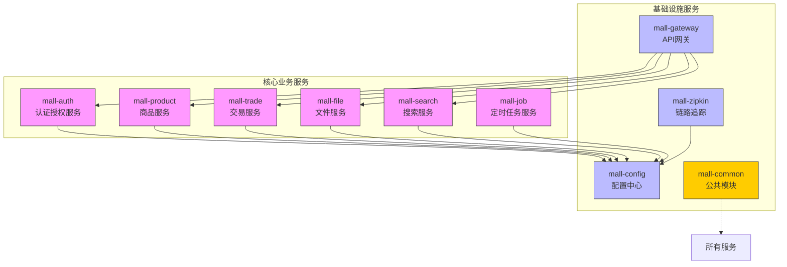
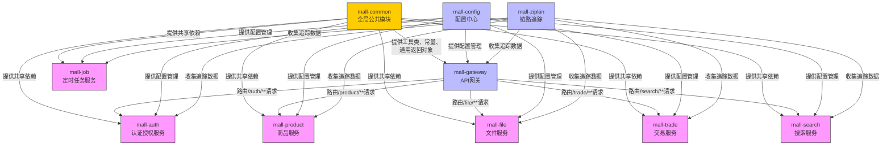
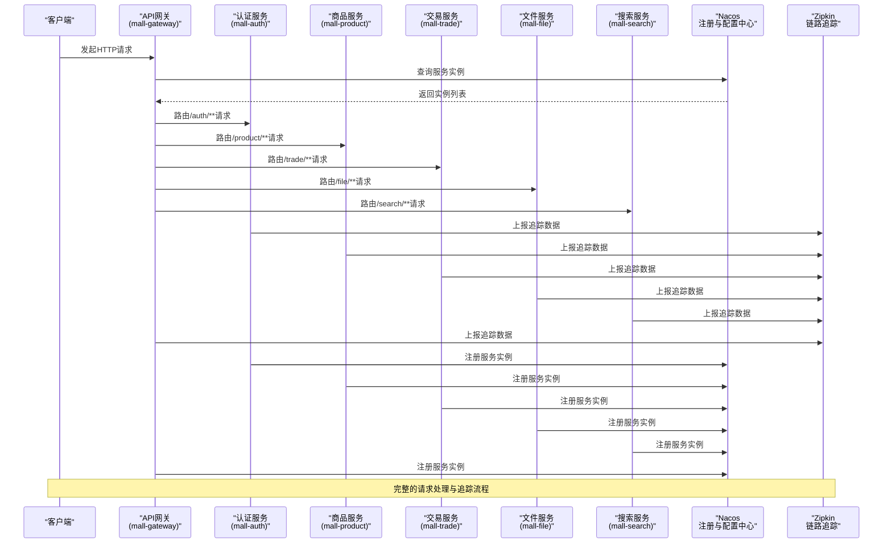

# 项目概述

<cite>
**本文档引用的文件**
- [catalogue.md](file://catalogue.md)
- [pom.xml](file://pom.xml)
- [mall-auth/pom.xml](file://mall-auth/pom.xml)
- [mall-gateway/pom.xml](file://mall-gateway/pom.xml)
- [mall-zipkin/pom.xml](file://mall-zipkin/pom.xml)
- [mall-auth/src/main/resources/application.yml](file://mall-auth/src/main/resources/application.yml)
- [mall-gateway/src/main/resources/application.yml](file://mall-gateway/src/main/resources/application.yml)
- [mall-zipkin/src/main/resources/application.yml](file://mall-zipkin/src/main/resources/application.yml)
- [mall-auth/src/main/java/xyh/dp/mall/auth/MallAuthApplication.java](file://mall-auth/src/main/java/xyh/dp/mall/auth/MallAuthApplication.java)
- [mall-gateway/src/main/java/xyh/dp/mall/gateway/MallGatewayApplication.java](file://mall-gateway/src/main/java/xyh/dp/mall/gateway/MallGatewayApplication.java)
</cite>

## 目录
1. [简介](#简介)
2. [项目结构](#项目结构)
3. [核心功能](#核心功能)
4. [架构设计原则](#架构设计原则)
5. [微服务职责划分](#微服务职责划分)
6. [技术栈选型分析](#技术栈选型分析)
7. [服务协作与数据流](#服务协作与数据流)
8. [配置与依赖管理](#配置与依赖管理)
9. [总结](#总结)

## 简介

mail-cloud项目是一个基于Spring Cloud的电商平台微服务系统，旨在提供一个高可用、可扩展的分布式电商解决方案。系统采用现代化的微服务架构，将传统单体应用拆分为多个独立部署、独立演进的服务模块，涵盖商品管理、交易处理、用户认证、文件存储、搜索服务等核心电商业务能力。

该项目为开发者提供了清晰的技术架构和模块化设计，既适合初学者理解微服务架构的全貌，也为高级开发者提供了深入的技术决策背景。通过使用最新的Java 25、Spring Boot 4.0.0-M1和Spring Cloud 2025.0.0等前沿技术，系统展现了现代云原生应用的最佳实践。

## 项目结构

mail-cloud项目采用典型的Maven多模块结构，每个微服务作为一个独立的Maven模块进行管理，便于独立开发、测试和部署。项目根目录下的pom.xml定义了全局依赖管理和版本控制，确保所有子模块使用统一的技术栈。

**Diagram sources**
- [pom.xml](file://pom.xml)
- [catalogue.md](file://catalogue.md)

**Section sources**
- [pom.xml](file://pom.xml#L24-L34)
- [catalogue.md](file://catalogue.md#L1-L13)

## 核心功能

mail-cloud系统提供了完整的电商平台核心功能，通过微服务架构实现了功能解耦和独立演进：

- **商品管理**：通过mall-product服务实现商品信息、分类体系、品牌管理等核心商品数据的维护
- **交易处理**：通过mall-trade服务支持购物车管理、订单创建、支付回调等完整交易流程
- **用户认证**：通过mall-auth服务提供微信登录集成、JWT令牌签发与验证等安全认证功能
- **文件存储**：通过mall-file服务实现图片、视频等多媒体文件的上传与管理，支持OSS/MinIO等对象存储
- **搜索服务**：通过mall-search服务基于Elasticsearch提供高性能的商品全文搜索能力
- **定时任务**：通过mall-job服务处理过期订单清理、数据统计等后台定时任务
- **配置管理**：通过mall-config服务实现分布式配置的集中管理与动态刷新
- **链路追踪**：通过mall-zipkin服务提供全链路分布式追踪能力，便于问题排查与性能分析

这些功能模块通过清晰的边界划分和标准化的接口协议协同工作，共同构成了完整的电商平台生态系统。

**Section sources**
- [catalogue.md](file://catalogue.md#L4-L13)

## 架构设计原则

mail-cloud项目遵循现代微服务架构的核心设计原则，确保系统的可维护性、可扩展性和高可用性：

### 微服务划分原则
系统采用业务能力驱动的微服务划分方法，每个服务对应一个明确的业务领域，具有高内聚、低耦合的特点。服务边界基于业务上下文进行定义，避免了功能交叉和职责不清的问题。

### 服务注册与发现
系统采用Nacos作为服务注册与发现中心，所有微服务在启动时向Nacos注册自身实例信息，并定期发送心跳维持注册状态。其他服务通过服务名称从Nacos获取可用实例列表，实现客户端负载均衡。

### API网关统一入口
通过Spring Cloud Gateway实现API网关层，作为系统的统一入口点。所有外部请求首先到达网关，由网关根据预定义的路由规则转发到相应的后端服务，实现了请求路由、负载均衡、安全过滤等功能的集中管理。

### 分布式链路追踪
系统集成Zipkin实现分布式链路追踪，通过Sleuth生成唯一的追踪ID并在服务调用链中传递，使得跨服务的请求能够被完整追踪和可视化，极大提升了分布式系统的可观测性。

### 配置中心
采用Nacos Config作为配置中心，将各服务的配置文件从代码中剥离，实现配置的集中管理和动态更新，避免了配置散落在各个服务中的管理难题。

**Section sources**
- [catalogue.md](file://catalogue.md#L11-L13)
- [pom.xml](file://pom.xml#L61-L69)

## 微服务职责划分

根据catalogue.md中的模块说明，mail-cloud项目中的各个微服务具有明确的职责边界：

**Diagram sources**
- [catalogue.md](file://catalogue.md)
- [mall-gateway/src/main/resources/application.yml](file://mall-gateway/src/main/resources/application.yml#L9-L29)

**Section sources**
- [catalogue.md](file://catalogue.md#L2-L13)

## 技术栈选型分析

mail-cloud项目的技术栈选择体现了对现代云原生应用最佳实践的深刻理解，各项技术选型均有明确的考量：

### Java 25
项目采用最新的Java 25版本，充分利用了Java语言最新的性能优化、语法特性和安全增强。Java 25带来了更好的虚拟线程支持、更高效的垃圾回收器以及更丰富的API，为高并发电商平台提供了坚实的基础。

### Spring Boot 4.0.0-M1
选择Spring Boot 4.0.0-M1（里程碑版本）表明项目追求技术前沿，该版本在响应式编程、云原生支持、启动性能等方面有显著改进，为微服务架构提供了更强大的基础框架支持。

### Spring Cloud 2025.0.0
与Spring Boot 4.0匹配的Spring Cloud 2025.0.0版本提供了最新的微服务解决方案，包括改进的服务发现、配置管理、网关路由等功能，确保了微服务生态的完整性和先进性。

### Spring Cloud Alibaba Nacos
选择Nacos而非传统的Eureka和Config，是因为Nacos提供了更全面的服务发现和配置管理功能，支持AP/CP一致性模式切换、动态配置推送、服务健康检查等高级特性，更适合生产环境。

### MyBatis-Plus 3.5.5
在持久层选择MyBatis-Plus而非JPA，是因为MyBatis-Plus提供了更好的SQL控制能力，适合电商平台复杂的查询需求，同时其代码生成器和通用CRUD功能大大提升了开发效率。

### Redis
集成Redis作为缓存层，用于存储会话信息、商品缓存、分布式锁等，显著提升系统性能和响应速度，同时支持高并发场景下的数据一致性。

### Elasticsearch
选择Elasticsearch作为搜索引擎，是因为其强大的全文检索能力、高扩展性和实时搜索特性，完美满足电商平台的商品搜索需求。

### JWT
采用JWT（JSON Web Token）作为认证机制，实现了无状态的认证授权，便于在分布式环境中进行用户身份验证和权限控制。

**Section sources**
- [pom.xml](file://pom.xml#L43-L53)
- [pom.xml](file://pom.xml#L55-L173)

## 服务协作与数据流

mail-cloud系统中的服务协作遵循清晰的数据流动路径，确保了系统的稳定性和可预测性：

**Diagram sources**
- [mall-gateway/src/main/resources/application.yml](file://mall-gateway/src/main/resources/application.yml)
- [mall-auth/src/main/resources/application.yml](file://mall-auth/src/main/resources/application.yml)
- [mall-zipkin/src/main/resources/application.yml](file://mall-zipkin/src/main/resources/application.yml)

**Section sources**
- [mall-gateway/src/main/resources/application.yml](file://mall-gateway/src/main/resources/application.yml#L9-L29)
- [mall-auth/src/main/resources/application.yml](file://mall-auth/src/main/resources/application.yml#L5-L10)

## 配置与依赖管理

mail-cloud项目通过精心设计的配置和依赖管理机制，确保了系统的可维护性和一致性：

### 统一依赖管理
项目根pom.xml通过<dependencyManagement>对所有子模块的依赖版本进行集中管理，确保了技术栈的一致性。这种"版本锁定"策略避免了不同模块使用不同版本依赖导致的兼容性问题。

### 配置外置化
各服务的application.yml配置文件中包含了Nacos配置中心的连接信息，实现了配置的外置化管理。服务启动时从Nacos拉取配置，支持配置的动态更新而无需重启服务。

### 环境隔离
通过Nacos的命名空间和分组功能，可以实现开发、测试、生产等不同环境的配置隔离，确保了环境间的配置独立性和安全性。

### 公共模块复用
mall-common模块作为全局公共模块，封装了工具类、常量定义、通用返回对象等跨服务共享的代码，避免了代码重复，提升了开发效率。

### 健康检查与监控
各服务配置了Actuator端点和日志级别，便于系统监控和故障排查。同时通过Zipkin的集成，实现了分布式系统的全面可观测性。

**Section sources**
- [pom.xml](file://pom.xml#L174-L191)
- [mall-auth/src/main/resources/application.yml](file://mall-auth/src/main/resources/application.yml)
- [mall-gateway/src/main/resources/application.yml](file://mall-gateway/src/main/resources/application.yml)
- [mall-zipkin/src/main/resources/application.yml](file://mall-zipkin/src/main/resources/application.yml)

## 总结

mail-cloud项目作为一个基于Spring Cloud的电商平台微服务系统，展现了现代分布式架构的最佳实践。通过合理的微服务划分、先进的技术栈选择和清晰的架构设计，系统实现了高内聚、低耦合的模块化结构，具备良好的可扩展性和可维护性。

项目采用Java 25、Spring Boot 4.0.0-M1等前沿技术，体现了对技术创新的追求；通过Nacos实现服务发现与配置管理，通过Spring Cloud Gateway统一API入口，通过Zipkin提供分布式追踪能力，构建了完整的微服务基础设施。

对于初学者而言，该项目提供了清晰的系统全景图，有助于理解微服务架构的核心概念和实现方式；对于高级开发者而言，项目的技术选型和架构设计提供了有价值的参考，展示了如何在实际项目中应用最新的云原生技术。

mail-cloud项目不仅是一个功能完整的电商平台原型，更是一个优秀的微服务架构学习案例，为开发者提供了从理论到实践的完整参考。